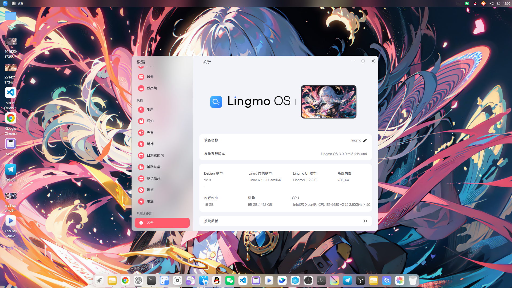

# Lingmo OS

This is the source tree of the LingmoOS desktop environment.

### Introduction


Lingmo OS is a Linux operating system based on the desktop environment. It is developed based on the open source Linux kernel and is compatible with the amd64 architecture. It has a beautiful desktop environment, software adapted to the desktop environment, and a unified UI style.

### UI, new desktop environment

Lingmo OS adopts a new design that is different from the traditional KDE, making the operation no longer cumbersome; the operation is more user-friendly, making the interaction and vision more dynamic.

# Preparations
## Build Host Requirements

 - Debian GNU/Linux 12(Bookworm), 13(Trixie) or later.
 - Disk free space > 50GB
 - Multi-core multi-threaded processor
 - 8 GB minimum running memory

## Tool preparation

### Clone This Code Warehouse.
   ```
   git clone https://github.com/LingmoOS/LingmoOS.git
   mkdir -p ~/bin
   cp -v LingmoOS/repo ~/bin/
   chmod a+x ~/bin/repo
   echo 'export PATH="$PATH:$HOME/bin"' >> ~/.bashrc
   source ~/.bashrc
```

# Initialize repo warehouse

## Enter source directory:
```
cd LingmoOS
```
## Init Repo

```
repo init -u https://github.com/LingmoOS/manifest.git
```

# Synchronization code
```
repo sync
```

## Dependencies
Before building the project, ensure the following tools are installed:
- `autoconf`: Used to generate the `configure` script.
- `automake`: Used to generate `Makefile.in`.
- `lingmo-pkgbuild`: Used to build packages.
- `make`: Used to execute the build process.
- `gcc` or another C compiler.

On Debian/Ubuntu systems, you can install the dependencies with:
```bash
sudo apt-get install autoconf automake build-essential
```

---

## Build Process

### 1. Initialize the Project
Run the following commands to generate the `configure` script and `Makefile`:
```bash
autoreconf -fiv  # Generate the configure script
./configure      # Generate the Makefile
```

### 2. Build the Project
Build iso image:
```bash
make image-iso
```
Use the following commands to build the project:
```bash
make             # Build all targets
make pkg_all     # Build all packages
make third-party # Process third-party packages
```

### 3. Clean the Project
Run the following command to clean the build directories:
```bash
make clean       # Clean the build directories
```

---

## Target Descriptions
- **`make`**: Default target, builds all components.
- **`make pkg_all`**: Builds all packages using `lingmo-pkgbuild`.
- **`make third-party`**: Processes third-party packages in the `third-party` directory.
- **`make clean`**: Cleans the build directories.

---

## License

This project has been licensed by GPLv3.
