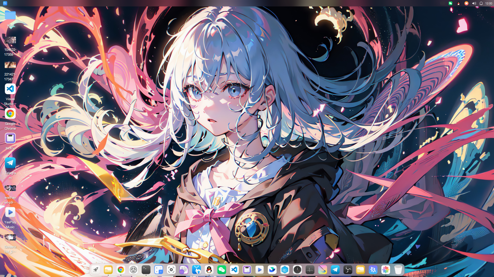
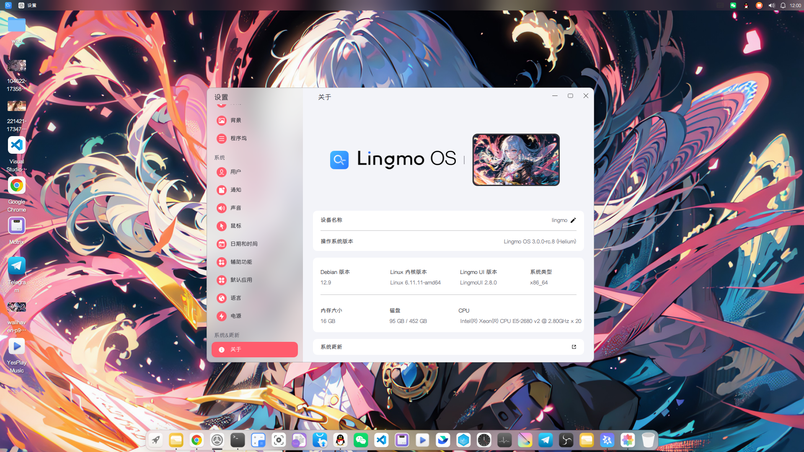
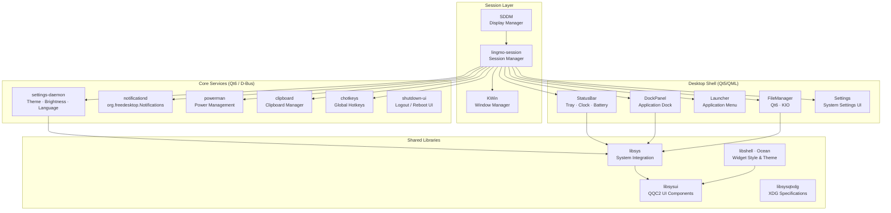
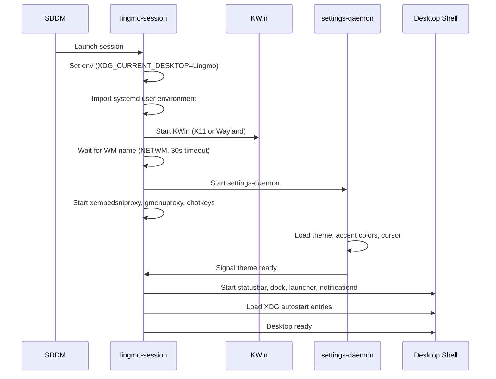

<p align="center">
  
</p>

<h1 align="center">Lingmo OS</h1>

<p align="center">
  <strong>A modern Linux desktop environment with a distinctive design language</strong>
</p>

<p align="center">
  <a href="#features">Features</a> &bull;
  <a href="#architecture">Architecture</a> &bull;
  <a href="#technology-stack">Tech Stack</a> &bull;
  <a href="#building-from-source">Build</a> &bull;
  <a href="#contributing">Contributing</a> &bull;
  <a href="#license">License</a>
</p>

---

<p align="center">
  
</p>

## About

Lingmo OS is an open-source Linux desktop environment for the amd64 architecture. It features a macOS-inspired layout with a top status bar, application dock, and unified settings system — delivering a clean, modern desktop experience with its own visual identity.

The desktop communicates entirely through D-Bus, with every component registering well-known services. The UI layer uses QML (Qt Quick) for smooth, hardware-accelerated rendering, and the system integrates tightly with X11/XCB for low-level window management.

## Features

- **Unified Desktop Experience** — Status bar, application dock, launcher, and system settings with consistent visual language
- **D-Bus IPC Architecture** — All components communicate through well-defined D-Bus interfaces (`com.lingmo.*`)
- **Hybrid Qt5/Qt6 Support** — Core services use Qt6; shell components remain on Qt5 for stability
- **Wayland Ready** — Session manager supports both X11 and Wayland compositing via KWin
- **Theme System** — Dark mode, accent colors, cursor themes, GTK2/GTK3 integration, font management
- **Built-in Apps** — File manager, terminal, calculator, text editor, screenshot tool, system monitor, and more
- **Fcitx5 + Rime** — Bundled input method framework with Rime engine for CJK input
- **Full Disk Installer** — Based on Calamares with ZFS and LVM support

## Architecture

### System Overview


```mermaid
graph TB
    subgraph Session ["Session Layer"]
        SM[lingmo-session<br/>Session Manager]
        KWin[KWin<br/>Window Manager]
        SDDM[SDDM<br/>Display Manager]
    end

    subgraph Core ["Core Services (Qt6 / D-Bus)"]
        SD[settings-daemon<br/>Theme · Brightness · Language]
        ND[notificationd<br/>org.freedesktop.Notifications]
        PM[powerman<br/>Power Management]
        CB[clipboard<br/>Clipboard Manager]
        HK[chotkeys<br/>Global Hotkeys]
        SU[shutdown-ui<br/>Logout / Reboot UI]
    end

    subgraph Shell ["Desktop Shell (Qt5/QML)"]
        SB[StatusBar<br/>Tray · Clock · Battery]
        DP[DockPanel<br/>Application Dock]
        LA[Launcher<br/>Application Menu]
        FM[FileManager<br/>Qt6 · KIO]
        SET[Settings<br/>System Settings UI]
    end

    subgraph Libs ["Shared Libraries"]
        LS[libsys<br/>System Integration]
        LUI[libsysui<br/>QQC2 UI Components]
        LSH[libshell · Ocean<br/>Widget Style & Theme]
        LXDG[libsysqtxdg<br/>XDG Specifications]
    end

    SDDM --> SM
    SM --> KWin
    SM --> SD
    SM --> ND
    SM --> PM
    SM --> CB
    SM --> HK
    SM --> SB
    SM --> DP
    SM --> LA
    SM --> FM
    SM --> SET
    SD --> LS
    SB --> LS
    DP --> LS
    FM --> LS
    LS --> LUI
    LSH --> LUI
```

### D-Bus Service Registry

| Service Name | Component | Role |
|---|---|---|
| `com.lingmo.Session` | `core/session` | Session lifecycle, environment, autostart |
| `com.lingmo.Settings` | `core/settings-daemon` | Unified settings daemon |
| `com.lingmo.Theme` | `core/settings-daemon` | Theme, accent colors, cursors, fonts |
| `com.lingmo.Brightness` | `core/screen-brightness` | Screen brightness control |
| `com.lingmo.PrimaryBattery` | `core/settings-daemon` | Battery status reporting |
| `com.lingmo.PowerManager` | `core/powerman` | Idle management, lid watcher, CPU scaling |
| `com.lingmo.Language` | `core/settings-daemon` | Language and locale settings |
| `com.lingmo.Dock` | `core/settings-daemon` | Dock configuration |
| `com.lingmo.AppManager` | `shell/cc/Daemon` | Application management, permissions |
| `com.lingmo.Statusbar` | `shell/bc/StatusBar` | Status bar control interface |
| `com.lingmo.Launcher` | `shell/bc/Launcher` | Application launcher control |
| `com.lingmo.ShutdownUI` | `core/shutdown-ui` | Logout/reboot/shutdown dialog |
| `com.lingmo.FileManager` | `fm` | File operations, trash management |
| `org.freedesktop.Notifications` | `core/notificationd` | Desktop notification server (v1.2) |
| `org.freedesktop.FileManager1` | `fm` | Standard file manager D-Bus interface |

### Session Startup Sequence


```mermaid
sequenceDiagram
    participant SDDM
    participant SM as lingmo-session
    participant KWin
    participant SD as settings-daemon
    participant Shell as Desktop Shell

    SDDM->>SM: Launch session
    SM->>SM: Set env (XDG_CURRENT_DESKTOP=Lingmo)
    SM->>SM: Import systemd user environment
    SM->>KWin: Start KWin (X11 or Wayland)
    SM->>SM: Wait for WM name (NETWM, 30s timeout)
    SM->>SD: Start settings-daemon
    SM->>SM: Start xembedsniproxy, gmenuproxy, chotkeys
    SD->>SD: Load theme, accent colors, cursor
    SD->>SM: Signal theme ready
    SM->>Shell: Start statusbar, dock, launcher, notificationd
    SM->>Shell: Load XDG autostart entries
    SM->>Shell: Desktop ready
```

## Module Reference

### Core Services (`core/`)

Custom LingmoOS components — the heart of the desktop environment.

| Module | D-Bus Service | Description |
|---|---|---|
| `session/` | `com.lingmo.Session` | Session manager — starts KWin, sets up environment, launches desktop processes |
| `settings-daemon/` | `com.lingmo.Settings` | Settings daemon — theme, brightness, battery, language, mouse, touchpad, dock |
| `notificationd/` | `org.freedesktop.Notifications` | Full notification server (v1.2) with inline reply, persistence, deduplication |
| `powerman/` | `com.lingmo.PowerManager` | Power manager — idle management, lid watcher, display dimming, CPU scaling |
| `clipboard/` | — | Clipboard manager |
| `shutdown-ui/` | `com.lingmo.ShutdownUI` | Shutdown/logout/reboot QML dialog |
| `polkit-agent/` | — | PolicyKit authentication agent (QML) |
| `screen-brightness/` | — | Brightness helper (polkit-privileged) |
| `cpufreq/` | — | CPU frequency scaling helper (polkit-privileged) |
| `xembed-sni-proxy/` | — | XEmbed system tray → StatusNotifierItem proxy |
| `gmenuproxy/` | — | GTK/GMenu → DBusMenu proxy for global menu |
| `sddm-helper/` | — | SDDM display manager helper |
| `chotkeys/` | — | Global hotkey daemon (QHotkey library) |

### Desktop Shell (`shell/bc/`)

24 built-in applications and components:

| Component | Description |
|---|---|
| `StatusBar/` | System status bar — tray, notifications, brightness, battery, app menu |
| `DockPanel/` | Application dock with X11 window monitoring |
| `Launcher/` | Application launcher (start menu) |
| `Terminal/` | Terminal emulator (qmltermwidget) |
| `Settings/` | System settings application |
| `Calculator/` | Calculator |
| `Texteditor/` | Text editor |
| `Notepad/` | Notepad |
| `VideoPlayer/` | Video player |
| `SystemMonitor/` | System monitor |
| `ScreenShots/` | Screenshot tool |
| `ScreenLocker/` | Screen locker UI |
| `UpdateTool/` | System updater |
| `Debinstaller/` | Package installer |
| `Desktop/` | Desktop shell component |

### Workspace Components (`core32/`, `shell32/`)

Modified workspace components providing the underlying panel, applet, and runner infrastructure:

- `core32/shell/` — Shell layout (panels, containments, layouts)
- `core32/applets/` — Panel applets
- `core32/kcms/` — System settings modules
- `core32/krunner/` — Application launcher/search runner
- `core32/ksmserver/` — Session manager
- `shell32/lingmo-shell/` — Desktop shell package
- `shell32/lingmo-framework/` — Declarative UI framework

### Shared Libraries (`lib/`)

| Library | Purpose | Framework |
|---|---|---|
| `libsys` | System integration — accounts, audio, Bluetooth, MPRIS, network, screen | Qt6, KDE Frameworks |
| `libsysui` | QQC2 UI component library — editor, FM, accounts, terminal, tagging | Qt6, XCB |
| `libshell` (Ocean) | Platform theme + widget style — blur, shadow, borderless windows | Qt5/6 |
| `libsysqtxdg` | XDG specifications implementation (from LXQt) | Qt |

### Window Manager Plugins (`windows/`)

- `global/` — Rounded corners KWin effect (Qt6/KF6)
- `plugins/` — KWin scripts (launcher, squash, scale, tabbox)
- `next/` — Window decoration plugin based on Breeze (git submodule)

### Third-Party Components

| Component | Location | Description |
|---|---|---|
| Calamares | `installer/` | Linux distribution installer (based on Calamares) |
| Fcitx5 | `im/fcitx5-5.1.12/` | Input method framework |
| Rime | `im/fcitx5-rime-5.1.10/` | Rime IME engine plugin |
| librime | `im/librime-1.13.1/` | Rime IME core library |
| xcb-imdkit | `xcb/xcb-imdkit-1.0.9/` | XCB Input Method Development Kit |
| sudo | `admin/sudo-1.9.16p2+lingmo3/` | Patched sudo (CVE-2025-32463 fix) |
| audit | `admin/audit-4.0.2/` | Linux Audit Framework |

## Technology Stack

```
┌─────────────────────────────────────────────────┐
│                  User Interface                  │
│        QML (Qt Quick / Qt Quick Controls 2)      │
├─────────────────────────────────────────────────┤
│                 Application Layer                │
│           Qt6 Widgets · Qt6 Quick · Qt5          │
├─────────────────────────────────────────────────┤
│               Framework & Libraries              │
│       KDE Frameworks · KIO · Solid · BluezQt     │
│       NetworkManager-Qt · Phonon · Polkit-Qt     │
├─────────────────────────────────────────────────┤
│                  IPC & System                    │
│      D-Bus (Session Bus) · systemd · polkit      │
├─────────────────────────────────────────────────┤
│             Window System & Display              │
│   X11/XCB · Wayland · KWin · XEmbed · SNI       │
├─────────────────────────────────────────────────┤
│                   Kernel                         │
│          Linux 6.12 LTS (amd64)                  │
└─────────────────────────────────────────────────┘
```

### Key Dependencies

| Category | Components |
|---|---|
| **Qt** | Core, Gui, Widgets, Quick, QuickControls2, DBus, Svg, Network, Concurrent, LinguistTools, X11Extras, WaylandClient |
| **KDE Frameworks** | KIO, Solid, WindowSystem, Config, KCMUtils, ConfigWidgets, Notifications, GlobalAccel, Activities, IdleTime |
| **X11/XCB** | libxcb, xcb-randr, xcb-image, xcb-shape, xcb-xfixes, xcb-composite, xcb-icccm, xcb-ewmh |
| **System** | polkit, KWin, KScreenLocker, PipeWire (optional), Fontconfig, ICU (optional) |

## Building from Source

### Prerequisites

| Requirement | Specification |
|---|---|
| **Host OS** | Debian GNU/Linux 12 (Bookworm), 13 (Trixie), or later |
| **Disk Space** | > 50 GB free |
| **CPU** | Multi-core multi-threaded processor |
| **RAM** | 8 GB minimum |
| **Compiler** | GCC or Clang (C++17 support required) |

### Quick Start

```bash
# Clone the repository
git clone https://github.com/LingmoOS/LingmoOS.git
cd LingmoOS

# Install build dependencies
sudo apt-get install -y autoconf automake build-essential cmake \
    debhelper devscripts dpkg-dev qt6-base-dev qt6-declarative-dev \
    extra-cmake-modules libkf5*-dev libkf6*-dev libxcb1-dev

# Initialize build directories
make config-pkgs

# Build all packages
make build-pkgs

# Build third-party packages
make third-party
```

### Build Targets

| Command | Description |
|---|---|
| `make` | Display help information |
| `make config-pkgs` | Initialize build directories and copy source trees |
| `make build-pkgs` | Build all packages (auto/ with lingmo-pkgbuild, default/ with dpkg-buildpackage) |
| `make third-party` | Build third-party packages |
| `make clean` | Remove all build artifacts |

### Build System Details

The project uses a two-tier build approach:

1. **`auto/` packages** — Built with `lingmo-pkgbuild` (custom C++17 tool in `tools/pkg_build/`), which wraps `dpkg-buildpackage` with parallel build support and Debian repository management
2. **`default/` packages** — Built directly with `dpkg-buildpackage`

Individual components can also be built standalone:

```bash
# Build a single component (e.g., the file manager)
cd fm
mkdir build && cd build
cmake .. -DCMAKE_INSTALL_PREFIX=/usr
make -j$(nproc)
```

## Project Structure

```
LingmoOS/
├── admin/              # System administration tools (sudo, audit)
├── boot/               # Boot components (GRUB, Plymouth splash)
├── build/              # Build helper scripts
├── cmd/                # CLI utilities (ver command)
├── core/               # Core desktop services (Qt6, D-Bus)
├── core32/             # Desktop workspace infrastructure
├── daemon/             # Watchdog daemon
├── drivers/            # Kernel driver packages (Broadcom, DKMS)
├── fm/                 # File manager (Qt6, KIO)
├── guide/              # First-run setup wizard
├── im/                 # Input method (Fcitx5, Rime)
├── installer/          # System installer (Calamares-based)
├── kernel/             # Linux kernel build metadata
├── lib/                # Shared libraries (libsys, libsysui, libshell)
├── lingmo-qt-plugins/  # Qt platform theme & widget style
├── posic/              # Post-install welcome wizard
├── preic/              # Pre-install welcome screen
├── research/           # Analysis tools (gitignored)
├── service/            # KDE Framework service adaptations
├── shell/              # Desktop shell apps & components
│   ├── bc/             # Built-in components (24 apps)
│   └── cc/             # Core components (daemon, appmotor)
├── shell32/            # Desktop shell infrastructure
├── tools/              # Build tools (lingmo-pkgbuild)
├── uncore/             # Legacy/alternate core services
├── utils/              # Distribution build utilities
├── windows/            # KWin plugins (rounded corners, decorations)
├── xcb/                # XCB libraries (IMDKit)
├── Makefile            # Top-level build orchestrator
├── core_extra.build    # Additional core package builder
└── README.md
```

## Contributing

We welcome contributions! Here's how to get started:

1. **Fork** the repository
2. **Create** a feature branch: `git checkout -b feature/my-feature`
3. **Commit** your changes with clear messages
4. **Push** to your fork: `git push origin feature/my-feature`
5. **Open** a Pull Request against `main`

### Development Guidelines

- **C++ Standard**: C++17 (`-std=gnu++17`)
- **Qt Version**: New components should target Qt6; existing Qt5 code may be maintained
- **D-Bus**: All new services must register a well-defined D-Bus interface
- **Internationalization**: Use Qt Linguist (`.ts` files) for all user-facing strings
- **Packaging**: Every component must include `debian/` packaging metadata

## Support

If you find Lingmo OS useful, consider supporting the project:

- **Patreon**: https://www.patreon.com/LingmoLinux

Your support helps keep the project moving forward. Thank you!

## License

Lingmo OS is licensed under the [GNU General Public License v3.0](LICENSE).

```
This program is free software: you can redistribute it and/or modify
it under the terms of the GNU General Public License as published by
the Free Software Foundation, either version 3 of the License, or
(at your option) any later version.
```
