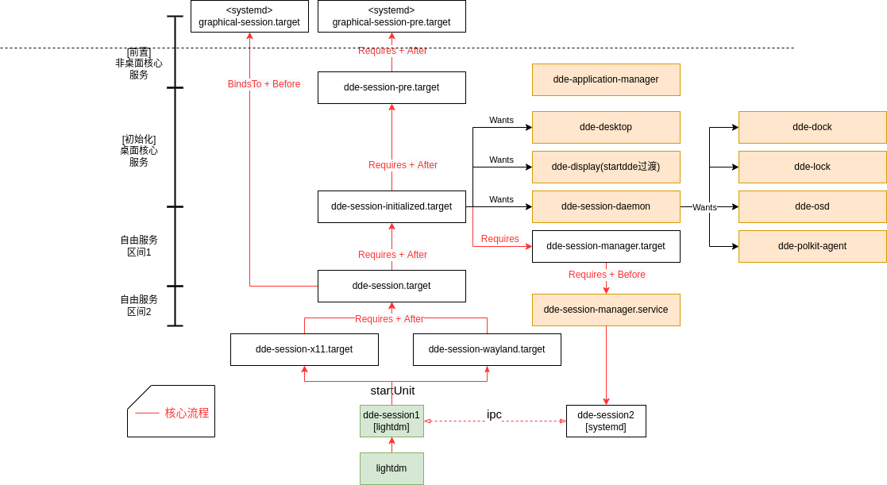

lightdm 在认证通过以后，会启动 ocean-session，ocean-session 会通过 systemd 的 dbus 启动 org.lingmo.ocean.Session1.service

在 org.lingmo.ocean.Session1.service 中会执行 ocean-session-ctl --systemd-service，启动 ocean-session-x11.target.

注销会话有两个入口，一个是 lightdm 停止会话，那么就需要一种途径去关闭启动的 session 相关的 services。
另外一个是主动启动 ocean-session-shutdown.service，在 service 中会执行 ocean-session-ctl --shutdown，去开启 ocean-session-shutdown.target,在这个
target中关联了所有服务的冲突，这样其它服务就会被关闭，等执行完毕，所有的服务都将会退出。

在一些核心的服务上也会关联上 ocean-session-shutdown.service。

在 ocean-session-manager.service 的 ExecStop 执行 /usr/libexec/ocean-session-ctl --logout，这个命令会
调用 org.lingmo.ocean.Session1.Logout() 方法，把阻塞 lightdm 的 会话入口退出，当 org.lingmo.ocean.Session1 服务在 DBus 上消失时，关联的 org.lingmo.ocean.Session1.service 服务就会停止，从而执行 /usr/libexec/ocean-session-ctl --shutdown，去启动 ocean-session-shutdown.target，将所有 OCEAN 服务冲突掉，从而完成关闭，在最后阶段，ocean-session-shutdown.target 会启动 ocean-session-restart-dbus.service 去将 dbus.service 服务停止，完成最终的防止 dbus 服务进程逃逸。

systemd unit图：

