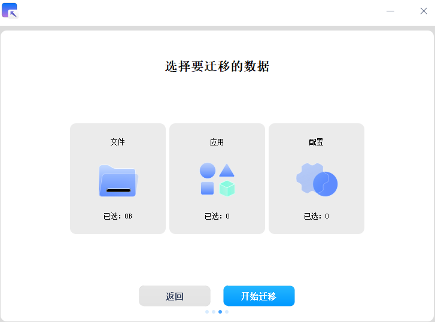

# UOS迁移工具|deepin-data-transfer|

## 概述

UOS迁移工具是一款数据迁移工具，可以一键将您的个人数据和应用数据从Windows端传输到UOS端，帮助您实现无缝更换系统。

## 建立连接

建立连接时发送端和接收端需同时打开UOS迁移工具，在Windows端输入UOS端IP地址和连接密码后，单击 **连接** 发送连接请求。若IP地址和连接密码均输入正确，网络通畅，则连接建立成功。

**UOS端：**

**Windows端：**

> 说明：发送端和接收端设备需处在相同局域网内，且仅支持对单个设备进行协同连接。

## 准备数据

连接建立成功后，UOS端为等待传输页面，Windows端为选择迁移数据页面。在Windows端单击 **文件**，在目录中选择您想要迁移的文件/文件夹，单击 **确认**。

**UOS端：**

**Windows端：**

## 数据传输

在Windows端确认迁移数据范围后，单击 **开始迁移** 进行数据传输。

> 说明：传输完成的数据，将被存放在您的home目录下。

若您在传输过程中出现网络问题导致传输中断的情况，待重新建立连接成功后，您可以单击 **继续传输** 继续上次的传输任务。

## 数据迁移结果

数据传输完成后，您可以在UOS端查看数据迁移结果。

