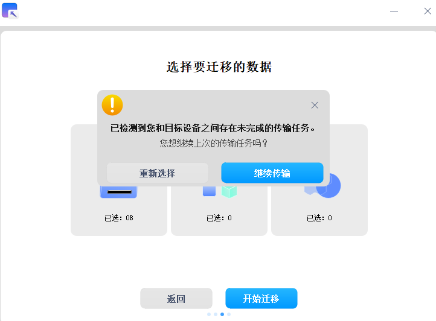

# UOS遷移工具|deepin-data-transfer|

## 概述

UOS遷移工具是一款數據遷移工具，可以一鍵將您的個人數據和應用數據從Windows端傳輸到UOS端，幫助您實現無縫更換系統。

## 建立連接

建立連接時發送端和接收端需同時打開UOS遷移工具，在Windows端輸入UOS端IP位址和連接密碼後，單擊 **連接** 發送連接請求。若IP位址和連接密碼均輸入正確，網絡通暢，則連接建立成功。

**UOS端：**

**Windows端：**

> 說明：發送端和接收端設備需處在相同局域網內，且僅支持對單個設備進行協同連接。

## 準備數據

連接建立成功後，UOS端為等待傳輸頁面，Windows端為選擇遷移數據頁面。在Windows端單擊 **文件**，在目錄中選擇您想要遷移的文件/文件夾，單擊 **確認**。

**UOS端：**

**Windows端：**

## 數據傳輸

在Windows端確認遷移數據範圍後，單擊 **開始遷移** 進行數據傳輸。

> 說明：傳輸完成的數據，將被存放在您的home目錄下

若您在傳輸過程中出現網絡問題導致傳輸中斷的情況，待重新建立連接成功後，您可以單擊 **繼續傳輸** 繼續上次的傳輸任務。

## 數據遷移結果

數據傳輸完成後，您可以在UOS端查看數據遷移結果。

