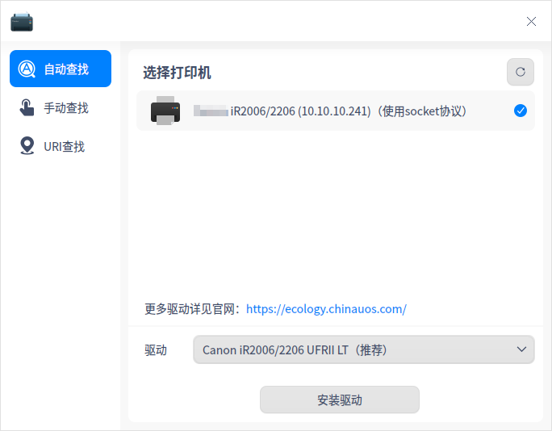
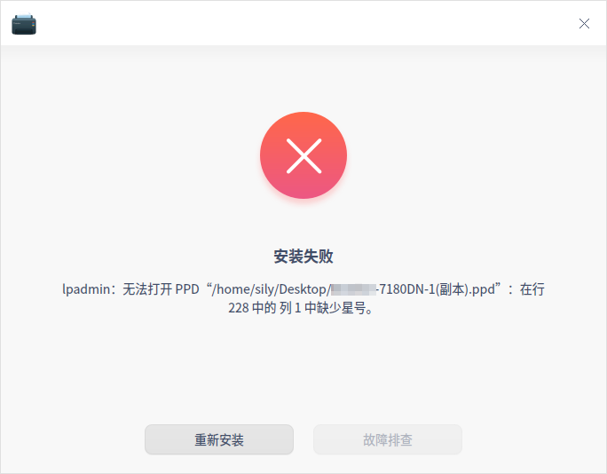
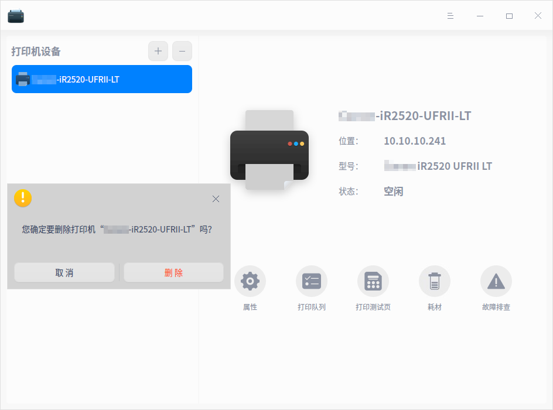

# 打印管理器|dde-printer|

## 概述

打印管理器是一款基于CUPS的打印机管理工具，可同时管理多个打印机。界面可视化，操作简单，方便用户快速添加打印机及安装驱动。

## 使用入门

您可以通过以下方式运行或关闭打印管理器，或者创建快捷方式。

### 运行打印管理器

1. 单击任务栏上的启动器图标 ，进入启动器界面。
2. 上下滚动鼠标滚轮浏览或通过搜索，找到打印管理器图标  ，单击运行。
3. 右键单击，您可以：
   - 单击 **发送到桌面**，在桌面创建快捷方式。
   - 单击 **发送到任务栏**，将应用程序固定到任务栏。
   - 单击 **开机自动启动**，将应用程序添加到开机启动项，在电脑开机时自动运行该应用程序。

### 关闭打印管理器

- 在打印管理器界面单击   ，退出打印管理器。
- 右键单击任务栏上的，选择 **关闭所有** 来退出打印管理器。
- 在打印管理器界面单击  ，选择 **退出** 来退出打印管理器。

## 添加打印机

您可以通过网络连接打印机或USB直连打印机。

### 网络连接打印机

#### 查找打印机

在打印管理器界面，单击添加按钮，可选择 **自动查找**、**手动查找**、**URI查找** 方式添加打印机。

**自动查找**

1. 单击 **自动查找** 按钮，系统会加载出打印机列表。

     

2. 勾选需要添加的打印机，系统会自动匹配打印机驱动。

   - 驱动匹配成功：单击 **安装驱动**，进入安装界面。
   - 驱动匹配失败：选择手动安装驱动或在 [官网](https://ecology.chinauos.com/) 查找、下载并安装对应驱动。单击 **下一步** 按钮，进入选择驱动界面。

**手动查找**

1. 单击 **手动查找** 按钮，输入打印机IP后单击 **查找** 按钮，系统通过各种协议扫描打印机。

   

2. 勾选需要添加的打印机，系统会自动匹配打印机驱动。

   - 驱动匹配成功：单击 **安装驱动**，进入安装界面。

   - 驱动匹配失败：选择手动安装驱动或在 [官网](https://ecology.chinauos.com/) 查找、下载并安装对应驱动。单击 **下一步** 按钮，进入选择驱动界面。

**URI查找**

在自动查找和手动查找的情况下都不能查询到打印机时，可以通过URI查找并安装打印驱动。

1. 单击 **URI查找** 按钮，输入打印机的URI。

   

2. 系统默认选择手动驱动方案安装，也可以在 [官网](https://ecology.chinauos.com/) 查找、下载并安装对应驱动。

3. 单击 **下一步** 按钮，进入选择驱动界面。

#### 选择驱动

1. 系统默认驱动：选择打印机后，如果有匹配的驱动，系统会默认选择推荐驱动。

2. 手动选择驱动：选择打印机后，手动选择驱动，驱动来源有三种。

   * 本地驱动：通过下拉框选择厂商及型号，查询本地驱动。

   

   * 本地PPD文件：将本地文件PPD文件拖放到对应地方，或单击 **选择一个PPD文件** 在本地文件夹查找，比如在/usr/share/ppd目录下选择PPD文件。

   > 说明：必须在本地安装了驱动，才可以使用PPD文件安装，否则会提示驱动安装失败。

   

   * 搜索打印机驱动：输入精确的厂商和型号，系统会在后台驱动库中搜索，搜索结果会显示在下拉框中。

   

#### 安装打印机

选择驱动后，单击 **安装驱动**，进入安装界面。

- 安装成功：弹出窗口提示安装成功，单击 **打印测试页**，查看是否可以正常打印；或单击 **查看打印机**，跳转到打印机管理界面。
  

- 安装失败：弹出窗口提示安装失败，则可选择重新安装。
  

### USB直连打印机

当打印机设备通过USB连接电脑时，打印管理器后台会自动添加该打印机设备，您可以根据配置结果进行相关操作。

> 说明：只有适配过的打印机，后台能够查询到驱动，才可能自动添加成功。

- 配置成功：弹出配置成功的通知，单击后跳转到打印管理器界面，可查看打印机详情。

  

- 配置失败：弹出配置失败的通知，单击后跳转到打印管理器界面，您可以选择手动添加驱动，详细操作请参考 [网络连接打印机](#网络连接打印机)。

## 打印管理界面

若已经成功添加了打印机，可在打印管理器界面查看详情。选中打印机，可选择属性设置、打印队列、打印测试页、查看耗材及故障排查。

### 打印属性 

1. 在打印管理器主界面，单击 **属性**，跳转到打印设置列表界面。可以查看打印机驱动、URI、位置、描述、颜色及分辨率等。
3. 还可以设置项纸张来源、纸张类型、纸张大小、双面打印、页边距位置、方向、打印顺序等。可根据您的实际需求进行设置，如纸张大小可以选择A4、A5、B5或A3等，打印方向可以选择纵向、横向或反横向等。

> 说明：打印机属性列表与打印机型号及驱动相关联，请以实际情况为准。

### 打印队列

1. 在打印管理器主界面，单击 **打印队列**，可以查看打印任务，包括全部列表、打印队列、已完成列表。系统默认选择 **打印队列** 界面。

3. 选择一个打印任务并单击右键，可选择 **取消打印**、**删除任务**、**暂停打印**、**恢复打印**、**优先打印**、**重新打印** 等操作。

### 打印测试页

在打印管理器主界面，单击 **打印测试页**，测试是否打印成功。

   - 打印成功：测试页打印成功，可进行其他的打印任务。

   - 打印失败：测试页打印失败，选择重新安装或故障排查。

### 耗材

在打印管理器主界面，单击 **耗材** 可查看打印机耗材余量，如果余量不足，则需要更换。

### 故障排查

打印失败时，在打印管理器主界面可单击 **故障排查**，排查内容如下：

   - 检查cups服务是否开启。

   - 检查驱动文件是否完整。

   - 检查打印机设置：打印机是否启动、是否接受任务。

   - 检查打印机连接状态是否正常。

### 右键菜单

在打印管理器主界面，选中打印机型号并单击右键，可以修改打印机名称、选择是否共享/启用打印机、是否接受任务等操作。

> 说明：共享打印机前必须开启  “主菜单 > 设置” 页面中的共享功能，否则即使在右键菜单中勾选了也不会生效。

## 删除打印机

在打印管理器主界面，单击，可删除选中的打印机。

## 主菜单

在主菜单中，可以设置基本服务器，切换窗口主题，查看帮助手册等。

### 设置

1. 在打印管理器界面，单击 。

2. 单击 **设置**，可以进行基本服务器设置。

   - 是否发布连接到这个系统的共享打印机。开启后可以共享已添加的打印机，同一局域网的用户才能进行连接。
   - 是否允许远程管理打印机
   - 是否保留调试信息用于故障排除

   

### 主题

窗口主题包含浅色主题、深色主题和系统主题。

1. 在打印管理器界面，单击 。
2. 单击 **主题**，选择一个主题颜色。

### 帮助

1. 在打印管理器界面，单击 。
2. 单击 **帮助**，查看帮助手册，进一步了解和使用打印管理器。

### 关于

1. 在打印管理器界面，单击 。
2. 单击 **关于**，查看打印管理器的版本和介绍。

### 退出

1. 在打印管理器界面，单击 。
2. 单击 **退出**。

