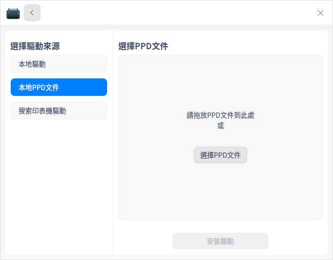
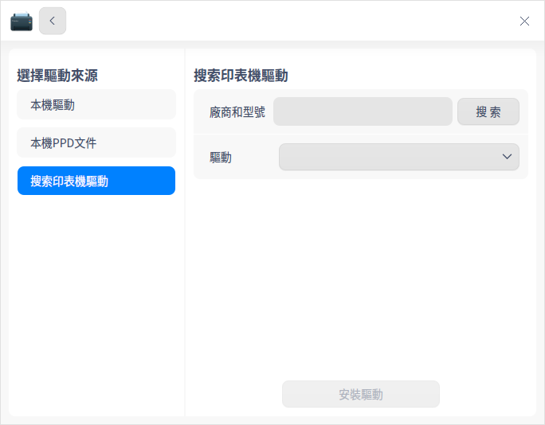
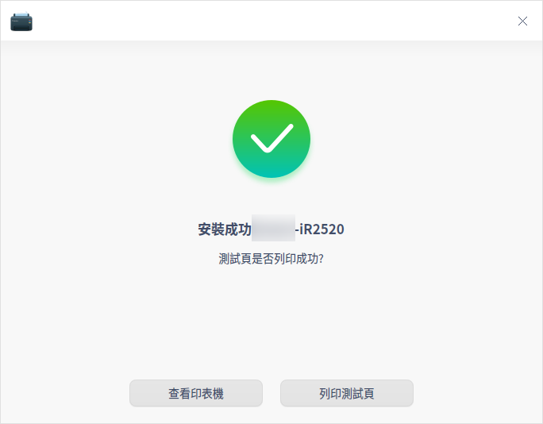
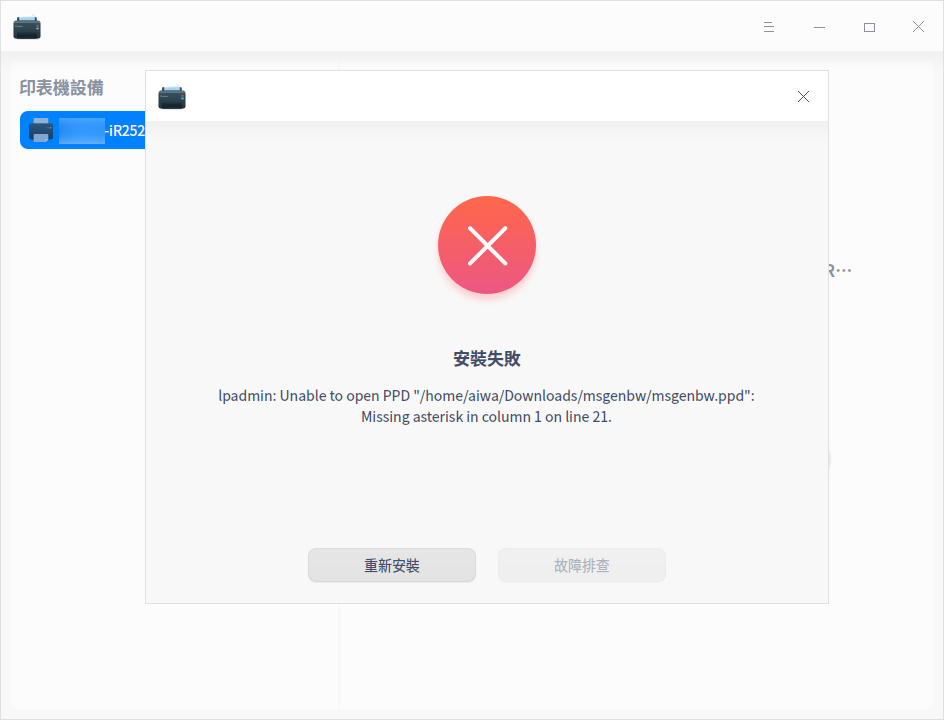
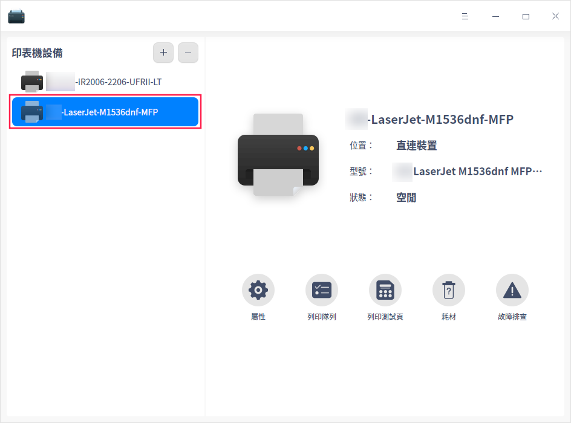
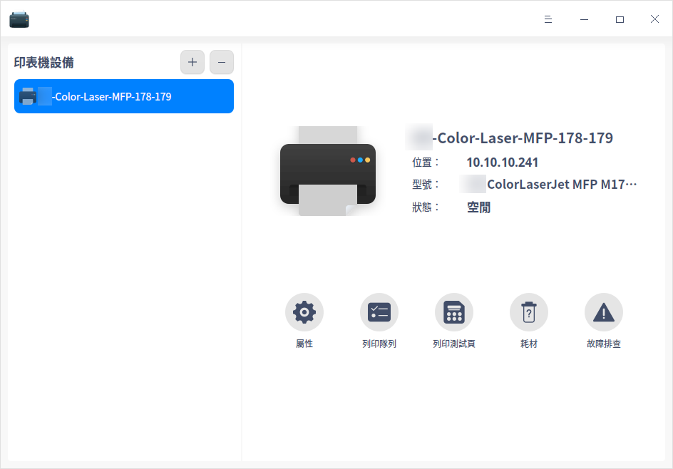
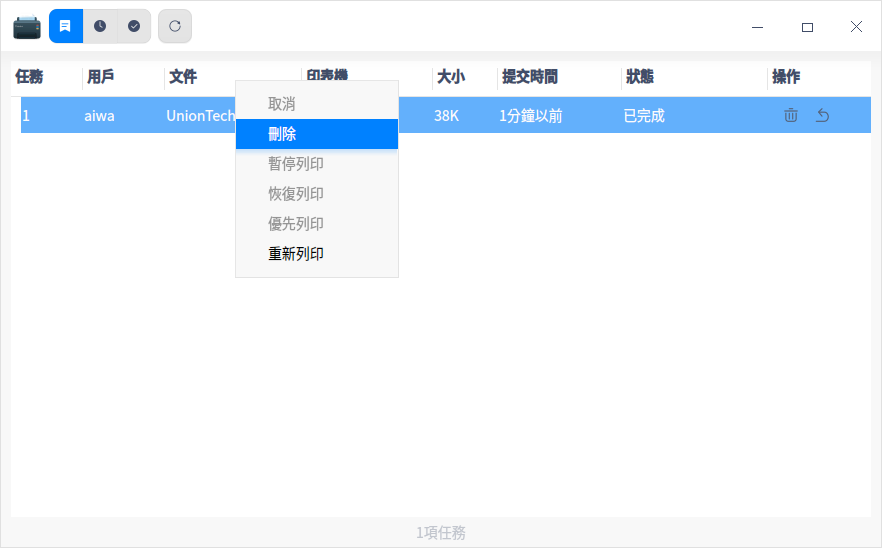
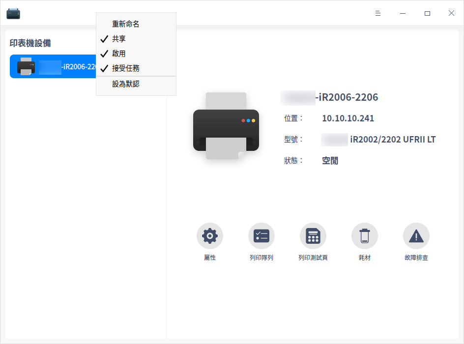
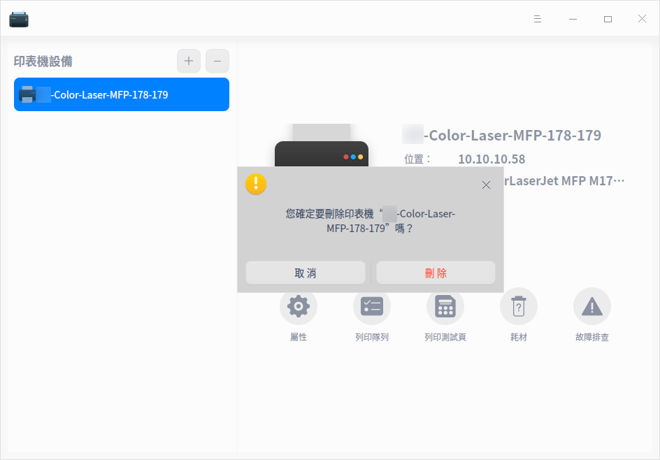

# 列印管理器|dde-printer|

## 概述

列印管理器是一款基於CUPS的印表機管理工具，可同時管理多個印表機。介面可視化，操作簡單，方便使用者快速添加印表機及安裝驅動。

## 使用入門

您可以透過以下方式執行或關閉列印管理器，或者建立捷徑。

### 執行列印管理器

1. 單擊任務欄上的啟動器 ，進入啟動器介面。
2. 上下滾動滑鼠滾輪瀏覽或透過搜尋，找到「列印管理器」按鈕 ，單擊開啟。
3. 右鍵單擊 ，您可以：
   - 單擊 **建立桌面捷徑**，在桌面建立捷徑。
   - 單擊 **釘選到Dock**，將應用程式固定到Dock。
   - 單擊 **開機啟動**，將應用程式添加到開機啟動項，在電腦開機時自動執行該應用程式。

### 關閉列印管理器

- 在列印管理器介面，單擊 ，關閉列印管理器。
- 右鍵單擊任務欄上的  圖示，選擇 **全部關閉** 來關閉列印管理器。
- 在列印管理器介面單擊 ，選擇 **離開** 來關閉列印管理器。

## 添加印表機

您可以透過網路連接印表機，或USB直連印表機。

### 網路連接印表機

#### 查找印表機

在列印管理器介面，單擊添加按鈕，可選擇 **自動查找**、**手動查找**、**URI查找** 方式添加印表機。

**自動查找**

1. 單擊 **自動查找** 按鈕，會載入出印表機列表，選擇需要添加的印表機。

2. 勾選需要添加的印表機，系統會自動匹配印表機驅動。

   - 驅動匹配成功：單擊 **安裝驅動**，進入安裝介面。
   - 驅動匹配失敗：選擇手動安裝驅動或在 [官網](https://ecology.chinauos.com/) 尋找、下載並安裝對應驅動。單擊 **下一步** 按鈕，進入選擇驅動介面。

**手動查找**

1. 單擊 **手動查找** 按鈕，輸入主機名稱或IP地址（XX.XX.XX.XX）後單擊 **查找** 按鈕查找印表機，系統透過各種協議掃描印表機。

2. 勾選需要添加的印表機，系統會自動匹配印表機驅動。

   - 驅動匹配成功：單擊 **安裝驅動**，進入安裝介面。
   - 驅動匹配失敗：選擇手動安裝驅動或在 [官網](https://ecology.chinauos.com/) 尋找、下載並安裝對應驅動。單擊 **下一步** 按鈕，進入選擇驅動介面。

**URI查找**

在 **自動查找** 和 **手動查找** 的情況下都不能查詢到印表機時，可透過URI查找並安裝列印驅動。

1. 單擊 **URI查找** 按鈕，輸入印表機的URI。

&nbsp;&nbsp;&nbsp;&nbsp;&nbsp;&nbsp;&nbsp;&nbsp;&nbsp;&nbsp;&nbsp;&nbsp;&nbsp;
2. 系統預設手動選擇驅動方案安裝，，也可以在 [官網](https://ecology.chinauos.com/) 尋找、下載並安裝對應驅動。
3. 單擊 **下一步**，進入選擇驅動介面。

#### 選擇驅動

1. 系統預設驅動：選擇印表機後，如果有匹配的驅動，系統會預設選擇推薦驅動。

2. 手動選擇驅動：選擇印表機後，選擇 **手動選擇驅動方案**，驅動來源有三種。

   - 本地驅動：透過下拉框選擇廠商及型號，查詢本地驅動。

   

   - 本地PPD文件：將本地PPD文件拖放到對應地方，或單擊 **選擇PPD文件** 在本地資料夾尋找，比如在/usr/share/ppd目錄下選擇ppd文件。

      >  說明：使用前提是使用者必須在本地安裝了驅動，才可以使用PPD文件安裝。否則，會提示驅動安裝失敗。

   

   - 搜索印表機驅動：輸入精確的廠商和型號，系統會在後台驅動庫中探測搜索，搜索結果會顯示在下拉框中。

   

#### 安裝印表機

添加印表機選擇驅動後，單擊 **開始安裝**，進入安裝介面。

- 安裝成功
  彈出視窗提示安裝成功，可以單擊 **列印測試頁**，查看是否可以正常列印；或單擊 **查看印表機**，跳轉到列印管理介面。

- 安裝失敗
  彈出視窗提示安裝失敗，則可選擇重新安裝。

### USB直連印表機

當印表機裝置透過USB連接電腦時，列印管理器後台會自動添加該印表機裝置，您可以根據配置結果進行相關操作。

> 說明：只有適配過的印表機，後台才能夠查詢到驅動，才可能自動添加成功。

- 配置成功：彈出配置成功的通知，單擊後跳轉到列印管理介面，可查看印表機詳情。

- 配置失敗：彈出配置失敗的通知，單擊後跳轉到列印管理介面，您可以選擇手動添加驅動，詳細操作請參考 [網路連接印表機](#網路連接印表機)。

## 列印管理介面

若已經成功添加了印表機，打開應用，進入列印管理介主介面。選中印表機，可選擇屬性、列印隊列、列印測試頁、查看耗材及故障排查。

### 列印屬性 

1. 在列印管理器主介面，單擊 **屬性**，跳轉到列印設定列表介面。可以查看印表機驅動、URI、位置、描述、顏色及解析度等。
2. 還可以設定項紙張來源、紙張類型、紙張大小、雙面列印、頁邊距位置、方向、列印順序等。可根據您的實際需求進行設定，如紙張大小可以選擇A4、A5、B5或A3等，列印方向可以選擇縱向、橫向或反橫向等。

> 說明：印表機屬性列表與印表機型號及驅動相關聯，請以實際情況為準。

### 列印隊列

1. 在列印管理器主介面，單擊 **列印隊列**，可以查看列印任務，包括全部列表、列印隊列、已完成列表。系統預設選擇 **列印隊列** 介面。

2. 選擇一個列印任務並單擊右鍵，可選擇 **取消**、**刪除**、**暫停列印**、**復原列印**、**優先列印**、**重新列印** 等操作。

### 列印測試頁

在列印管理器主介面，單擊 **列印測試頁**，測試是否列印成功。

  - 列印成功：測試頁列印成功，可進行其他的列印任務。

  - 列印失敗：測試頁列印失敗，選擇重新安裝或故障排查。

### 耗材

在列印管理器主介面，單擊 **耗材** 可查看印表機耗材餘量，如果餘量不足，則需要更換。

### 故障排查

列印失敗時，在列印管理器主介面可單擊 **故障排查**，排查內容如下：

&nbsp;&nbsp;&nbsp;&nbsp;&nbsp;&nbsp;&nbsp;&nbsp;&nbsp;&nbsp;&nbsp;&nbsp;&nbsp;
  - 檢查CUPS服務是否開啟。
  - 檢查驅動文件是否完整。
  - 檢查印表機設置：印表機是否啟動、是否接受任務。
  - 檢查印表機連接狀態是否正常。

### 右鍵選單

在列印管理器主介面，選中印表機型號，單擊右鍵，可修改印表機名稱、是否共享、是否啟用、是否接受任務、是否設為默認印表機。

> 說明：共享印表機錢必須開啟“主選單>設定”頁面中的共享功能，否則即使在右鍵選單中勾選了也不會生效。

## 刪除印表機

在列印管理器主介面，單擊，可刪除選中的印表機。

## 主選單

在主選單中，您可以進行基本伺服器設定，切換視窗主題，查看說明手冊等操作。

### 設置

1. 在列印管理器主介面，單擊 。

2. 單擊 **設置**，可以進行基本伺服器設定。
   - 是否發布連接到這個系統的共享印表機，是否允許從網際網路列印。開啟後可以共享已添加的印表機，同一區域網路的使用者才能進行連接。
   - 是否允許遠程管理印表機
   - 是否保留除錯訊息用於故障排除

### 主題

視窗主題包含亮色主題、暗色主題和系統主題。

1. 在列印管理器主介面，單擊 。
2. 單擊 **主題**，選擇一個主題顏色。

### 說明

查看說明手冊，透過幫助進一步讓您了解和使用列印管理器。

1. 在列印管理器主介面，單擊 。
2. 單擊 **說明**。
3. 查看關於列印管理器的說明手冊。

### 關於

1. 在列印管理器主介面，單擊 。
2. 單擊 **關於**。
3. 查看關於列印管理器的版本和介紹。

### 離開

1. 在列印管理器主介面，單擊 。
2. 單擊 **離開**。