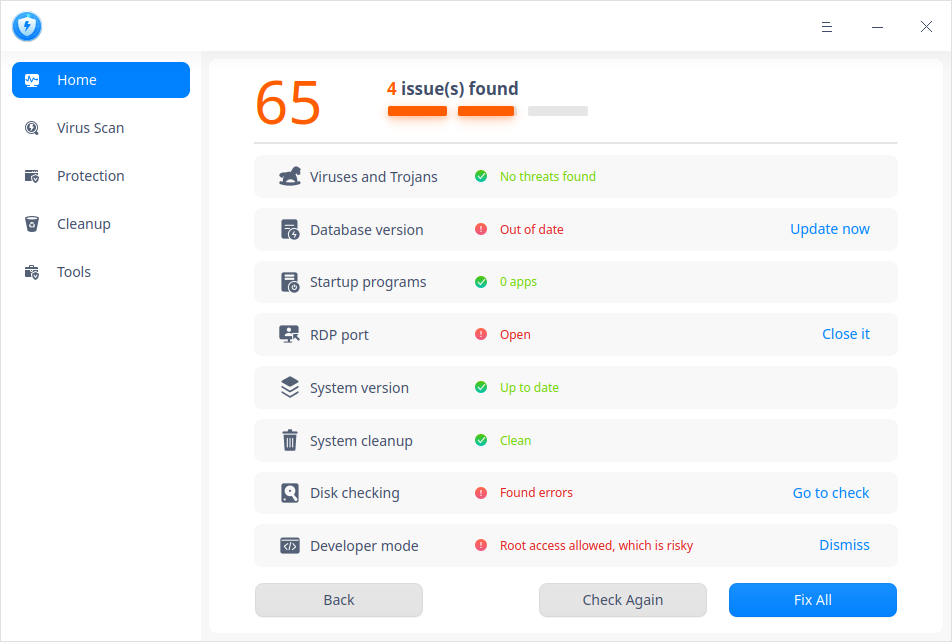
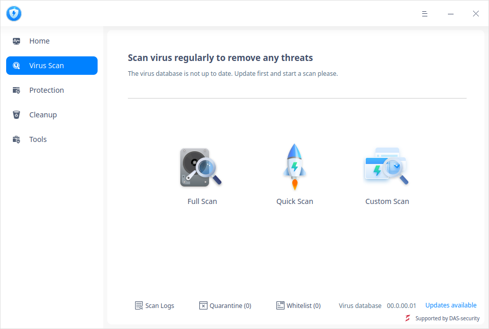
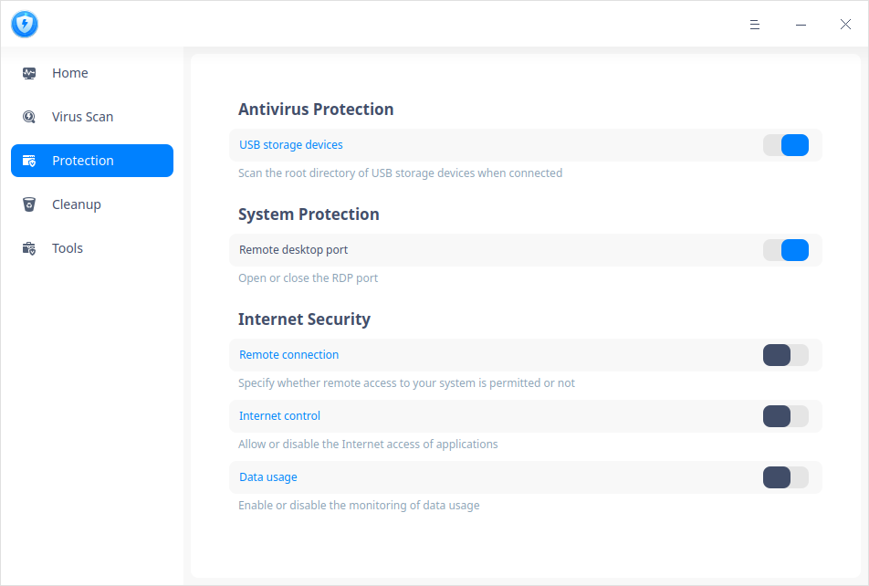
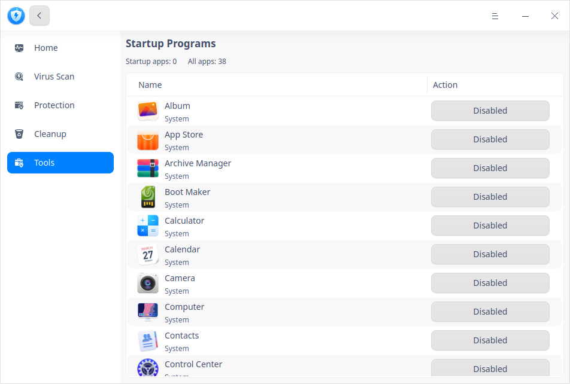
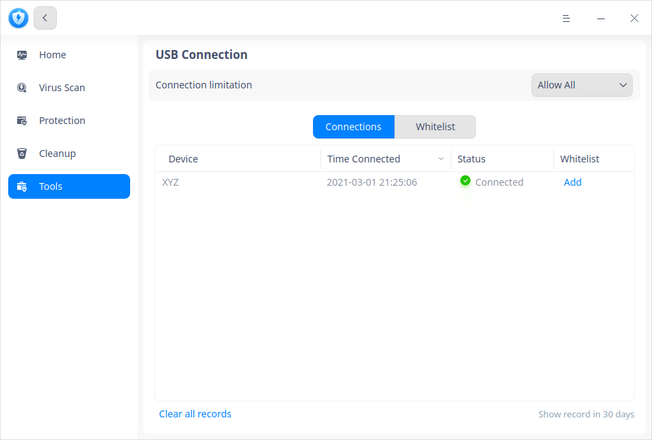
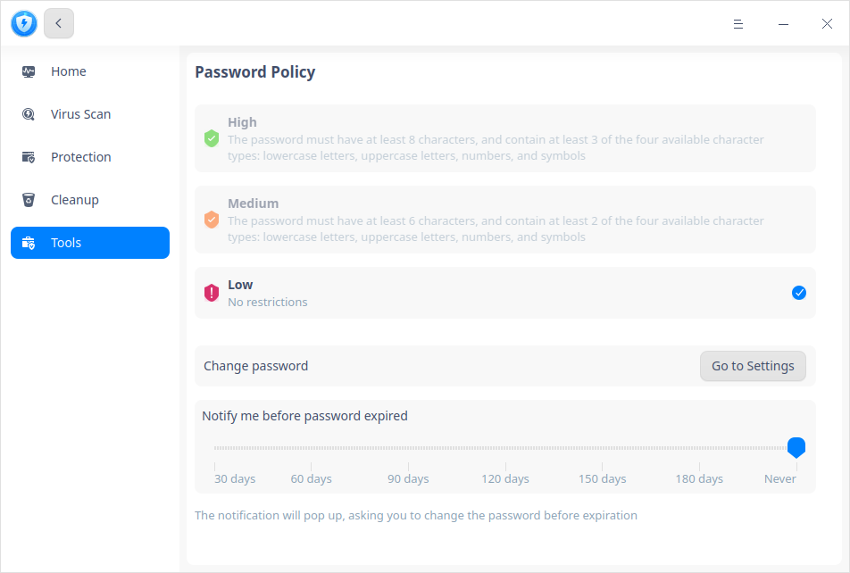

# Security Center|deepin-defender|

## Overview 

Security Center is an application that provides system security examination, virus scanning, junk cleaning and protection.

## Guide

You can run, close and create a shortcut for Security Center by the following ways.

### Run Security Center

1. Click  on dock to enter Launcher interface.
2. Locate  by scrolling mouse wheel or searching by "Security Center" in Launcher interface.
3. Right-click , you can

   - Click **Send to desktop** to create a desktop shortcut.
   - Click **Send to dock** to fix the application on dock.
   - Click **Add to startup** to add it to startup, it will automatically run when the system starts up.

### Exit Security Center

- On Security Center interface, click  to exit.
- Right-click  on Dock, select **Close All** to exit.
- Click  and select **Exit**.

## Operations

### Homepage

1. Open Security Center, click **Home** in the left panel, you can click **Check Now** to examine the system. 
2. After the system examination is finished, if there is any abnormality, you can operate on each problem item separately, for example, if you see a hint "Out of date", you can click **Check for updates**; or, you can click **Fix All** to fix many problems.

### Virus Scan
#### Scanning

Security Center supports full scanning, quick scanning, and custom scanning.

1. On the homepage, click **Virus Scan** in the left panel, and select a scanning method. After scanning finishes, you will see the result.

2. According to the result, you can choose corresponding operations to one or multiple results.

   **Singularly Operation:**

   Repair: click , this risk will be fixed, and it won't be diagnosed as a risk for the next time.

   Quarantine: click , this risk will be quarantined, other files would not be affected. It won't be diagnosed as a risk for the next time. You can click **Quarantine** icon below to view it. 
   
   Trust: click , this risk will be trusted. It won't be diagnosed as a risk for the next time. You can click **Whitelist** icon below to view it. 
   
   **Batch Operation:**
   
   Check all risks you want to deal with, select **Repair Now**, **Quarantine Now** or **Add to Whitelist** from the drop-down box, and then click **Start**. 

#### Quarantine
On the interface of Virus Scan, you can click **Quarantine** icon below to view the list of quarantined files, and click **Restore** to move them out of it.

#### Whitelist
On the interface of Virus Scan, you can click **Whitelist** icon below to view the list of quarantined files, and click **Remove** to move them out of it.

#### Scan Logs
On the interface of Virus Scan, you can click **Scan Logs** icon below to view scanning time, scan type, results and action. Click  to view details and you can also delete logs.

#### Virus database update

New virus keep coming out everyday. So your virus database should be regularly updated to satisfy the security needs of your computer.

On the interface of Virus Scan, whenever there is a new virus database, you can click **Updates available** in the lower right corner to choose whether to update it. 

### Protection

Open Security Center, click **Protection** in the left panel, you can choose whether to switch on antivirus protection, system protection and Internet security or not. 

#### Antivirus Protection

Antivirus Protection function is on by default, which can scan the USB storage devices connected to the computer for virus. If abnormal virus is found in files in USB storage devices, corresponding processing can be carried out to protect the system from virus invasion.

Click **USB storage devices** to go to the security setting page to make relative settings.

- Ask me: After the virus scanning is completed, a processing prompt will pop up. You can choose **Cancel**(which means do not process) or **Remove Threats**. If nothing is done, it will be canceled by default.
- Auto remove threats: abnormal virus are removed automatically after scanning finishes.

#### System Protection

The remote desktop port of the operating system is opened by default. When the login password is extremely simple, the system is easy to be broken when it is invaded.

- Off: close the remote desktop port.

- On: open the remote desktop port.

#### Internet Security

**Remote Connection**

This function controls the applications that are able to call remote services in the system, and it is turned off by default.

- Off: the remote connection control does not take effect, and the applications can call the remote access service by default.
- On: the remote connection control takes effect. Click **Remote connection** to jump to the security setting interface and set the processing mode.
   + Ask me always(default):  when an application or service starts up port listening, a prompt saying “xxx wants to start remote connection” pops up. And you can select **Allow Once**, **Allow always** or **Disable**. 
   + Allow always: whenever the application starts up remote connection, it is allowed by default, and no prompt will pop up. 
   + Disable always: when an application or service starts up port listening, a prompt saying “The firewall has blocked xxx from remote connection” pops up. And you can select **Go to Settings** or **OK**. 

**Internet control**

This function controls the default Internet access settings of all applications and services, and it is turned off by default.

- Off: when an application connects to the Internet, no control is carried out.
- On: connecting to the Internet is controlled. Click **Internet control** to go to the interface of **Tools**. Please refer to [Internet Control](#Internet Control) under Chapter "Tools" for details.

**Data Usage**

This function monitors the data usage of the applications in the system, and it is turned off by default.

- Off: the data usage monitoring service is not turned on, and the specific network traffic data cannot be viewed in the interface.

- On: start the data usage monitoring service, and click **Data usage** to jump to the "Data Usage" interface of **Tools**. Please refer to [Data Usage](#Data Usage) under Chapter "Tools" for details.

### Cleanup

Operating system will produce all kinds of junks in the daily operation. When more and more junks are generated, the efficiency of the system will be affected, and disk resources are wasted. It is suggested to clean up the garbage regularly to ensure the smooth operation of the system and improve the utilization rate of resources.

1. Open Security Center and select **Cleanup** in the left panel to enter the garbage cleaning interface.

2. Check the corresponding garbage type. Currently, you can choose to clean up system junk, application junk, traces and cookies.

3. Click **Scan Now** to enter the scanning interface.

4. After scanning, the junks found in scanning can be viewed and disposed accordingly.

   - Clean up: clean up all the selected junks. You can also cancel or check more options.
   - Back: return to the cleaning interface without any processing.

5. Click **Done** after cleaning. You can also click **Cancel** during cleaning up.

### Tools

Open Security Center and select **Tools** in the left panel. Click the small icons to use the tools accordingly. 

#### Data Usage

Before using this function, turn on the "Data usage" button in **Protection**. Otherwise, the following operations will not take effect.

In the Data Usage interface, you can view the current networking applications and traffic ranking.

- Apps and Services: view all applications started, and display the current downloading speed and uploading speed of each application. Click the drop-down box to select **Ask**, **Allow** or **Disable**. Refer to [Internet Control](#Internet Control) under Chapter "Tools" to see if the application can connect to the Internet.

- Rankings: view the traffic ranking of all applications in the Launcher, including downloading traffic, uploading traffic, total traffic and data used details. Click the drop-down box in the upper right corner of the list to switch time span: today, yesterday, this month and last month.

#### Startup Programs

In this interface, only applications in the Launcher are displayed and detailed by "Name", "Auto Startup" and "Action". You can choose "Enabled" or "Disabled" for each application. 

#### Internet Control

Before using this function, turn on the "Internet control" button in **Protection**. Otherwise, the following operations will not take effect.

This function  is used to set the networking status of a single application in the Launcher. Each application or service has three options in the drop-down box.

- Ask: when an application or service starts up port listening, a prompt saying “xxx wants to connect to the Internet” pops up. And you can select **Allow Once**, **Allow always** or **Disable**. 

- Allow: whenever the application starts up remote connection, it is allowed by default, and no prompt will pop up. 
- Disable: when an application or service starts up port listening, a prompt saying “The firewall has blocked xxx from connecting to the Internet” pops up. And you can select **Go to Settings** or **OK**. 

#### USB Connection

On **USB Connection** interface, you can view all history about USB devices with storage function connecting to your computer.

You can also add the USB device used very often into whitelist, and select **Only Whitelist** in **Connection limitation** to avoid data breach.

#### Login Safety
On **Login Safety** interface, you can set password security levels and notifying period before password expired and change password regularly. 
- **High** or **Medium**: If you have chosen either one of them, when you modify password in Control Center or setup password when creating new ID, the password you set will not be saved successfully if it doesn't comply with the requirement of the corresponding level. You can go to Control Center to reset your password or modify security level in Security Center. 
- **Low**:  If you have chosen this option, when you modify password in Control Center or setup password when creating new ID, the new password will be saved directly. 

## Main Menu

You can switch themes, view manual and version information in Main Menu.

### Settings

Click on the interface. Select **Settings**.

#### Basic

**Virus Scan**
- Add "Virus scan" to the context menu: after you check this option, when you right-click a folder, you can select **Virus scan**.
- Do not scan archives larger than xxxMB(20-5120): after you check this option, if a package is larger than the size you set here, it won't be scanned.
- Virus database server address: after you check this option, you can set the address for virus database updating.

**Antivirus Engine**

You can choose "Rising" or "DAS-security".

**Close Main Window**
   - you can click **Minimize to system tray**. When you close the main window, it will be minimized to system tray.
   - you can click **Exit**. When you close the main window, you will exit Security Center directly.
   - you can click **Ask me always**. When you close the main window, the system will pop up a query to get your confirmation.

#### Security

- USB Storage Devices: refer to [Antivirus Protection](#Antivirus Protection) under Chapter "Protection". 
- Remote Connection: refer to Remote Connection in [Internet Security](#Internet Security) under Chapter "Protection". 

#### Restore Defaults

Click **Restore Defaults** button to restore the current page to defaults.

### Report issues

1. Click on the interface. 
2. Select **Report issues** to go to **Consults** interface of **Support** application where you can give your feedback.

### Logs

1. Click on the interface. 
2. Select **Logs**, you can view operation logs of Security Center according to "Date and Time" and "Category". You can also select to **Clear below logs**. 

### Theme

The window theme includes Light Theme, Dark Theme and System Theme.

1. Click on the interface.
2. Click  **Theme** to select one.

### Help

View the manual to help you further know and use Security Center.

1. Click on the interface.
2. Click **Help** to view the manual.

### About

1. Click on the interface.
2. Click **About** to view version information and introduction about Security Center.

### Exit

1. Click on the interface.
2. Click **Exit**.

