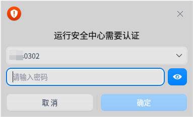
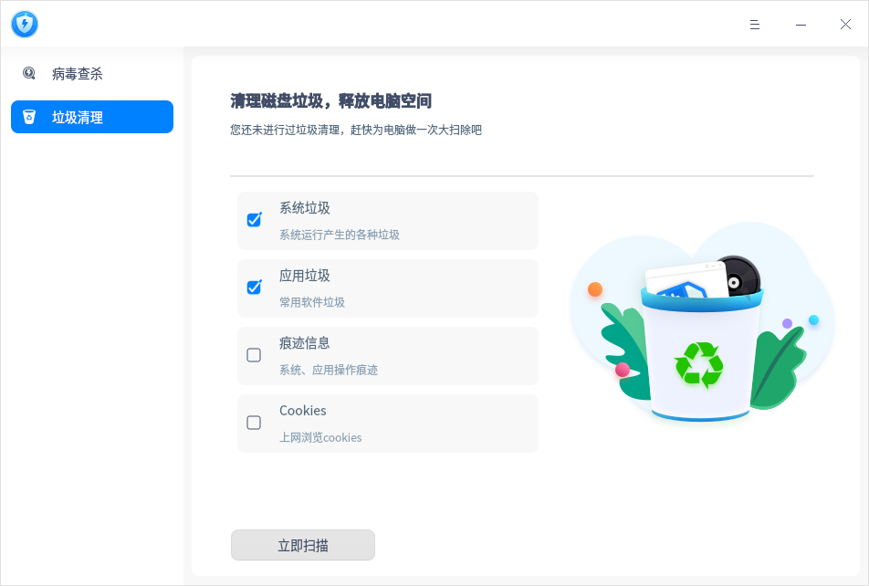
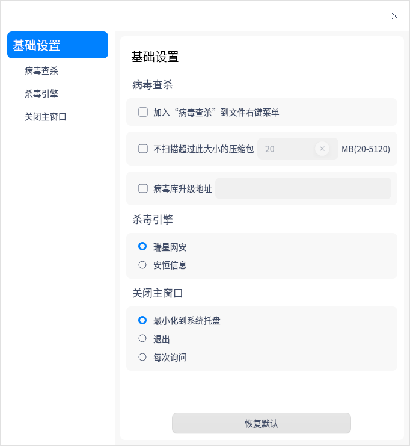

# 安全中心|deepin-defender|

## 概述

安全中心是一款提供系统病毒查杀和垃圾清理的应用工具。

## 使用入门

您可以通过以下方式运行或关闭安全中心，或者创建快捷方式。

### 运行安全中心

1. 单击任务栏上的启动器图标，进入启动器界面。

2. 上下滚动鼠标滚轮浏览或通过搜索，找到安全中心图标 ，单击运行  。弹出授权框，需要输入系统登录密码进行认证。

   

3. 右键单击 ，您可以：
   - 单击 **发送到桌面**，在桌面创建快捷方式。

   - 单击 **发送到任务栏**，将应用程序固定到任务栏。

   - 单击 **开机自动启动**，将应用程序添加到开机启动项，在电脑开机时自动运行该应用程序。

### 关闭安全中心

- 在安全中心界面单击，退出安全中心。
- 右键单击任务栏上的 ，选择 **关闭所有** 来退出安全中心。
- 在安全中心界面单击  ，选择 **退出** 来退出安全中心。

## 操作介绍

### 病毒查杀
#### 病毒扫描

安全中心支持三种病毒扫描方式，分别为全盘扫描、快速扫描和自定义扫描。

1. 打开安全中心，选择左侧导航栏的 **病毒查杀**。在病毒查杀界面，选择病毒扫描方式，扫描完成后会显示扫描结果。

   

2. 根据扫描结果，可以对每个风险项单独操作，也可以选择批量操作。

   **单项操作**：

   - 修复：单击修复按钮  后，风险项被修复，下次扫描不会被判定为异常。

   - 隔离：单击隔离按钮  后，风险项被隔离，隔离后不会影响其他文件，下次扫描不会被判定为异常，可在隔离区查看。

   - 信任：单击信任按钮  后，风险项被信任，下次扫描不会被判定为异常，可在信任区查看。
   
   **批量操作**：
   
   勾选需要处理的风险项后，在页面底部的下拉框中选择 **立即修复**、**立即隔离** 或 **添加信任** 选项后，单击 **执行**，则可以批量处理风险项。
   
   

#### 隔离区

在病毒查杀界面，单击 **隔离区**，可查看隔离文件列表，还可以选择将文件移出隔离。

#### 信任区

在病毒查杀界面，单击 **信任区**，可查看信任文件列表，还可以选择将文件移出信任。

#### 查杀日志

在病毒查杀界面，单击 **查杀日志**，可查看每次病毒扫描的时间、扫描类型及结果。单击详情按钮 ，可查看日志详情，还可以选择删除日志。

#### 病毒库更新

每天都有新病毒产生，所以要定期更新病毒库，以满足计算机的安全需求。

在病毒查杀界面，如果有新的病毒库，在界面右下角单击 **有更新** 后，您可以选择是否更新病毒库。

### 垃圾清理

操作系统在日常运行中会产生各种垃圾，当垃圾越来越多，会影响系统的运行效率，浪费磁盘资源。建议定期清理垃圾，保障系统运行流畅，提升资源利用率。

1. 打开安全中心，选择左侧导航栏的 **垃圾清理**，进入垃圾清理界面。

2. 勾选对应的垃圾类型，当前可以选择清理系统垃圾、应用垃圾、痕迹信息和Cookies。

   

3. 单击 **立即扫描**，进入扫描界面。

4. 扫描完成后，可查看扫描发现的垃圾，并进行相应的处理。
   - 立即清理：清理所有选中的垃圾，您还可以自行取消勾选或者增加勾选。

   - 返回：不做任何处理，返回到垃圾清理界面。

5. 清理完成后单击 **完成** 即可，清理过程中还可以单击 **取消清理。**

## 主菜单

在主菜单中，您可以进行基础设置、切换窗口主题，查看帮助手册等操作。

### 设置

在安全中心界面，单击 ，选择 **设置** ，您可以进行以下设置。

**病毒查杀**

- 加入 “病毒查杀” 到文件右键菜单：勾选后，单击文件（夹）右键可直接选择 **病毒查杀**。
- 不扫描超过此大小的压缩包：勾选后，若压缩包超过设定的大小，则不会进行扫描。
- 病毒库升级地址：勾选后，可设置病毒库升级地址。

**杀毒引擎**

可以选择瑞星网安或安恒信息杀毒引擎。

**关闭主窗口**

- 选择 **最小化到系统托盘**，关闭主窗口时，应用将隐藏到系统托盘。
- 选择 **退出**，关闭主窗口时直接退出应用。
- 选择**每次询问**，每次关闭主窗口时会弹出确认弹框。

**恢复默认**

单击 **恢复默认** ，恢复默认设置。

### 主题

窗口主题包含浅色主题、深色主题和系统主题。

1. 在安全中心界面，单击。
2. 选择 **主题**，选择一个主题颜色。

### 帮助

1. 在安全中心界面，单击 。
2. 选择 **帮助**，查看关于安全中心的帮助手册，进一步了解和使用安全中心。

### 关于

1. 在安全中心界面，单击 。
2. 选择 **关于**，查看安全中心的版本和介绍。

### 退出

1. 在安全中心界面，单击 。
2. 选择 **退出**。

 