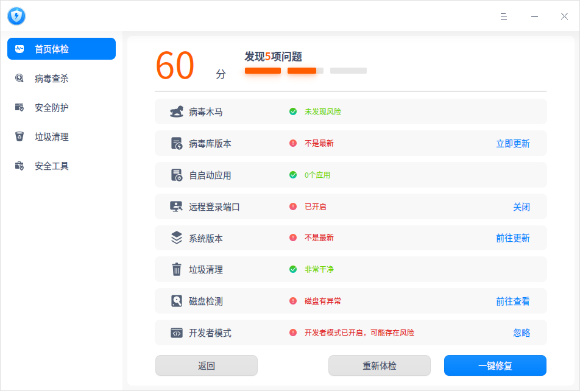
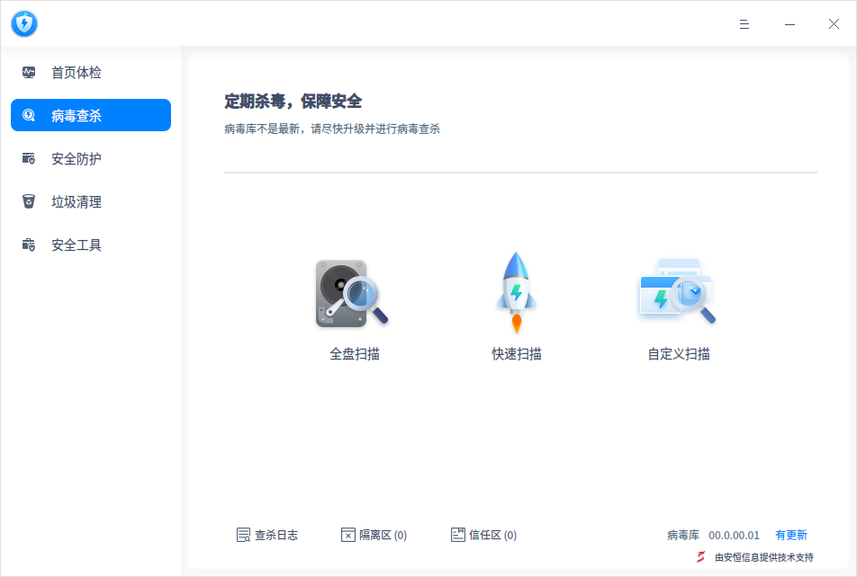
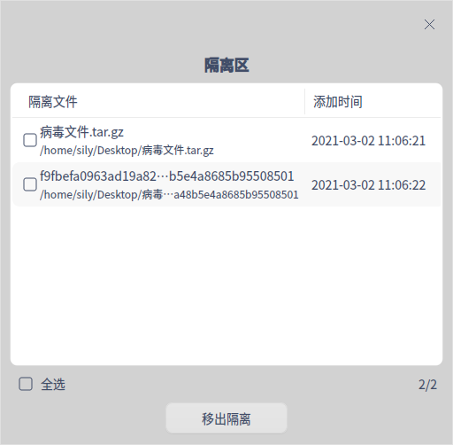
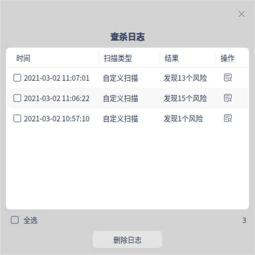
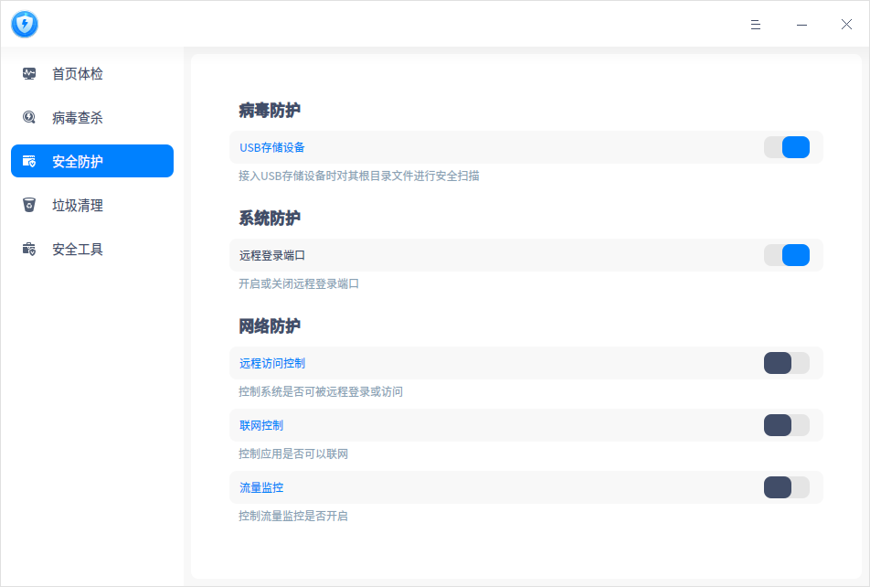
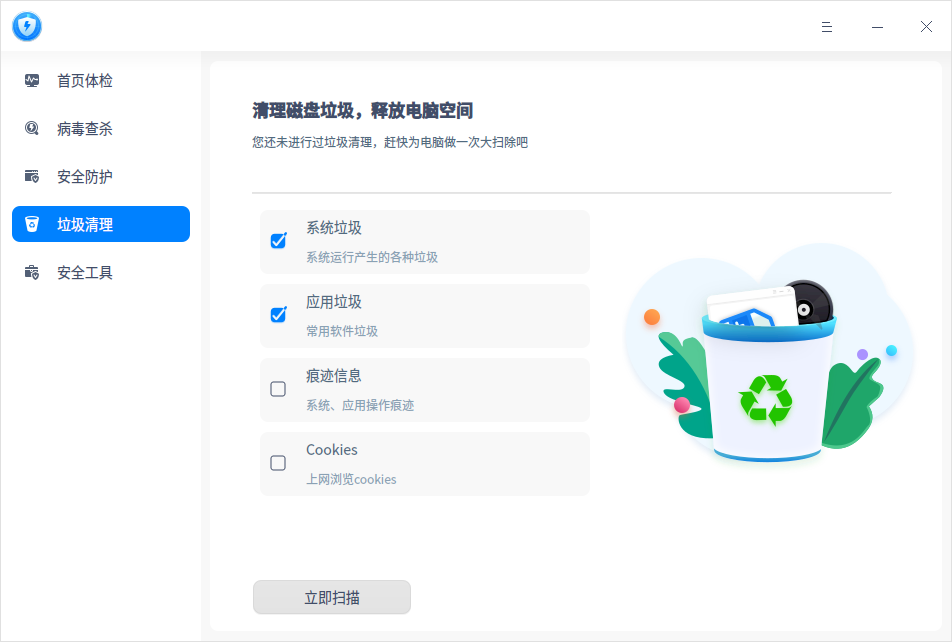
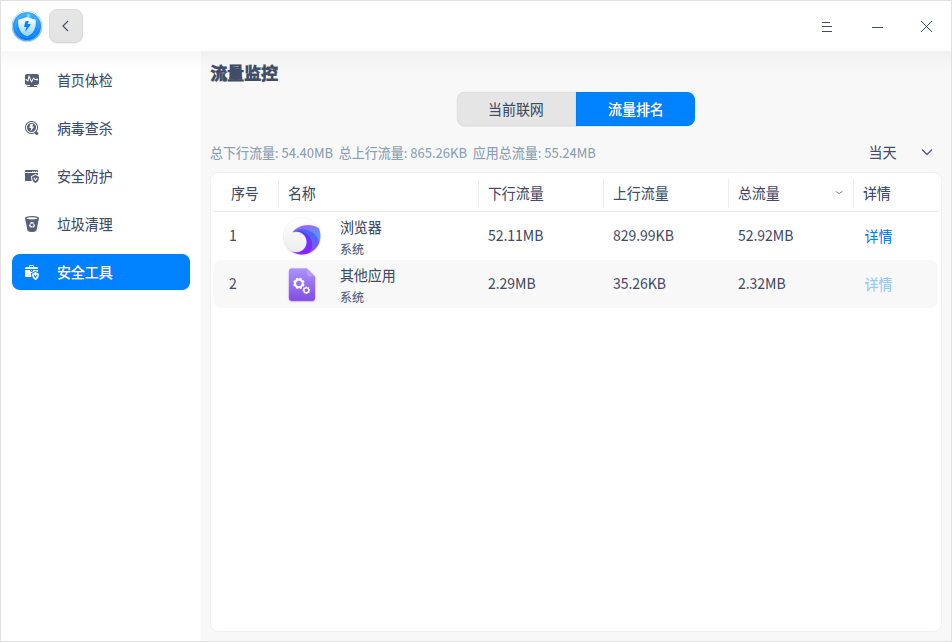
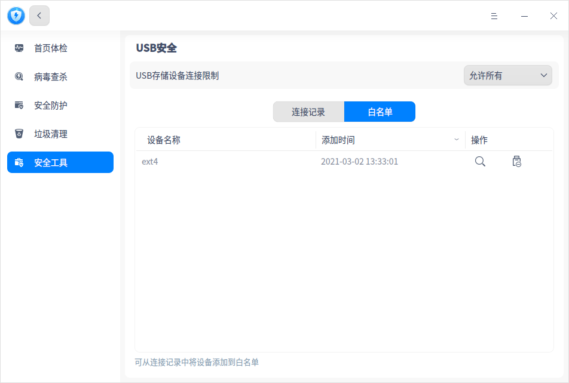
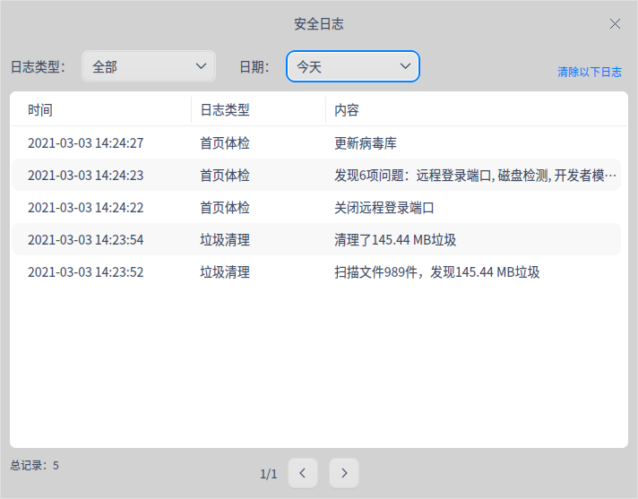

# 安全中心|deepin-defender|

## 概述

安全中心是一款提供系统安全检测、病毒查杀、垃圾清理以及安全防护的应用工具。

## 使用入门

您可以通过以下方式运行或关闭安全中心，或者创建快捷方式。

### 运行安全中心

1. 单击任务栏上的启动器图标，进入启动器界面。
2. 上下滚动鼠标滚轮浏览或通过搜索，找到安全中心图标 ，单击运行  。
3. 右键单击 ，您可以：
   - 单击 **发送到桌面**，在桌面创建快捷方式。

   - 单击 **发送到任务栏**，将应用程序固定到任务栏。

   - 单击 **开机自动启动**，将应用程序添加到开机启动项，在电脑开机时自动运行该应用程序。

### 关闭安全中心

- 在安全中心界面单击，退出安全中心。
- 右键单击任务栏上的 ，选择 **关闭所有** 来退出安全中心。
- 在安全中心界面单击  ，选择 **退出** 来退出安全中心。

## 操作介绍

### 首页体检

1. 打开安全中心，选择左侧导航栏的 **首页体检**，单击 **立即体检** 后进行系统体检。

2. 体检完后，若有异常则可以对每个问题项单独操作，比如 “系统版本不是最新”，单击 **前往更新** 即可。还可以单击  **一键修复** 修复多项问题。

   

### 病毒查杀
#### 病毒扫描

安全中心支持三种病毒扫描方式，分别为全盘扫描、快速扫描和自定义扫描。

1. 打开安全中心，选择左侧导航栏的 **病毒查杀**。在病毒查杀界面，选择病毒扫描方式，扫描完成后会显示扫描结果。

   

2. 根据扫描结果，可以对每个风险项单独操作，也可以选择批量操作。

   **单项操作**：

   - 修复：单击修复按钮  后，风险项被修复，下次扫描不会被判定为异常。

   - 隔离：单击隔离按钮  后，风险项被隔离，隔离后不会影响其他文件，下次扫描不会被判定为异常，可在隔离区查看。

   - 信任：单击信任按钮  后，风险项被信任，下次扫描不会被判定为异常，可在信任区查看。
   
   **批量操作**：
   
   勾选需要处理的风险项后，在页面底部的下拉框中选择 **立即修复**、**立即隔离** 或 **添加信任** 选项后，单击 **执行**，则可以批量处理风险项。
   
   

#### 隔离区

在病毒查杀界面，单击 **隔离区**，可查看隔离文件列表，还可以选择将文件移出隔离。

#### 信任区

在病毒查杀界面，单击 **信任区**，可查看信任文件列表，还可以选择将文件移出信任。

#### 查杀日志

在病毒查杀界面，单击 **查杀日志**，可查看每次病毒扫描的时间、扫描类型及结果。单击详情按钮 ，可查看日志详情，还可以选择删除日志。

#### 病毒库更新

每天都有新病毒产生，所以要定期更新病毒库，以满足计算机的安全需求。

在病毒查杀界面，如果有新的病毒库，在界面右下角单击 **有更新** 后，您可以选择是否更新病毒库。

### 安全防护

打开安全中心，选择左侧导航栏的 **安全防护**。在安全防护界面，您可以选择是否开启病毒防护、系统防护和网络防护功能。

#### 病毒防护

病毒防护功能默认开启，可以对接入电脑的USB存储设备进行病毒扫描。如发现USB存储设备文件有异常病毒，则可以进行相应的处理，保障系统避免病毒的侵害。

单击 **USB存储设备** 可以跳转到安全设置界面，设置USB存储设备的处理方式。

- 询问：病毒扫描完成后，弹出处理提示，您可以选择 **取消** 不处理，还可以选择 **立即处理**。若不做任何处理，则默认取消不处理。
- 自动处理：病毒扫描完成后自动处理异常病毒。

#### 系统防护

操作系统远程登录端口默认开启，当登录密码极其简单的时候，系统被入侵时容易被攻破。

- 开关关闭：关闭远程登录端口。
- 开关开启：开启远程登录端口。

#### 网络防护

**远程访问控制**

对系统里有调用远程服务的应用进行管控，远程访问控制功能默认关闭。

- 开关关闭：远程访问控制功能不生效，默认应用可以调用远程访问服务。
- 开关开启：远程访问控制功能生效，单击 **远程访问控制 ** 可以跳转到安全设置界面，设置远程访问控制的处理方式。
  - 每次询问（默认选项）：应用或服务开启端口监听时，给出提示 “xxx需要开启远程访问”，您可以选择 **仅允许本次**、**始终允许** 或 **禁止**。 
  - 默认允许：应用每次开启远程访问的时候，默认允许，不会弹框提示。
  - 默认禁止：应用或服务开启端口监听时，给出提示 “防火墙已禁止xxx开启远程访问”，您可以选择 **前往设置** 或 **确定**。

**联网控制**

对系统里的应用做联网的控制限制，联网控制功能默认关闭。

- 开关关闭：不对应用联网进行控制。

- 开关开启：对应用联网进行控制，单击 **联网控制 ** 可以跳转到安全工具中的联网控制界面 ，详细内容请参考安全工具中的 [联网控制](#联网控制)。

**流量监控**

对系统里应用上网所使用的流量情况进行监控，流量监控功能默认关闭。

- 开关关闭：流量监控服务不开启，在流量监控界面查看不到具体网络流量数据。
- 开关开启：启动流量监控服务，单击  **流量监控 ** 可以跳转到安全工具中的流量监控界面， 详细内容请参考安全工具中的 [流量监控](#流量监控)。

### 垃圾清理

操作系统在日常运行中会产生各种垃圾，当垃圾越来越多，会影响系统的运行效率，浪费磁盘资源。建议定期清理垃圾，保障系统运行流畅，提升资源利用率。

1. 打开安全中心，选择左侧导航栏的 **垃圾清理**，进入垃圾清理界面。

2. 勾选对应的垃圾类型，当前可以选择清理系统垃圾、应用垃圾、痕迹信息和Cookies。

   

3. 单击 **立即扫描**，进入扫描界面。

4. 扫描完成后，可查看扫描发现的垃圾，并进行相应的处理。
   - 立即清理：清理所有选中的垃圾，您还可以自行取消勾选或者增加勾选。

   - 返回：不做任何处理，返回到垃圾清理界面。

5. 清理完成后单击 **完成** 即可，清理过程中还可以单击 **取消清理。**

### 安全工具

打开安全中心，选择左侧导航栏的 **安全工具**。在安全工具界面，单击对应图标则可以使用小工具。

#### 流量监控

使用前需打开安全防护界面的流量监控开关，否则以下操作将不会生效。

在流量监控界面，可查看当前联网应用和流量排名。

- 当前联网：查看所有启动中的应用，并展示每个应用当前的下行网速、上行网速。单击管控下拉框，可以选择 **询问**、**允许** 或 **禁止** 选项，控制应用是否能联网，详细操作可参考安全工具中的 [联网控制](#联网控制)。

  

- 流量排名：查看启动器里所有应用的流量排名，包括下行流量、上行流量、总流量、流量时间分布详情。列表右上角支持切换时间跨度：当天、昨天、当月、上月。

  
  

#### 自启动应用

开机自启动管理界面仅显示启动器里的应用，包括应用名称、自启动状态和操作按钮。每个应用可选择允许或禁止开机自启动。

#### 联网控制

使用前需打开安全防护界面中的联网控制开关，否则以下操作将不会生效。

联网控制是设置启动器中单个应用联网的状态，每个应用或服务下拉框有三种选项。

- 询问：应用联网时给出提示 ”xxx需要连接网络“，您可以选择 **仅允许本次**、**始终允许** 或 **禁止**。 

- 允许：应用联网时默认允许，不会有提示信息。

- 禁止：应用联网时给出提示 ”防火墙已禁止xxx连接网络“，您可以选择 **前往设置** 或 **确定**。 

  

#### USB安全

在USB安全界面，可以查看带存储功能的 USB 设备连接电脑的记录。

还可以将常用的USB设备加入白名单，设置只允许白名单设备连接电脑，防止电脑数据泄露。

#### 登录安全

在登录安全界面，可以设置密码安全等级，还可以设置密码到期提醒时间，定期更换密码。

- 安全等级为 **高** 或 **中** ：在控制中心修改密码，或创建新用户设置密码时，若设置的密码不符合级别要求，会保存失败，您可以前往安全中心修改等级或重新设置密码。
- 安全等级为 **低** ：在控制中心修改密码，或创建新用户设置密码的时候，直接保存新设置的密码。

## 主菜单

在主菜单中，您可以进行相关参数设置、问题反馈、切换窗口主题，查看帮助手册等操作。

### 设置

在安全中心界面，单击 ，选择 **设置** ，您可以进行基础设置及安全设置。

#### 基础设置

**病毒查杀**

- 加入 “病毒查杀” 到文件右键菜单：勾选后，单击文件（夹）右键可直接选择 **病毒查杀**。
- 不扫描超过此大小的压缩包：勾选后，若压缩包超过设定的大小，则不会进行扫描。
- 病毒库升级地址：勾选后，可设置病毒库升级地址。

**杀毒引擎**

可以选择瑞星网安或安恒信息杀毒引擎。

**关闭主窗口**

- 选择 **最小化到系统托盘**，关闭主窗口时，应用将隐藏到系统托盘。
- 选择 **退出**，关闭主窗口时直接退出应用。
- 选择**每次询问**，每次关闭主窗口时会弹出确认弹框。

#### 安全设置

- USB存储设备：详细设置内容可参考安全防护的 [病毒防护](#病毒防护)。

- 远程访问控制：详细设置内容可参考安全防护的 [远程访问控制](#网络防护)。

#### 恢复默认

单击 **恢复默认** ，恢复默认设置。

### 用户反馈

1. 在安全中心界面，单击 。
2. 选择 **用户反馈**，跳转到 “服务与支持”应用的留言咨询界面，您可以反馈相关问题。

### 安全日志

1. 在安全中心界面，单击 。

2. 选择 **安全日志**，可以根据日志类型和日期查看安全中心的操作日志，还可以选择清除日志。

   

### 主题

窗口主题包含浅色主题、深色主题和系统主题。

1. 在安全中心界面，单击。
2. 选择 **主题**，选择一个主题颜色。

### 帮助

1. 在安全中心界面，单击 。
2. 选择 **帮助**，查看关于安全中心的帮助手册，进一步了解和使用安全中心。

### 关于

1. 在安全中心界面，单击 。
2. 选择 **关于**，查看安全中心的版本和介绍。

### 退出

1. 在安全中心界面，单击 。
2. 选择 **退出**。

 