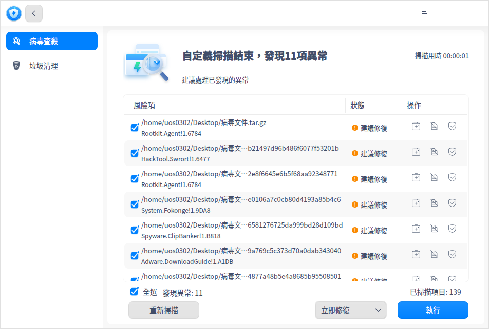
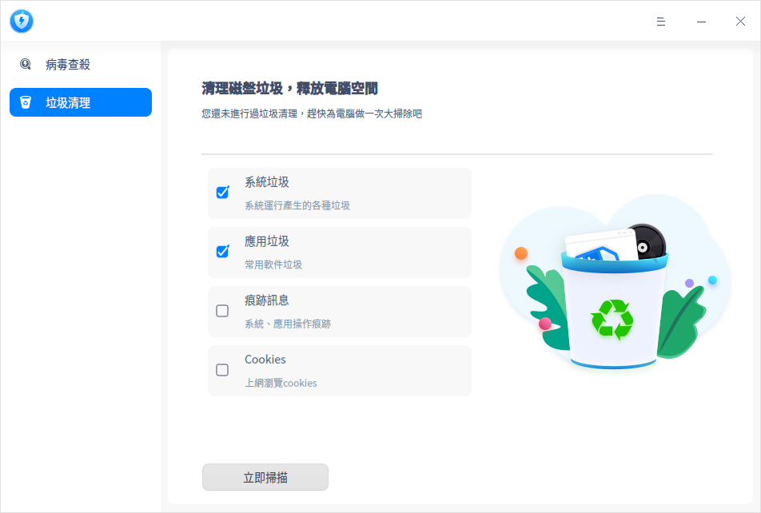
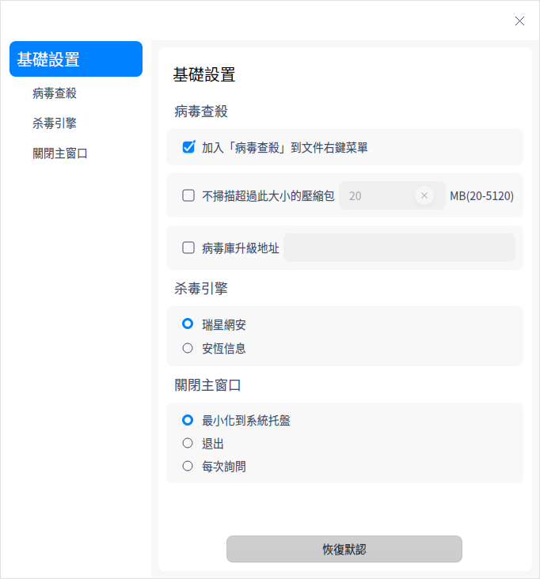

# 安全中心|deepin-defender|

## 概述

安全中心是一款提供系統病毒查殺和垃圾清理的應用工具。

## 使用入門

您可以通過以下方式運行或關閉安全中心，或者創建快捷方式。

### 運行安全中心

1. 單擊任務欄上的啟動器圖標 ，進入啟動器界面。

2. 上下滾動鼠標滾輪瀏覽或通過搜索，找到安全中心圖標 ，單擊運行。彈出授權框，需要輸入系統登錄密碼進行認證。

   

3. 右鍵單擊 ，您可以：
   - 單擊 **傳送到桌面**，在桌面創建快捷方式。

   - 單擊 **傳送到任務欄**，將應用程序固定到任務欄。

   - 單擊 **加至開機啟動**，將應用程序添加到開機啟動項，在電腦開機時自動運行該應用程序。

### 關閉安全中心

- 在安全中心界面單擊 ，退出安全中心。

- 右鍵單擊任務欄上的  ，選擇 **關閉所有** 來退出安全中心。

- 在安全中心界面單擊 ，選擇 **退出** 來退出安全中心。

## 操作介绍

### 病毒查殺
#### 病毒掃描

安全中心支持三種病毒掃描方式，分別為全盤掃描、快速掃描和自定義掃描。

1. 在安全中心主界面，選擇左側導航欄的 **病毒查殺**。在病毒查殺界面，根據需求選擇病毒掃描方式，掃描完成後會顯示掃描結果。

   

2. 根據掃描結果，可以對每個風險項單獨操作，也可以選擇批量操作。

   **單項操作**：

   - 修復：單復按鈕  後，風險項被修復，下次掃描不會被判定為異常。

   - 隔離：單擊隔離按鈕  後，風險項被隔離，隔離後不會影響其他文件，下次掃描不會被判定為異常，可在隔離區查看。
   
   - 信任：單擊信任按鈕  後，風險項被信任，下次掃描不會被判定為異常，可在信任區查看。

	**批量操作**：
	
	勾選需要處理的風險項後，在頁面底部的下拉框中選擇 **立即修復**、**立即隔離** 或 **添加信任** 選項後，單擊 **執行**，則可以批量處理風險項。
	
	

#### 隔離區

在病毒查殺界面，單擊 **隔離區**，可查看隔離文件列表，還可以選擇將文件移出隔離。

#### 信任區

在病毒查殺界面，單擊 **信任區**，可查看信任文件列表，還可以選擇將文件移出信任。

#### 查殺日誌

在病毒查殺界面，單擊 **查殺日誌**，可查看每次病毒掃描的時間、掃描類型及結果。單擊詳情按鈕 ，可查看日誌詳情，還可以選擇刪除日誌。

#### 病毒庫更新

每天都有新病毒產生，所以要定期更新病毒庫，以滿足計算機的安全需求。

在病毒查殺界面，如果有新的病毒庫，在界面右下角單擊 **有更新** 後，您可以選擇是否更新病毒庫。

### 垃圾清理

操作系統在日常運行中會產生各種垃圾，當垃圾越來越多，會影響系統的運行效率，浪費磁盤資源。建議定期清理垃圾，保障系統運行流暢，提升資源利用率。

1. 打開安全中心，選擇左側導航欄的 **垃圾清理**，進入垃圾清理界面。

2. 勾選對應的垃圾類型，當前可以選擇清理系統垃圾、應用垃圾、痕跡訊息和Cookies。

   

3. 單擊 **立即掃描**，進入掃描界面。

4. 掃描完成後，可查看掃描發現的垃圾，並進行相應的處理。
   - 立即清理：清理所有選中的垃圾，您還可以自行取消勾選或者增加勾選。

   - 返回：不做任何處理，返回到垃圾清理界面。

5. 清理完成後單擊 **完成** 即可，清理過程中還可以單擊 **取消清理**。

## 主菜單

在主菜單中，您可以進行基礎設置、切換窗口主題，查看幫助手冊等操作。

### 設置

在安全中心界面，單擊 ，選擇 **設置** ，您可以進行以下設置。

**病毒查殺**

- 加入 “病毒查殺” 到文件右鍵菜單：勾選後，單擊文件（夾）右鍵可直接選擇 **病毒查殺**。
- 不掃描超過此大小的壓縮包：勾選後，若壓縮包超過設定的大小，則不會進行掃描。
- 病毒庫升級地址：勾選後，可設置病毒庫升級地址。

**殺毒引擎**

可以選擇瑞星網安或安恆訊息殺毒引擎。

**關閉主窗口**

- 選擇 **最小化到系統托盤**，關閉主窗口時，應用將隱藏到系統托盤。
- 選擇 **退出**，關閉主窗口時直接退出應用。
- 選擇**每次詢問**，每次關閉主窗口時會彈出確認彈框。

**恢復默認**

單擊 **恢復默認** ，恢復默認設置。

### 主題

窗口主題包含淺色主題、深色主題和跟隨系統主題。

1. 在安全中心界面，單擊 。
2. 選擇 **主題**，選擇一個主題顏色。

### 幫助

1. 在安全中心界面，單擊 。
2. 選擇 **幫助**，查看幫助手冊，進一步了解和使用安全中心。

### 關於

1. 在安全中心界面，單擊 。
2. 選擇 **關於**，查看安全中心的版本和介紹。

### 退出

1. 在安全中心界面，單擊 。
2. 選擇 **退出**。

 