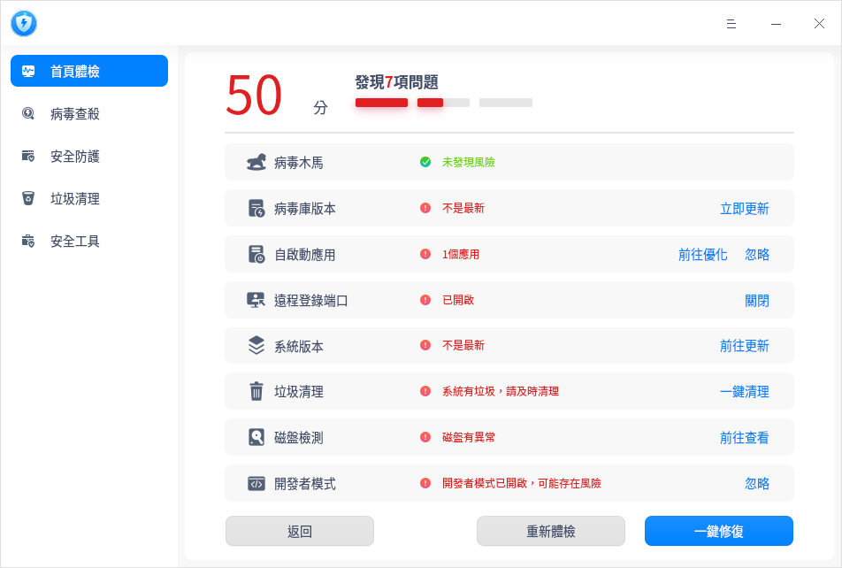
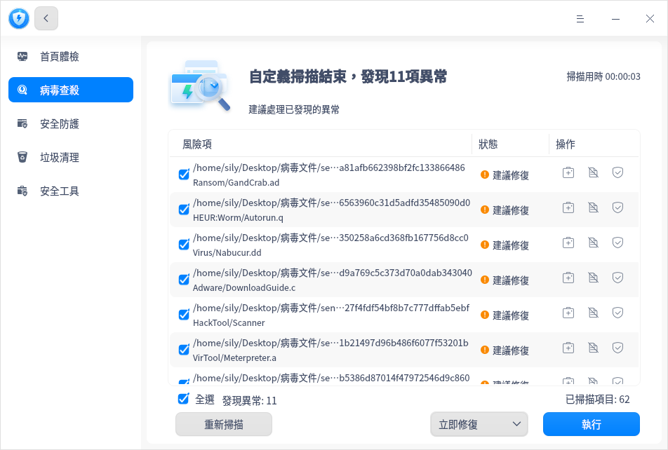
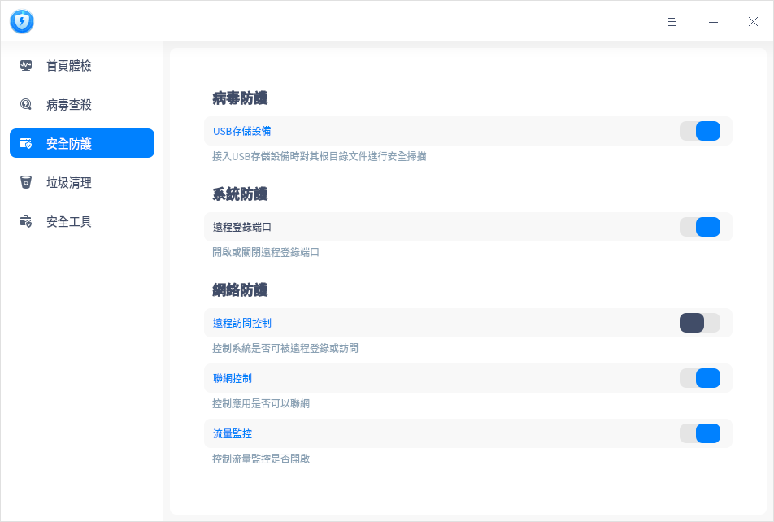
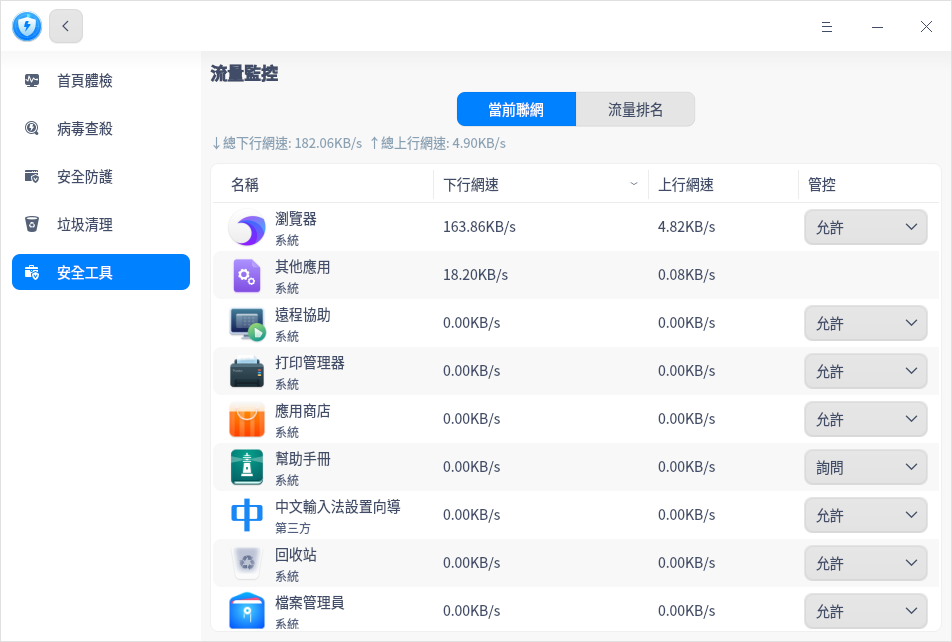
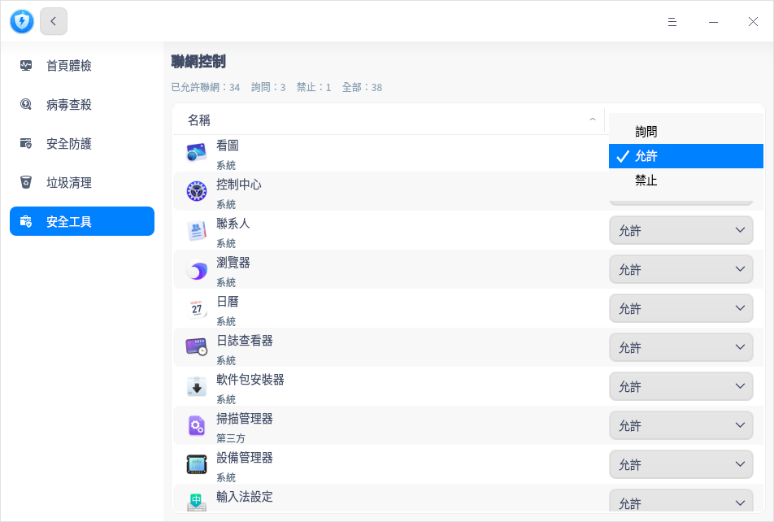
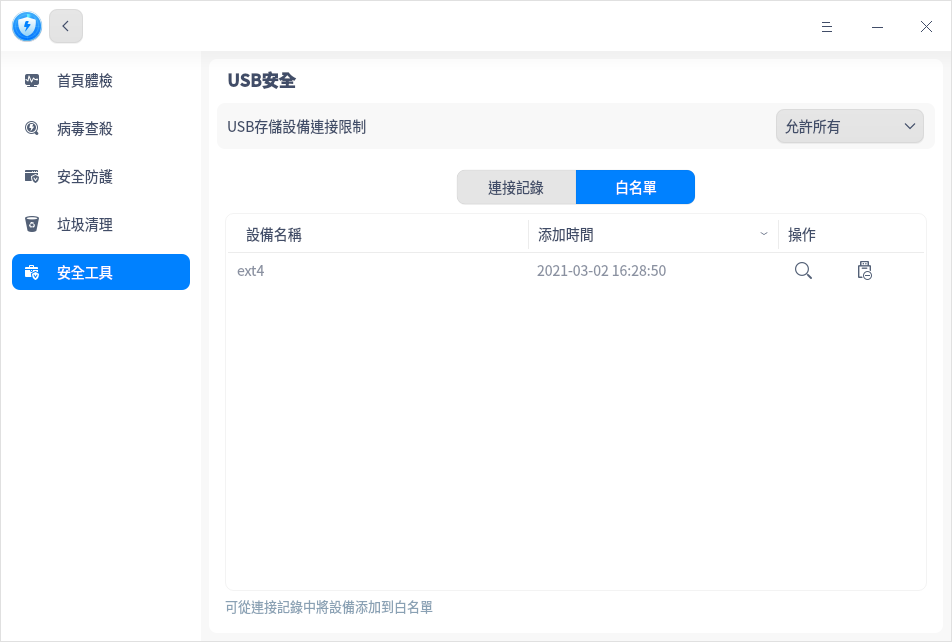
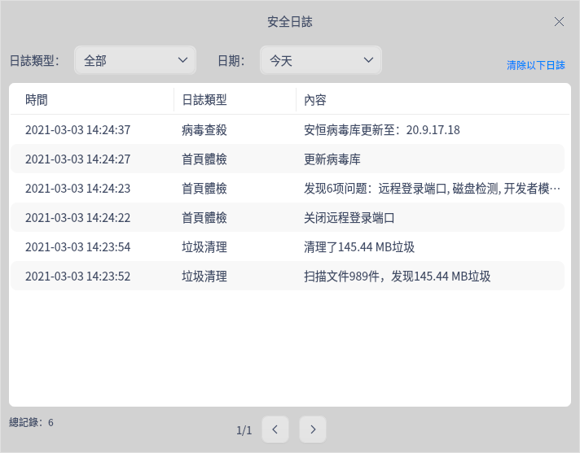

# 安全中心|deepin-defender|

## 概述

安全中心是一款提供系統安全檢測、病毒查殺、垃圾清理以及安全防護的應用工具。

## 使用入門

您可以通過以下方式運行或關閉安全中心，或者創建快捷方式。

### 運行安全中心

1. 單擊任務欄上的啟動器圖標 ，進入啟動器界面。
2. 上下滾動鼠標滾輪瀏覽或通過搜索，找到安全中心圖標 ，單擊運行。
3. 右鍵單擊 ，您可以：
   - 單擊 **傳送到桌面**，在桌面創建快捷方式。

   - 單擊 **傳送到任務欄**，將應用程序固定到任務欄。

   - 單擊 **加至開機啟動**，將應用程序添加到開機啟動項，在電腦開機時自動運行該應用程序。

### 關閉安全中心

- 在安全中心界面單擊 ，退出安全中心。

- 右鍵單擊任務欄上的  ，選擇 **關閉所有** 來退出安全中心。

- 在安全中心界面單擊 ，選擇 **退出** 來退出安全中心。

## 操作介绍

### 首頁體檢

1. 打開安全中心，選擇左側導航欄的 **首頁體檢**，單擊 **立即體檢** 后進行系統體檢。

2. 體檢完後，若有異常則可以對每個問題項單獨操作，比如 「系統有垃圾，請及時清理」，單擊 **一鍵清理** 即可。還可以單擊  **一鍵修復** 修復多項問題。

   

### 病毒查殺
#### 病毒掃描

安全中心支持三種病毒掃描方式，分別為全盤掃描、快速掃描和自定義掃描。

1. 在安全中心主界面，選擇左側導航欄的 **病毒查殺**。在病毒查殺界面，根據需求選擇病毒掃描方式，掃描完成後會顯示掃描結果。

   

2. 根據掃描結果，可以對每個風險項單獨操作，也可以選擇批量操作。

   **單項操作**：

   - 修復：單復按鈕  後，風險項被修復，下次掃描不會被判定為異常。

   - 隔離：單擊隔離按鈕  後，風險項被隔離，隔離後不會影響其他文件，下次掃描不會被判定為異常，可在隔離區查看。
   
   - 信任：單擊信任按鈕  後，風險項被信任，下次掃描不會被判定為異常，可在信任區查看。

	**批量操作**：
	
	勾選需要處理的風險項後，在頁面底部的下拉框中選擇 **立即修復**、**立即隔離** 或 **添加信任** 選項後，單擊 **執行**，則可以批量處理風險項。
	
	

#### 隔離區

在病毒查殺界面，單擊 **隔離區**，可查看隔離文件列表，還可以選擇將文件移出隔離。

#### 信任區

在病毒查殺界面，單擊 **信任區**，可查看信任文件列表，還可以選擇將文件移出信任。

#### 查殺日誌

在病毒查殺界面，單擊 **查殺日誌**，可查看每次病毒掃描的時間、掃描類型及結果。單擊詳情按鈕 ，可查看日誌詳情，還可以選擇刪除日誌。

#### 病毒庫更新

每天都有新病毒產生，所以要定期更新病毒庫，以滿足計算機的安全需求。

在病毒查殺界面，如果有新的病毒庫，在界面右下角單擊 **有更新** 後，您可以選擇是否更新病毒庫。

### 安全防護

打開安全中心，選擇左側導航欄的 **安全防護**。在安全防護界面，您可以選擇是否開啟病毒防護、系統防護和網絡防護功能。

#### 病毒防護

病毒防護功能默認開啟，可以對接入電腦的USB存儲設備進行病毒掃描。如發現USB存儲設備文件有異常病毒，則可以進行相應的處理，保障系統避免病毒的侵害。

單擊 **USB存儲設備** 可以跳轉到安全設置界面中，設置USB存儲設備的處理方式。

- 詢問：病毒掃描完成後，彈出處理提示，您可以選擇 **取消** 不處理，還可以選擇 **立即處理**。若不做任何處理，則默認取消不處理。
- 自動處理：病毒掃描完成後自動處理異常病毒。

#### 系統防護

操作系統遠程登錄端口默認開啟，當登錄密碼極其簡單的時候，系統被入侵時容易被攻破。

- 開關關閉：關閉遠程登錄端口。
- 開關開啟：開啟遠程登錄端口。

#### 網絡防護

**遠程訪問控制**

對系統裏有調用遠程服務的應用進行管控，遠程訪問控制功能默認關閉。

- 開關關閉：遠程訪問控制功能不生效，默認應用可以調用遠程訪問服務。
- 開關開啟：遠程訪問控制功能生效，單擊 **遠程訪問控制 **可以跳轉到安全設置界面，設置遠程訪問控制的處理方式。
  - 每次詢問（默認選項）：應用或服務開啟端口監聽時，給出提示 「xxx需要開啟遠程訪問」，您可以選擇 **僅允許本次**、**始終允許** 或 **禁止**。 
  - 默認禁止：應用或服務開啟端口監聽時，給出提示「 防火牆已禁止xxx開啟遠程訪問」，您可以選擇 **前往設置** 或 **確定**。
  - 默認允許：應用每次開啟遠程訪問的時候，默認允許，不會彈框提示。

**聯網控制**

對系統裏的應用做聯網的控制限制，聯網控制功能默認關閉。

- 開關關閉：不對應用聯網進行控制。

- 開關開啟：對應用聯網進行控制，單擊 **聯網控制 ** 可以跳轉到安全工具中的聯網控制界面 ，詳細內容請參考安全工具中 [聯網控制](#聯網控制)。

**流量監控**

對系統裏應用上網所使用的流量情況進行監控，流量監控功能默認關閉。

- 開關關閉：流量監控服務不開啟，在流量監控界面查看不到具體網絡流量數據。
- 開關開啟：啟動流量監控服務，單擊  **流量監控 ** 可以跳轉到安全工具中的流量監控界面， 詳細內容請參考安全工具中 [流量監控](#流量監控)。

### 垃圾清理

操作系統在日常運行中會產生各種垃圾，當垃圾越來越多，會影響系統的運行效率，浪費磁盤資源。建議定期清理垃圾，保障系統運行流暢，提升資源利用率。

1. 打開安全中心，選擇左側導航欄的 **垃圾清理**，進入垃圾清理界面。

2. 勾選對應的垃圾類型，當前可以選擇清理系統垃圾、應用垃圾、痕跡訊息和Cookies。

   

3. 單擊 **立即掃描**，進入掃描界面。

4. 掃描完成後，可查看掃描發現的垃圾，並進行相應的處理。
   - 立即清理：清理所有選中的垃圾，您還可以自行取消勾選或者增加勾選。

   - 返回：不做任何處理，返回到垃圾清理界面。

5. 清理完成後單擊 **完成** 即可，清理過程中還可以單擊 **取消清理**。

### 安全工具

打開安全中心，選擇左側導航欄的 **安全工具**。在安全工具界面，單擊對應圖標則可以使用小工具。

#### 流量監控

使用前需打開安全防護界面的流量監控開關，否則以下操作將不會生效。

在流量監控界面，可查看當前聯網應用和流量排名。

- 當前聯網：查看所有啟動中的應用，並展示每個應用當前的下行網速、上行網速。單擊管控下拉框，可以選擇 **詢問**、**允許** 或 **禁止** 選項，控制應用是否能聯網，詳細操作可參考安全工具中 [聯網控制](#聯網控制)。

  

- 流量排名：查看啟動器裏所有應用的流量排名，包括下行流量、上行流量、總流量、流量時間分佈詳情。列表右上角支持切換時間跨度：當天、昨天、當月、上月。

  

#### 自啟動應用

開機自啟動管理界面僅顯示啟動器裏的應用，包括應用名稱、自啟動狀態和操作按鈕。每個應用可選擇允許或禁止開機自啟動。

#### 聯網控制

使用前需打開安全防護界面中的聯網控制開關，否則以下操作將不會生效。

聯網控制是設置啟動器中單個應用聯網的狀態，每個應用或服務下拉框有三種選項。

- 詢問：應用聯網時給出提示「xxx需要連接網路」，您可以選擇 **僅允許本次**、**始終允許** 或 **禁止**。 

- 允許：應用聯網時默認允許，不會有提示訊息。

- 禁止：應用聯網時給出提示 「 防火牆已禁止xxx連接網路」，您可以選擇 **前往設置** 或 **確定**。 

  

#### USB安全

在USB安全界面，可以查看帶存儲功能的 USB 設備連接電腦的紀錄。

還可以將常用的USB設備加入白名單，設置只允許白名單設備連接電腦，防止電腦數據洩露。

#### 登錄安全

在登錄安全界面，可以設置密碼安全等級，還可以設置密碼到期提醒時間，定期更換密碼。

- 安全等級為 **高** 或 **中** ：在控制中心修改密碼，或創建新用戶設置密碼時，若設置的密碼不符合級別要求，會保存失敗，您可以前往安全中心修改等級或重新設置密碼。

- 安全等級為 **低** ：在控制中心修改密碼，或創建新用戶設置密碼的時候，直接保存新設置的密碼。

## 主菜單

在主菜單中，您可以進行相關參數設置、問題反饋、切換窗口主題，查看幫助手冊等操作。

### 設置

在安全中心界面，單擊 ，選擇 **設置** ，您可以進行基礎設置及安全設置。

#### 基礎設置

**病毒查殺**

- 加入 “病毒查殺” 到文件右鍵菜單：勾選後，單擊文件（夾）右鍵可直接選擇 **病毒查殺**。
- 不掃描超過此大小的壓縮包：勾選後，若壓縮包超過設定的大小，則不會進行掃描。
- 病毒庫升級地址：勾選後，可設置病毒庫升級地址。

**殺毒引擎**

可以選擇瑞星網安或安恆訊息殺毒引擎。

**關閉主窗口**

- 選擇 **最小化到系統托盤**，關閉主窗口時，應用將隱藏到系統托盤。
- 選擇 **退出**，關閉主窗口時直接退出應用。
- 選擇**每次詢問**，每次關閉主窗口時會彈出確認彈框。

#### 安全設置

- USB存儲設備：詳細設置內容可參考安全防護的 [病毒防護](#病毒防護)。

- 遠程訪問控制：詳細設置內容可參考安全防護的 [遠程訪問控制](#網絡防護)。

#### 恢復默認

單擊 **恢復默認** ，恢復默認設置。

### 用戶反饋

1. 在安全中心界面，單擊 。
2. 選擇 **用戶反饋**，跳轉到「服務與支持」應用的留言諮詢界面，您可以反饋相關問題。

### 安全日誌

1. 在安全中心界面，單擊 。

2. 選擇 **安全日誌**，可以根據日誌類型和日期查看安全中心的操作日誌，還可以選擇清除日誌。

   

### 主題

窗口主題包含淺色主題、深色主題和跟隨系統主題。

1. 在安全中心界面，單擊 。
2. 選擇 **主題**，選擇一個主題顏色。

### 幫助

1. 在安全中心界面，單擊 。
2. 選擇 **幫助**，查看幫助手冊，進一步了解和使用安全中心。

### 關於

1. 在安全中心界面，單擊 。
2. 選擇 **關於**，查看安全中心的版本和介紹。

### 退出

1. 在安全中心界面，單擊 。
2. 選擇 **退出**。

 