# 安全中心|deepin-defender|

## 概述

安全中心是一款提供系統安全檢測、病毒查殺、垃圾清理以及安全防護的應用工具。

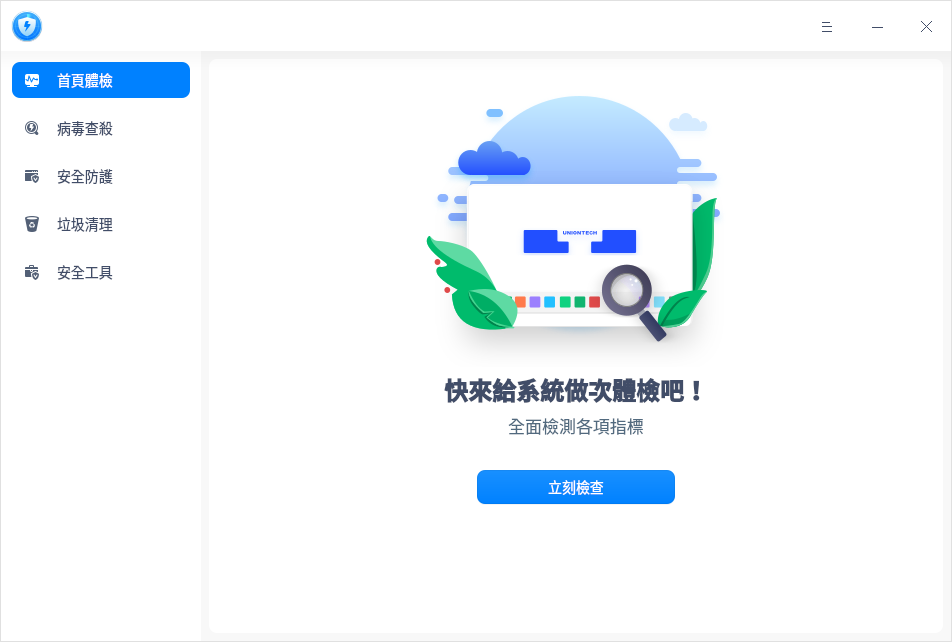

## 使用入門

您可以透過以下方式執行或關閉安全中心，或者建立捷徑。

### 執行安全中心

1. 單擊任務欄上的啟動器 ，進入啟動器介面。
2. 上下滾動滑鼠滾輪瀏覽或透過搜尋，找到「安全中心」按鈕 ，單擊開啟。
3. 右鍵單擊 ，您可以：
   - 單擊 **建立桌面捷徑**，在桌面建立捷徑。
   - 單擊 **釘選到Dock**，將應用程式固定到Dock。
   - 單擊 **開機啟動**，將應用程式添加到開機啟動項，在電腦開機時自動執行該應用程式。

### 關閉安全中心

- 在安全中心介面，單擊 ，關閉安全中心。
- 右鍵單擊任務欄上的  圖示，選擇 **全部關閉** 來關閉安全中心。
- 在安全中心介面單擊 ，選擇 **退出** 來關閉安全中心。

## 操作介紹

### 首頁體檢

1. 打開安全中心，選擇左側導航欄的 **首頁體檢**，在首頁可以單擊 **立刻檢查**，進行系統體檢。

2. 體檢完後，若有異常則可以對每個問題項單獨操作，比如「系統版本不是最新」，單擊 **前往更新** 即可。還可以單擊  **一鍵修復** 修復多項問題。

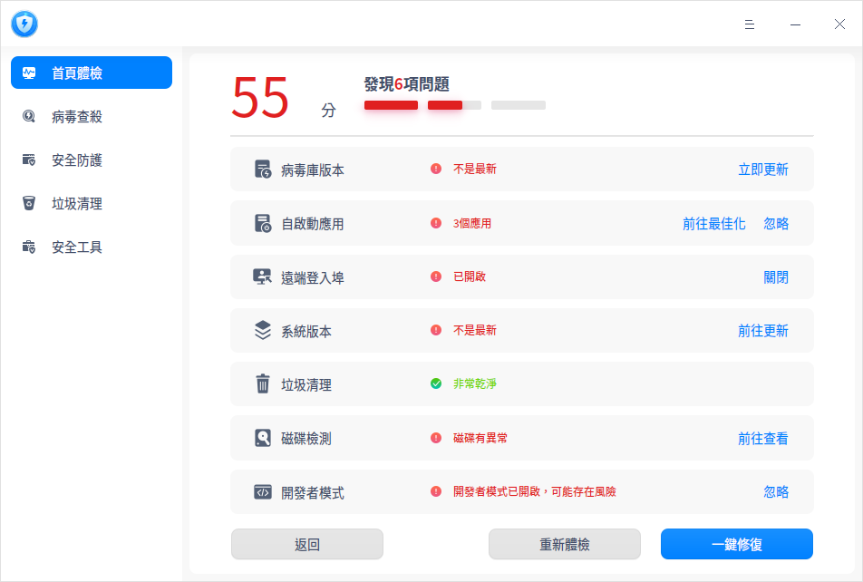

### 病毒查殺

#### 病毒掃描

安全中心支持三種病毒掃描方式，分別為全盤掃描、快速掃描和自訂掃描。

1. 在安全中心主界面，選擇左側導航欄的 **病毒查殺**。在病毒查殺界面，根據需求選擇病毒掃描方式，掃描完成後會顯示掃描結果。

   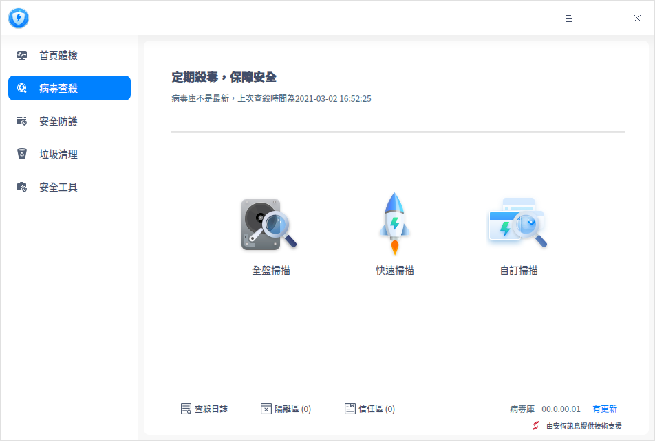
&nbsp;&nbsp;&nbsp;&nbsp;&nbsp;&nbsp;&nbsp;&nbsp;&nbsp;&nbsp;&nbsp;&nbsp;&nbsp;

2. 根據掃描結果，可以對每個風險項單獨操作，也可以選擇批量操作。有以下幾個操作項：

   **單項操作**：
   - 修復：單擊修復按鈕  後，風險項被修復，下次掃描不會被判定為異常。

   - 隔離：單擊隔離按鈕  後，風險項被隔離，隔離後不會影響其他文件，下次掃描不會被判定為異常，可在隔離區查看。

   - 信任：單擊信任按鈕  後，風險項被信任，下次掃描不會被判定為異常，可在信任區查看。

   **批次操作**：
   
   勾選需要處理的風險項後，在頁面底部的下拉框中選擇 **立即修復**、**立即隔離** 或 **添加信任** 選項後，單擊 **執行**，則可以批次處理風險項。

   

#### 隔離區

在病毒查殺界面，單擊 **隔離區**，可查看隔離文件列表，還可以選擇將文件移出隔離。

#### 信任區

在病毒查殺界面，單擊 **信任區**，可查看信任文件列表，還可以選擇將文件移出信任。

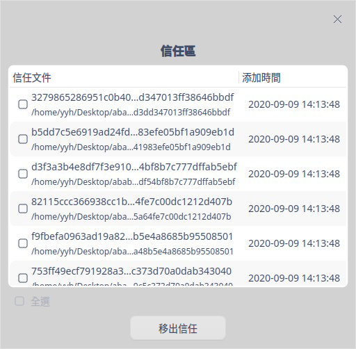

#### 查殺日誌

在病毒查殺界面，單擊 **查殺日誌**，可查看每次病毒掃描的時間、掃描類型及結果。單擊詳情按鈕 ，可查看日誌詳情，還可以選擇刪除日誌。

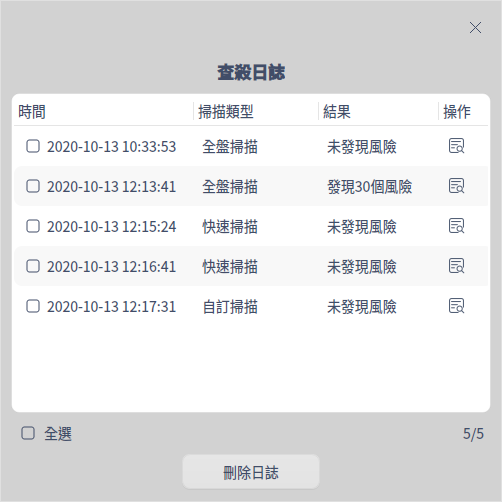

#### 病毒庫更新

每天都有新病毒產生，所以要定期更新病毒庫，以滿足計算機的安全需求。

在病毒查殺介面，如果有新的病毒庫，在介面右下角單擊 **有更新** 後，您可以選擇是否更新病毒庫。

### 安全防護

打開安全中心，選擇左側導航欄的 **安全防護**。在安全防護介面，您可以選擇是否開啟病毒防護、系統防護和網路防護功能。

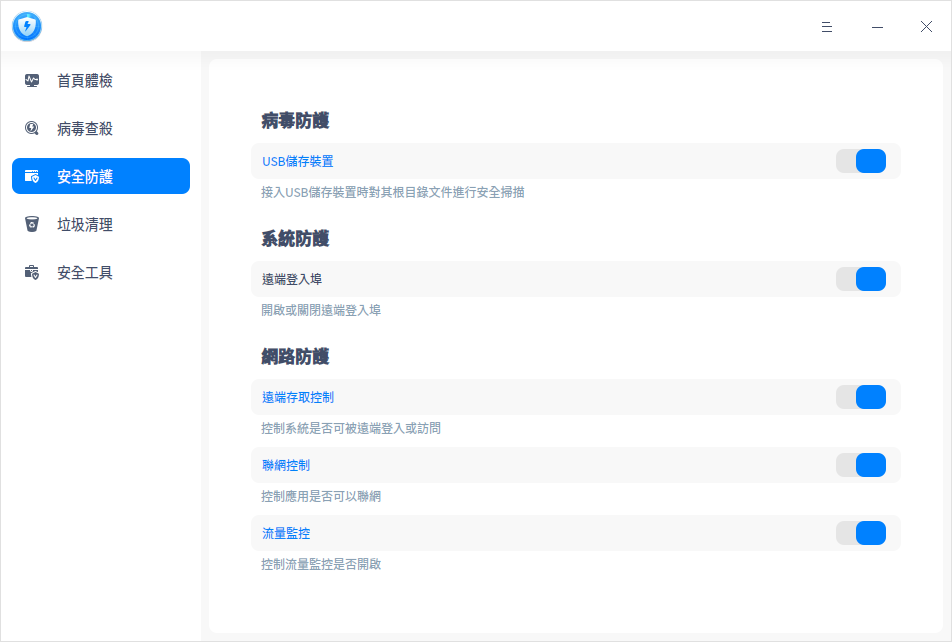

#### 病毒防護

病毒防護功能預設開啟，可以對接入電腦的USB儲存裝置進行病毒掃描。如發現USB儲存裝置文件有異常病毒，則可以進行相應的處理，保障系統避免病毒的侵害。

單擊 **USB儲存裝置** 可以跳轉到安全設定介面中，設定USB儲存裝置的處理方式。

- 詢問：病毒掃描完成後，彈出處理提示，您可以選擇 **取消** 不處理，還可以選擇 **立即處理**。若不做任何處理，則預設取消不處理。

- 自動處理：病毒掃描完成後自動處理異常病毒。

#### 系統防護

作業系統遠端登入埠預設開啟，當登入密碼極其簡單的時候，系統被入侵時容易被攻破。

- 開關關閉：關閉遠端登入埠。
- 開關開啟：開啟遠端登入埠。

#### 網路防護

**遠端存取控制**

對系統裡有呼叫遠端服務的應用進行管控，遠端存取控制功能預設關閉。

- 開關關閉：遠端存取控制功能不生效，預設應用可以呼叫遠端存取服務。
- 開關開啟：遠端存取控制功能生效，單擊 **遠端存取控制**可以跳轉到安全設定介面，設定遠端存取控制的處理方式。
  - 每次詢問（預設選項）：應用或服務開啟埠監聽時，給出提示「xxx需要開啟遠端存取」，您可以選擇 **僅允許本次**、**始終允許** 或 **禁止**。 
  - 預設允許：應用每次開啟遠端存取的時候，預設允許，不會彈框提示。
  - 預設禁止：應用或服務開啟埠監聽時，給出提示「防火牆已禁止xxx開啟遠端存取」，您可以選擇 **前往設定** 或 **確定**。

**聯網控制**

對系統裡的應用做聯網的控制限制，聯網控制功能預設關閉。

- 開關關閉：不對應用聯網進行控制。

- 開關開啟：對應用聯網進行控制，單擊 **聯網控制** 可以跳轉到安全工具中的聯網控制介面 ，詳細內容請參考安全工具章節中的 [聯網控制](#聯網控制)。

**流量監控**

對系統裡應用上網所使用的流量情況進行監控，流量監控功能預設關閉。

- 開關關閉：流量監控服務不開啟，在流量監控介面查看不到具體網路流量資料。
- 開關開啟：啟動流量監控服務，單擊  **流量監控** 可以跳轉到安全工具中的流量監控介面， 詳細內容請參考安全工具章節中的 [流量監控](#流量監控)。

### 垃圾清理

 作業系統在日常執行中會產生各種垃圾，當垃圾越來越多，會影響系統的執行效率，浪費磁碟資源。建議定期清理垃圾，保障系統執行流暢，提升資源利用率。

1. 打開安全中心，選擇左側導航欄的 **垃圾清理**，進入垃圾清理介面。
2. 勾選對應的垃圾類型，目前可以選擇清理系統垃圾、應用垃圾、痕跡訊息和Cookies。
3. 單擊 **立即掃描**，進入掃描介面。
4. 掃描完成後，可查看掃描發現的垃圾，並進行相應的處理。
   
   - 立即清理：清理所有選中的垃圾，您還可以自行取消勾選或者增加勾選。
   - 返回：不做任何處理，返回到垃圾清理介面。

5. 清理完成後單擊 **完成** 即可，清理過程中還可以單擊 **取消清理**。

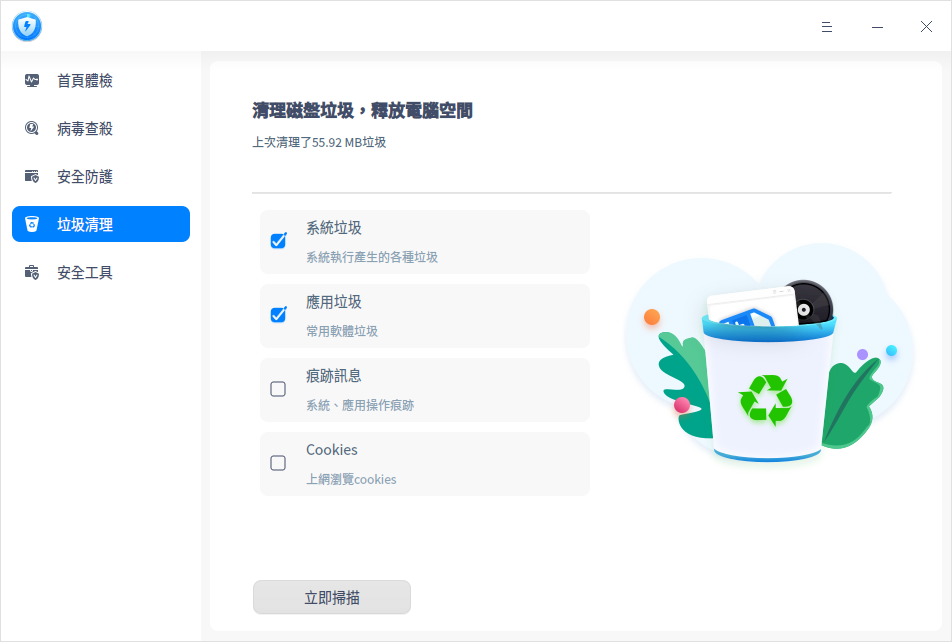

### 安全工具

打開安全中心，選擇左側導航欄的 **安全工具**。在安全工具介面，單擊對應圖示則可以使用小工具。

#### 流量監控

使用前需打開安全防護介面的流量監控開關，否則以下操作將不會生效。

在流量監控介面，可查看目前聯網應用和流量排名。

- 當前聯網：查看所有啟動中的應用，並展示每個應用當前的下行網速、上行網速。單擊管控下拉框，可以選擇 **詢問**、**允許** 或 **禁止** 選項，控制應用是否能聯網，詳細操作可參考安全工具章節的 [聯網控制](#聯網控制)。

  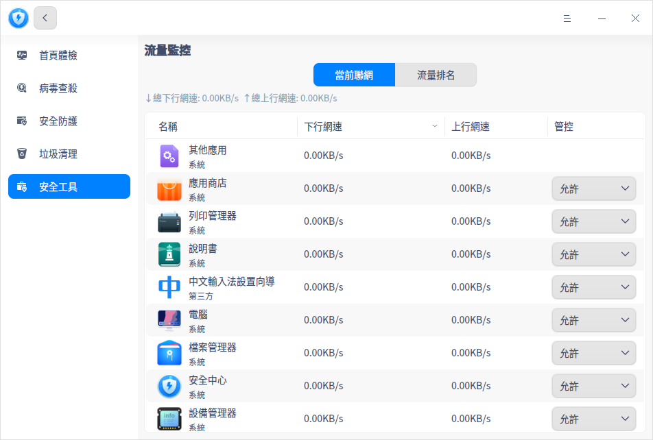

- 流量排名：查看啟動器裡所有應用的流量排名，包括下行流量、上行流量、總流量、流量時間分布詳情。列表右上角支援切換時間跨度：當天、昨天、當月、上月。

  

#### 自啟動應用

開機自啟動管理介面僅顯示啟動器裡的應用，包括應用名稱、自啟動狀態和操作按鈕。每個應用可選擇允許或禁止開機自啟動。

#### 聯網控制

使用前需打開安全防護介面中的聯網控制開關，否則以下操作將不會生效。

聯網控制是設定啟動器中單個應用聯網的狀態，每個應用或服務下拉框有三種選項。

- 詢問：應用聯網時給出提示「xxx需要連接網路」，您可以選擇 **僅允許本次**、**始終允許** 或 **禁止**。 

- 允許：應用聯網時預設允許，不會有提示訊息。

- 禁止：應用聯網時給出提示「防火牆已禁止xxx連接網路」，您可以選擇 **前往設定** 或 **確定**。

  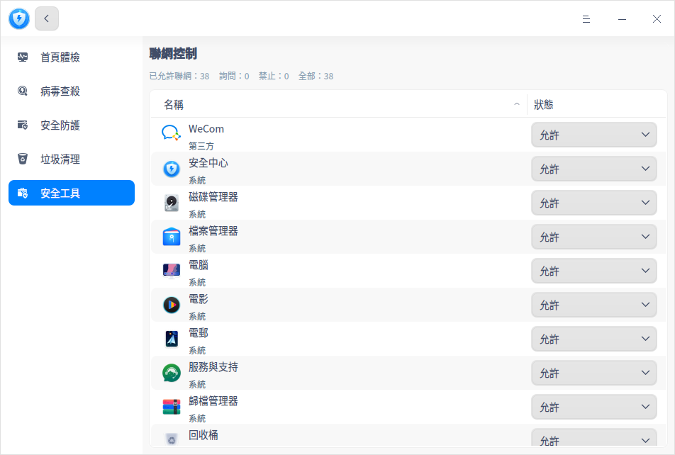

#### USB安全

在USB安全介面，可以查看帶儲存功能的 USB 裝置連接電腦的紀錄。

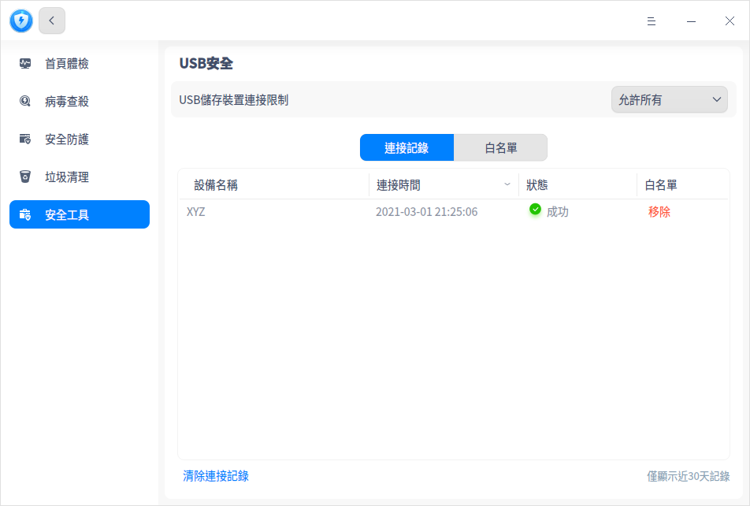

還可以將常用的USB裝置加入白名單，設定只允許白名單裝置連接電腦，防止電腦資料洩露。

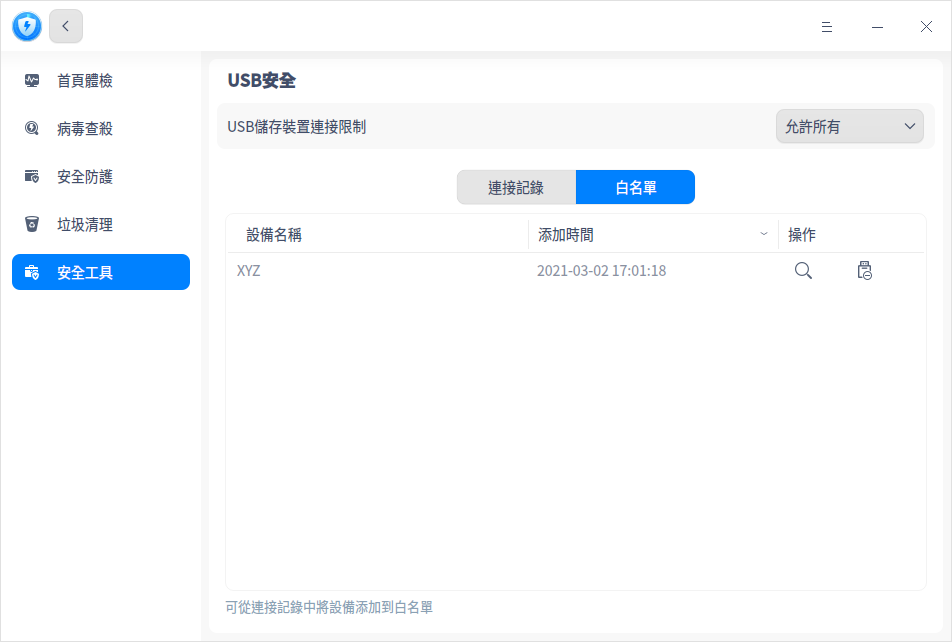

#### 登入安全

在登入安全介面，可以設定密碼安全等級，還可以設定密碼到期提醒時間，定期更換密碼。

- 安全等級為 **高** 或 **中** ：在控制中心修改密碼，或建立新使用者設定密碼時，若設定的密碼不符合級別要求，會儲存失敗，您可以前往安全中心修改等級或重新設定密碼。
- 安全等級為 **低** ：在控制中心修改密碼，或建立新使用者設定密碼的時候，直接儲存新設定的密碼。

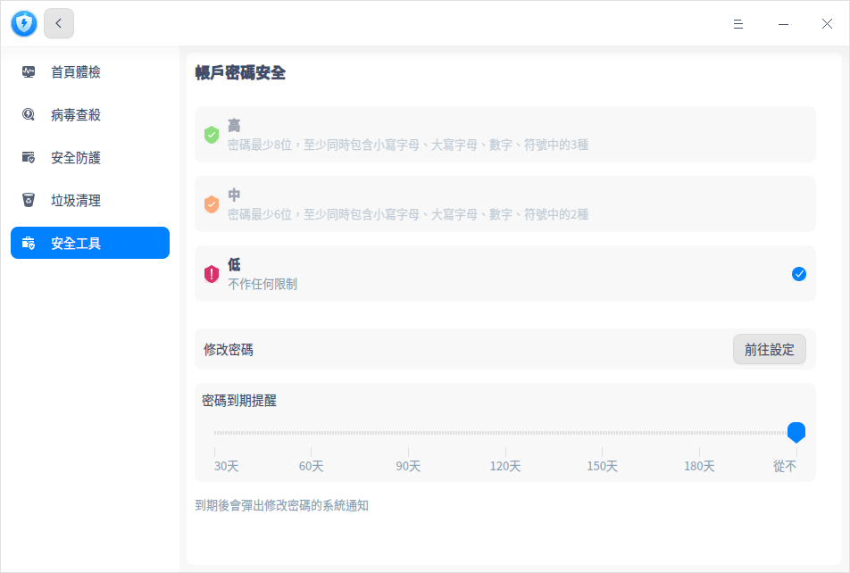

## 主選單

在主選單中，您可以進行相關參數設定、問題回饋、切換視窗主題，查看說明手冊等操作。

### 設定

在安全中心介面，單擊 ，選擇 **設定** ，您可以進行基礎設定及安全設定。

#### 基礎設定

**病毒查殺**

- 加入「病毒查殺」到文件右鍵選單：勾選後，單擊文件（夾）右鍵可直接選擇 **病毒查殺**。
- 不掃描超過此大小的壓縮包：勾選後，若壓縮包超過設定的大小，則不會進行掃描。
- 病毒庫升級地址：勾選後，可設定病毒庫升級地址。

**殺毒引擎**

可以選擇瑞星網安或安恆訊息殺毒引擎。

**關閉主視窗**

- 選擇 **最小化至系統列**，關閉主視窗時，應用將隱藏到系統工具列。
- 選擇 **退出**，關閉主視窗時直接退出應用。
- 選擇**每次詢問**，每次關閉主視窗時會彈出確認彈框。

#### 安全設定

- USB儲存裝置：詳細設定內容可參考安全防護的 [病毒防護](#病毒防護)。

- 遠端存取控制：詳細設定內容可參考安全防護的遠端存取控制，見 [網路防護](#網路防護)。

#### 還原預設值

單擊 **還原預設值** ，可復原目前頁面為預設設定值。

### 使用者回饋

1. 在安全中心介面，單擊 。
2. 選擇 **使用者回饋**，跳轉到「服務與支持」應用的「留言諮詢」介面，您可以回饋相關問題。

### 安全日誌

1. 在安全中心介面，單擊 。

2. 選擇 **安全日誌**，可以根據日誌類型和日期查看安全中心的操作日誌，還可以選擇清除日誌。

   

### 主題

視窗主題包含亮色主題、暗色主題和系統主題。

1. 在安全中心介面，單擊 。
2. 選擇 **主題**，選擇一個主題顏色。

### 說明

查看說明手冊，透過幫助進一步了解和使用安全中心。

1. 在安全中心介面，單擊 。
2. 選擇 **說明**，查看安全中心的說明手冊，進一步了解和使用安全中心。。

### 關於

1. 在安全中心介面，單擊 。
2. 選擇 **關於**，查看安全中心的版本和介紹。

### 退出

1. 在安全中心介面，單擊 。
2. 選擇 **退出**。