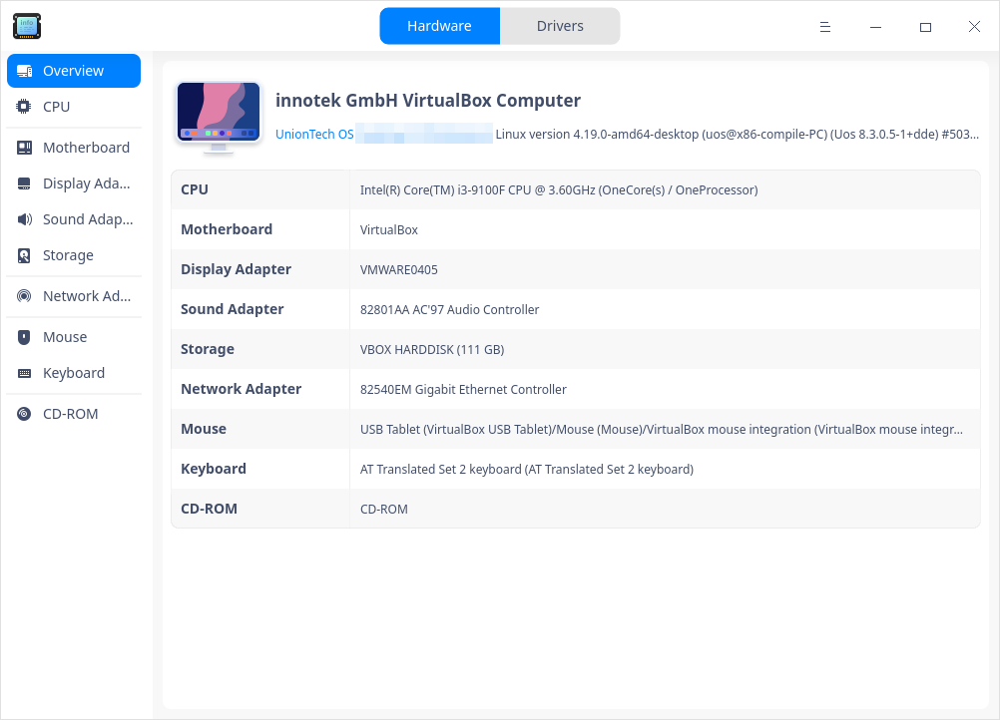
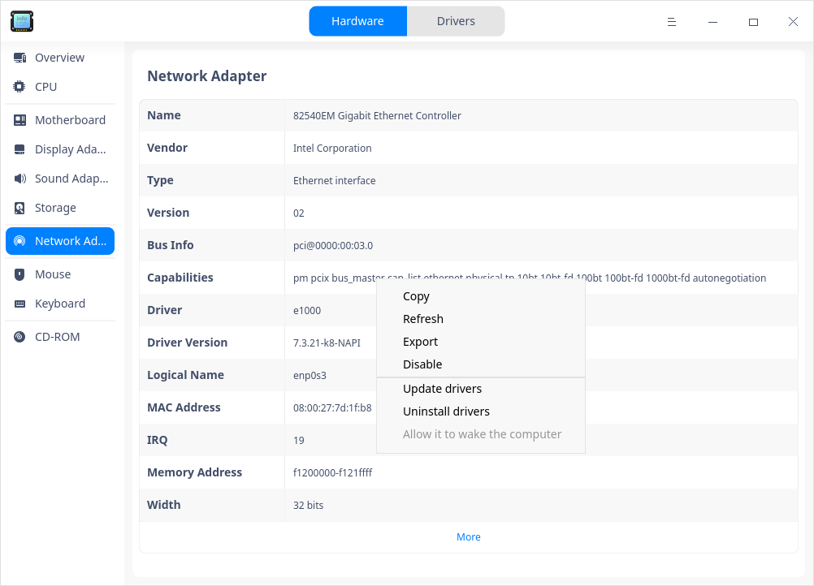
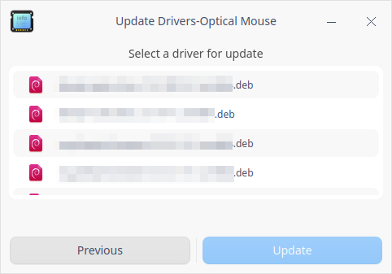
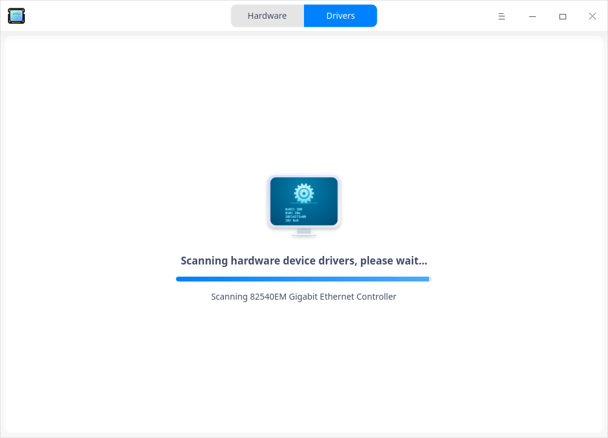
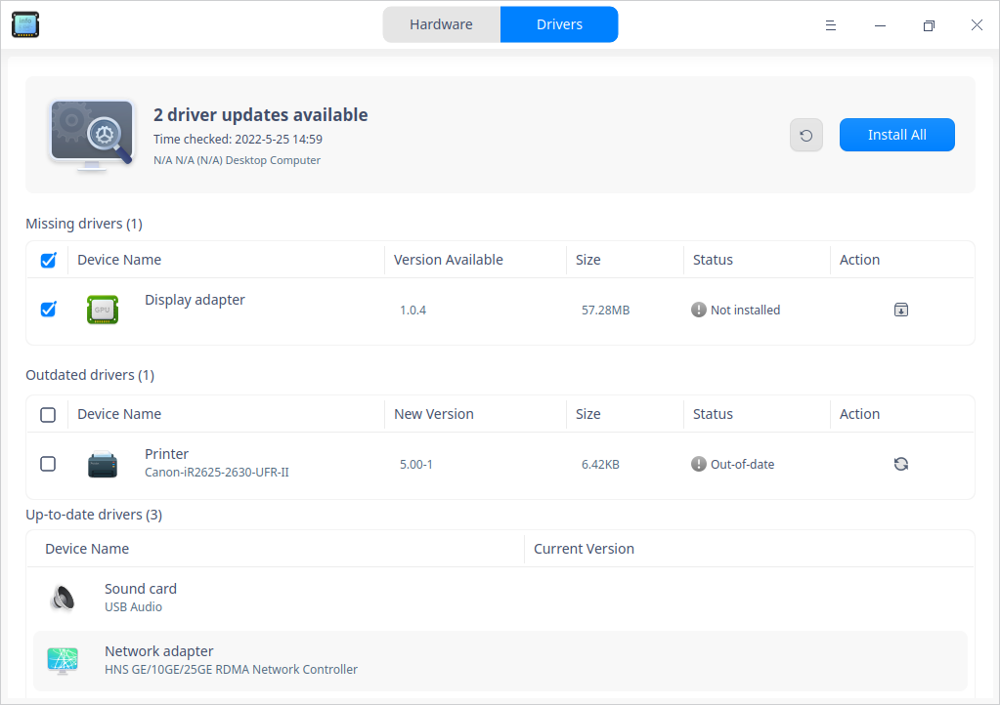

# Device Manager|deepin-devicemanager|

## Overview 

Device Manager is a tool to view and manage hardware devices, through which you can view all details of hardware running in the operating system, and you can manage drivers as well. 

## Guide

You can run, close or create a shortcut for Device Manager as follows.

### Run Device Manager

1. Click  on the Dock to enter the interface of launcher.

2. Locate  by scrolling the mouse wheel or searching "Device Manager" in the Launcher interface and click it to run. 

3. Right-click  to:

   - Select **Send to desktop** to create a shortcut on the desktop.

   - Select  **Send to dock** to fix it onto the dock.

   - Select **Add to startup** to run it automatically when the computer is turned on.

   

### Exit Device Manager

- On the main interface, click  to exit.
- Right-click   on the Dock, select **Close all** to exit.
- On interface of Device Manager, click   and select **Exit** to exit.

## Hardware

The information displayed by Device Manager is related to the computer hardwares. If your computer is connected to a mouse, keyboard, etc., the corresponding device information is displayed. If multiple devices of the same type are detected, the device information is displayed in a list. 

### Device Information

On the main interface, click **Hardware** to view details of each hardware running in this system.

The following table mainly introduces common hardware information and is for reference only, please refer to the actual situation.

<table class="block1">
    <caption></caption>
    <tbody>
        <tr>
            <td width="150px"><b>Hardware Name</b></td>
            <td><b>Details</b></td>
        </tr>
        <tr>
            <td>Overview</td>
            <td>Including the kernel and the hardware list.</td>
        </tr>
        <tr>
            <td>CPU</td>
            <td>Including name, vendor, CPU ID, architecture and so on.</td>
        </tr>
        <tr>
            <td>Motherboard</td>
            <td>Including vendor, version, chipset, SMBIOS version and so on.</td>
        </tr>
         <tr>
            <td>Memory</td>
            <td>Including name, vendor, size, type, speed and so on.</td>
      </tr>
      <tr>
            <td>Display Adapter</td>
            <td>Including name, vendor, model and so on.</td>
        </tr>
       <tr>
            <td>Sound Adapter</td>
            <td>Including name, vendor, model and so on.</td>
        </tr>
         <tr>
            <td>Storage</td>
            <td>Including model, vendor, media type and so on.</td>
        </tr>
        <tr>
            <td>Network Adapter</td>
            <td>Including name, vendor, type, driver and so on.</td>
        </tr>
         <tr>
            <td>Mouse</td>
            <td>Including name, vendor, model, interface and so on.</td>
        </tr>
          <tr>
            <td>Keyboard</td>
            <td>Including name, vendor, model, interface and so on.</td>
        </tr>
        <tr>
            <td>Monitior</td>
            <td>Including name, vendor, type, interface type and so on.</td>
        </tr>
   </tbody>
   </table>

### Context Menu 

Right-click in the details area of any device to carry out corresponding operations.

#### Copy
To copy contents of the current page or selected contents.

#### Refresh
To reload info of all devices of the operating system. You can also use shortcut key F5 to realize this function.

#### Export
To export the device information to the specified folder, formats such as txt/docx/xls/html are supported. 

#### Disable/Enable

You can disable /enable some hardware drives, which are enabled by default. You can judge whether the hardware device supports the disable function according to the right-click menu options. 

#### Update drivers

Some hardware supports update/uninstall driver function, which can be judged by the right-click menu options. 

>  Tips: Update online is supported in "Drivers" interface.

1. Select **Update drivers** in the right-click menu to bring up a pop-up window.
2. Select the folder where the driver is located and click the **Next** button. The "Include subfolders" is checked by default, indicating that the folder and the driver files contained in the subfolder are detected.

   

3. The system will detect all installable deb and ko format driver files contained in this file location. Select the corresponding driver file and then click the **Update** button.

   

4. Authentication window pops up. Input login password to complete authentication and proceed.
5. If the update fails, the system automatically rolls back the device's driver to the previous driver version, which does not affect the use. It is recommended to find the reason of failure according to the system prompt and update again.

#### Uninstall drivers

You can uninstall devices that you don't want to use.

1. Select **Uninstall drivers** in the right-click menu, after confirming again, click **Uninstall**. 

   - Successful: The device status becomes unavailable.

   - Failure: The original driver works normally. It is recommended to find the reason for failure according to the system prompt and uninstall again.

2. If you want to use the device again, right-click on the device details page and select **Update Driver** to install the driver.

#### Wake up the computer

When the computer is suspending, it supports waking up the computer and lighting up the screen via mouse, keyboard and network card. If the devices are disabled, this feature is not available.

**Wake up the computer by mouse and keyboard**

1. Click **Mouse** or **Keyboard** in "Hardware" interface to display details.
2. Right-click in the details area to check or uncheck **Allow it to wake the computer**.

   - Allow it to wake the computer: When the computer is suspending, left-click / right-click / middle-click or hit any key on keyboard to wake up the computer and light up the screen.
   - Don't allow it to wake the computer: When the computer is suspending, the computer does not respond when you left-click / right-click / middle-click or hit any key on keyboard.

**Wake up the computer by network card**

1. Click **Network Adapter** in "Hardware" interface to display details.
2. Right-click in the details area to check or uncheck **Allow it to wake the computer**.

   - Allow it to wake the computer: When this computer is suspending, other computers (in the same network segment that can be pinged through to each other's IP address) can wake up this computer and light up the screen by sending special network packet requests (Wake On LAN command) to it.
   - Don't allow it to wake the computer: When this computer is suspending, it does not respond if other computers (in the same network segment that can be pinged through to each other's IP address) send special network packet requests (Wake On LAN command) to it.

## Drivers

"Drivers" interface mainly includes features such as driver list, driver updates scan, driver online installation, etc.

### Scan for updates

Open Device Manager, click **Drivers**. The system will detect if there is any updates available automatically.

   - Already up to date: It means that there are no drivers that can be updated/installed, and the names and versions of devices that do not require driver updates are displayed.
   - Updates available: It means that updates are detected and can be installed online.

If the detection fails, click **Scan Again** after fixing the problem according to the prompt, or click **Feedback** for unknown reasons to jump to the "Consults" interface of Support to give feedback on the problem.

### Install drivers online

1. In the "Drivers" interface, you can view the list of updatable/installable drivers and install them online.

   - Click  to install the installable drivers.
   - Click  to update the updatable drivers.

   

2. For batch installation, check all drivers you want and click **Install All**.

3. Wait for the installation result.

   - Installation successful: The status bar will change to "Installation successful" and take effect after restarting the computer.

   - Installation failed: The status bar changes to "Installation failed", follow the prompts to fix the problem and click the refresh button  to re-scan and try to install again. For unknown reasons, you can click the **Feedback** button to jump to the "Consults" interface of Support to give feedback on the problem..

   - Installation partially  successful: For batch installation, some of the drivers may be installed successfully and some may not, you can check the status of each driver in the driver list.

   

## Main Menu

In the main menu, you can switch themes, view manual, and so on.

### Theme

The window theme includes Light Theme, Dark Theme and System Theme.

1. Click on the interface.
2. Click  **Theme** to select one.

### Help

Click Help to get the manual, which will help you further know and use Device Manager.

1. Click on the interface.
2. Click **Help** to view the manual to further know and use Device Manager.

### About

1. Click on the interface.
2. Click **About** to view version and introduction about Device Manager.

### Exit

1. Click on the interface.
2. Click  **Exit**.

