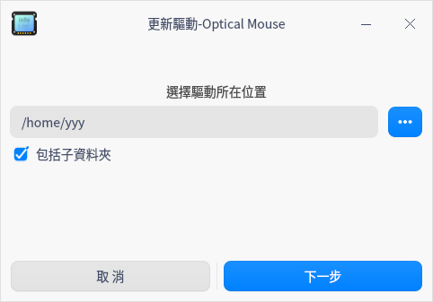
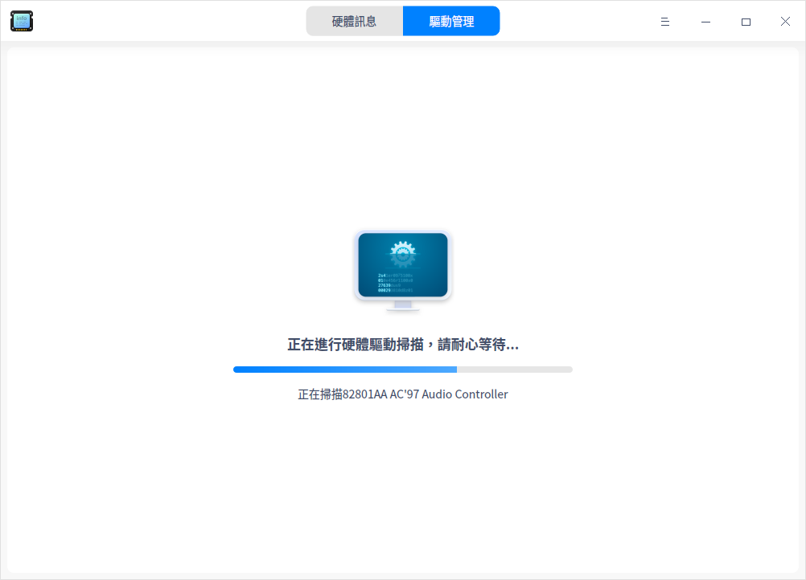

# 設備管理器|deepin-devicemanager|

## 概述

設備管理器是查看和管理硬體設備的工具軟體，可以查看執行在作業系統的硬體裝置訊息，並進行驅動管理。

## 使用入門

您可以透過以下方式執行或關閉設備管理器，或者建立捷徑。

### 執行設備管理器

1. 單擊任務欄上的啟動器 ，進入啟動器介面。

2. 上下滾動滑鼠滾輪瀏覽或透過搜尋，找到「設備管理器」按钮 ，單擊開啟。

3. 右鍵單擊 ，您可以：

   - 單擊 **建立桌面捷徑**，在桌面建立捷徑。

   - 單擊 **釘選到Dock**，將應用程式固定到Dock。

   - 單擊 **開機啟動**，將應用程式添加到開機啟動項，在電腦開機時自動執行該應用程式。

### 關閉設備管理器

- 在設備管理器介面，單擊 ，關閉設備管理器。
- 右鍵單擊任務欄上的  圖示，選擇 **全部關閉** 來關閉設備管理器。
- 在設備管理器介面單擊 ，選擇 **退出** 來關閉設備管理器。

## 硬體訊息

裝置管理器展示的訊息與電腦硬體相關，如果您的電腦接入滑鼠、鍵盤等裝置，則會顯示對應的裝置訊息。如果檢測到多個同類型裝置，則以列表形式顯示裝置訊息。

### 裝置訊息

在裝置管理器介面，單擊 **硬體訊息**，查看執行在作業系統上的硬體詳細訊息。

下表主要介紹常見的硬體訊息，僅作參考，請以實際情況為準。

<table class="block1">
    <caption></caption>
    <tbody>
        <tr>
            <td width="150px"><b>硬體名稱</b></td>
            <td><b>硬體訊息</b></td>
        </tr>
        <tr>
            <td>概況</td>
            <td>展示作業系統核心訊息及各硬體裝置列表。</td>
        </tr>
        <tr>
            <td>處理器</td>
            <td>展示處理器的名稱、製造商、處理器及架構等訊息。</td>
        </tr>
        <tr>
            <td>主機板</td>
            <td>展示主機板的製造商、版本、晶片組、SMBIOS版本等訊息。</td>
        </tr>
         <tr>
            <td>記憶體</td>
            <td>展示記憶體的名稱、製造商、大小、類型及速度等訊息。</td>
      </tr>
      <tr>
            <td>顯示適配器</td>
            <td>展示顯示適配器的名稱、製造商、型號等訊息。</td>
        </tr>
       <tr>
            <td>音訊適配器</td>
            <td>展示音訊適配器的名稱、製造商及型號等訊息。</td>
        </tr>
         <tr>
            <td>存儲裝置</td>
            <td>展示儲存裝置的型號、製造商、介質類型等訊息。</td>
        </tr>
        <tr>
            <td>網路適配器</td>
            <td>展示網路適配器的名稱、製造商、類型及驅動等訊息。</td>
        </tr>
         <tr>
            <td>滑鼠</td>
            <td>展示滑鼠的名稱、製造商、型號及介面等訊息。</td>
        </tr>
          <tr>
            <td>鍵盤</td>
            <td>展示鍵盤的名稱、型號、製造商、介面等訊息。</td>
        </tr>
        <tr>
            <td>顯示裝置</td>
            <td>展示顯示裝置的名稱、製造商、類型、介面類型等訊息。</td>
        </tr>
   </tbody>
   </table>

### 右键菜单

在裝置詳細訊息區域，單擊右鍵，可以進行相關操作。

#### 複製

複製目前頁面的所有訊息。對於可選中的訊息，也可以局部複製。

#### 重新整理

將重新載入作業系統目前所有設備的訊息，快捷鍵為 **F5**。

#### 匯出

將裝置訊息匯出到指定的資料夾，支援匯出 txt/docx/xls/html 格式。

#### 禁用/啟用

部分硬體驅動支援禁用和啟用功能，硬體驅動預設是啟用狀態，根據右鍵選單選項判斷是否支援禁用功能。

#### 更新驅動

部分硬體支援更新/移除驅動功能，可以根據右鍵選單選項進行判斷。

>  竅門：在驅動管理介面，支援線上更新驅動。

1. 在右鍵選單中選擇 **更新驅動**，彈出視窗。

2. 選擇驅動所在的資料夾，單擊 **下一步** 按鈕。預設勾選「包括子資料夾」，表示檢測資料夾以及子資料夾中包含的驅動文件。

   

3. 系統會檢測該檔案位置包含的所有可安裝的deb和ko格式驅動文件，選擇對應的驅動文件後，單擊 **更新** 按鈕。

   

4. 彈出認證視窗，輸入系統登入密碼完成認證後進行更新。

5. 如果更新失敗了，系統自動將該裝置的驅動回滾至之前的驅動版本，不影響使用。建議根據系統提示尋找失敗原因，重新更新。

#### 移除驅動

對於不想使用的裝置，可以移除驅動。

1. 在右鍵選單中選擇 **移除驅動**，二次確認後，單擊 **卸載** 按鈕。

   - 移除成功：裝置狀態變為不可用。

   - 移除失敗：原驅動正常使用，建議根據系統提示尋找失敗原因，重新移除。

2. 如果想重新使用該裝置，在裝置詳細訊息頁面單擊右鍵，並選擇 **更新驅動** 安裝驅動。

#### 喚起電腦

當電腦待機時，支援透過滑鼠、鍵盤和網卡喚起電腦，點亮螢幕。如果裝置禁用，則無法使用該功能。

**透過滑鼠和鍵盤喚起電腦**

1. 在硬體訊息介面，單擊 **滑鼠** 或 **鍵盤**，顯示裝置詳細訊息。

2. 在詳細訊息區域單擊右鍵，可以勾選或去勾選 **允許喚起電腦**。

   - 允許喚起電腦：電腦處於待機狀態時，左擊/右擊/單擊滑鼠中鍵或敲擊該鍵盤任意鍵，可將電腦喚起，點亮螢幕。

   - 不允許喚起電腦：電腦處於待機狀態時，左擊/右擊/單擊滑鼠中鍵或敲擊鍵盤，電腦無響應。

**透過網卡喚起電腦**

1. 在硬體訊息介面，單擊 **網路適配器**，顯示裝置詳細訊息。

2. 在詳細訊息區域單擊右鍵，可以勾選或去勾選 **允許喚起電腦**。

   - 允許喚起電腦：本機處於待機狀態時，其他電腦裝置（在同一網段，即可以ping通對方IP）向本機發送特殊網路包請求（Wake On LAN 指令），可將本機喚起，點亮螢幕。

   - 不允許喚起電腦：電腦處於待機狀態時，其他電腦裝置（在同一網段，即可以ping通對方IP）向本機發送特殊網路包請求（Wake On  LAN 指令），本機無響應。

## 驅動管理

驅動管理主要包括驅動列表訊息、驅動更新檢測、驅動線上安裝等內容。

### 驅動更新檢測

打開裝置管理器，單擊 **驅動管理**，系統會自動檢測是否有可更新/安裝的驅動。

- 無更新：表示沒有可更新/安裝的驅動，展示無需更新驅動的裝置名稱及版本。
- 有更新：表示檢測到可更新/安裝的驅動，可以進行線上安裝。

如果顯示檢測失敗，根據提示訊息修復問題後單擊 **重新檢測** 再次檢測，對於未知的原因則可以單擊 **回饋** 按鈕跳轉到「服務與支持」應用的留言諮詢介面，回饋相關問題。

### 驅動線上安裝

1. 在驅動管理介面，可以查看可更新/安裝的驅動列表，並進行線上安裝。

   - 對於可安裝的驅動，單擊安裝按鈕  進行驅動安裝。

   - 對於可更新的驅動，單擊更新按鈕  進行驅動更新。

   

2. 如果想要批次安裝，則可以勾選對應的驅動，單擊 **一鍵安裝**，將依次進行安裝。

3. 等待安裝結果。

   - 安裝成功：狀態欄變為「安裝成功」，重啟電腦後生效。

   - 安裝失敗：狀態欄變為「安裝失敗」，根據提示訊息修復問題後單擊重新整理按鈕  重新檢測驅動，再次嘗試安裝。對於未知的原因，可以單擊 **回饋** 按鈕跳轉到「服務與支援」應用的留言諮詢介面，回饋相關問題。

   - 部分安裝成功：對於批次安裝的驅動，可能部分安裝成功，部分安裝失敗，可以在驅動列表中查看對應驅動的狀態。

   

## 主選單

在主選單中，您可以切換視窗主題，查看說明手冊等操作。

### 主題

視窗主題包含亮色主題、暗色主題和系統主題。

1. 在設備管理器介面，單擊 。
2. 單擊 **主題**，選擇一個主題顏色。

### 說明

查看幫助手冊，透過幫助進一步讓您了解和使用設備管理器。

1. 在設備管理器介面，單擊 。
2. 單擊 **說明**，查看說明手冊，進一步了解和使用裝置管理器。

### 關於

1. 在設備管理器介面，單擊 。
2. 單擊 **關於**，查看關於設備管理器的版本和介紹。

### 退出

1. 在設備管理器介面，單擊 。
2. 單擊 **退出**。