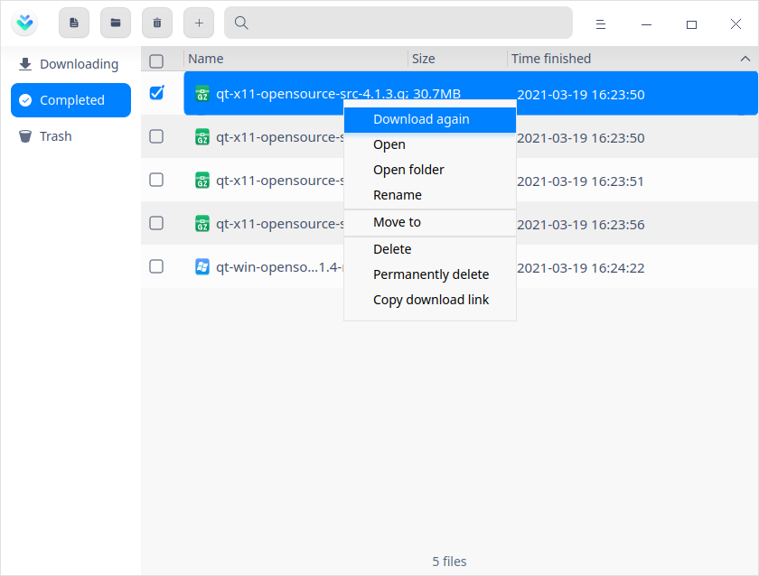
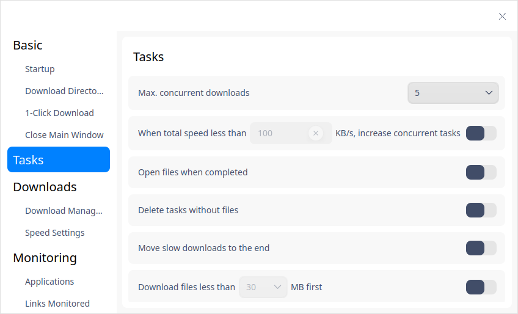
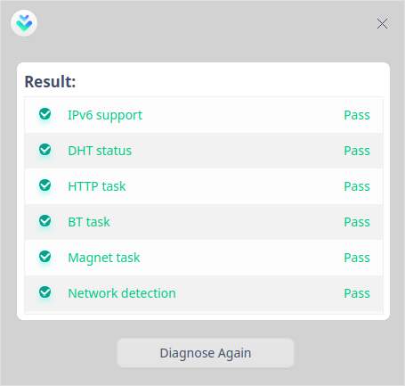

# Downloader|downloader|

## Overview

Downloader is an easy-to-use tool for downloading network resources. It supports a variety of network download protocols.

## Guide

You can run, close or create a shortcut for Downloader as follows.

### Run Downloader

1. Click  on the Dock to enter the interface of launcher.
2. Locate  by scrolling the mouse wheel or searching "Downloader" in the Launcher interface and click it to run.
3. Right-click  to:
   - Select **Send to desktop** to create a shortcut on the desktop.

   - Select  **Send to dock** to fix it onto the dock.

   - Select **Add to startup** to run it automatically when the computer is turned on.

### Close Downloader

- On the main interface of Downloader, click to exit.
- Right-click on the Dock, select **Close all** to exit.
- On interface of Downloader, click  and select **Exit** to exit.

## Operations
### New tasks

#### For URL

1. On main interface of Downloader, click , a window titled **New Task** pops up. 

   

2. Enter a URL, and select the file to be downloaded, type, and storing path, and click **Confirm** to create a task. 

   > Notes: You can add many URL at a time, but you should make sure there is only one in each line.

#### For BT files

1. You can create downloading tasks for BT files by one of the following ways:

   - Double-click a BT file, a window titled **New Task** pops up. Please make sure "Create new task when opening a torrent file" in "Main Menu" > "Settings" is switched on. 
   - In new task interface, drag the BT file into the address box.
   - In new task interface, click , a window of File Manager pops up. Select the BT file you need to download. 

2. Select the file to be downloaded, type and storing path. Click **Download Now** to create a task.

#### For MetaLink files

1. You can create downloading tasks for MetaLink files by one of the following ways:

   - Double click the MetaLink file to pop up the new task window. Please make sure "Create new task when opening a metalink file" in "Main Menu" > "Settings" is switched on. 
   - In new task interface, drag the MetaLink file into the address box.
   - In new task interface, click , a window of File Manager pops up. Select the MetaLink file you need to download. 

2. Select the file to be downloaded, type and storing path. Click **Download Now** to create a task.

### Search

1. In the interface of Downloader, click  to input keywords.

### Downloading

A list of files being downloaded is displayed in this interface, including task name, size and status.  You can also carry out the following operations to the checked tasks:

> Notes: The operations are different when you check single and multiple tasks. Please refer to the actual situation. 

**Pause**: click  or right-click and select **Pause** to pause downloading.

**Resume**: if you want to continue downloading, click  or right-click and select **Resume** to resume the paused downloading process. 

**Download first**: If the current number of download tasks is greater than the set maximum number of download tasks, only the tasks that have not started (queued and suspended) have this option. For details of setting the maximum number of download tasks, please refer to [Tasks](#Tasks).

**Delete**: click   or right-click the file and select **Delete** to delete a downloaded file, and it goes into Trash. If you check **Delete local files**, local file is deleted also. 

**Permanently delete**: right-click the file and select this option to delete local file. 

**Copy download link**: right-click the file and select this option to share it to others. 

**Open folder**: right-click the file and select this option, the folder where the file is saved will be opened.

### Completed

A list of files that have been downloaded is displayed in this interface, including file name, size and finish time. You can also carry out the following operations to the checked tasks:

> Notes: The operations are different when you check single and multiple tasks. Please refer to the actual situation. 

**Download again**: right-click and select this option, the file would be downloaded again, and the former one would be deleted.

**Open**: click  or right-click and select this option to open the file. 

**Open folder**: click right-click and select this option, the folder where the file is saved will be opened. 

**Rename**: right-click and select this option to rename it.

**Move to**: right-click and select this option to move the downloaded files into the specified folders.

**Delete**: click   or right-click the file and select **Delete** to delete a downloaded file, and it goes into Trash. If you check **Delete local files**, and local file is deleted also. 

**Permanently delete**: right-click the file and select this option to delete local file.

**Copy download link**: right-click the file and select this option to share it to others. 

### Failed

If downloading process has failed, you can try again. If it still fails, the possible causes include: wrong downloading URL, insufficient storage space, no network connection and so on. Please refer to the actual situation.

### Trash

A list of files that have been deleted is displayed in this interface, including file name, size and delete time. You can also carry out the following operations to the checked tasks:

> Notes: The operations are different when you check single and multiple tasks. Please refer to the actual situation. 

**Restore**: click  or right-click the file and select this option to restore it to its original status and it will be moved into the list of files that have been downloaded.

**Download again**: right-click the file and select this option to try again. 

**Open**: right-click the file and select this option t open it.

**Open folder**: right-click the file and select this option, the folder where the file is saved will be opened.

**Copy download link**: right-click the file and select this option to share it to others. 

**Delete**: click   or right-click the file and select **Delete** to delete a downloaded file, and it goes into Trash. If you select **Delete local files**, and local file is deleted also. 

**Permanently delete**: right-click the file and select this option to delete local file.

**Empty**: click  or right-click the file and select this option to clear up all files in Trash.

## Main Menu

In the main menu, you can adjust settings, use diagnostic tools, switch themes, view help manual, and so on.

### Settings
#### Basic

**Startup**: this option is related to the startup of the Downloader.

- Auto startup: Downloader starts up when the computer starts up when this button is switched on.  
- Resume downloading on startup: Whenever you start up Downloader, the unfinished tasks in the downloading list will be resumed automatically when this button is switched on.  

**Download Directory**: this setting is related to downloading directory. 

- Default directory: select a folder in File Manager and set it as default directory. 
- Last used directory: when you create a task, the last used directory is set as default directory.

**1-Click Download**: once this button is switched on, whenever you click a URL or open a BT file, a task is created directly without popping up the interface of Downloader. 

**Close Main Window**: you can choose whether to minimize to System Tray or to exit.

#### Tasks

You can set the tasks being downloaded, for example, maximum concurrent downloads, when total speed less than xxx KB/s, increase concurrent tasks, open files when completed, and so on.

#### Downloads

**Download Management**: you can set the original address threads from 1 to 10. The default limit maximum number of concurrent download resources is 500. You can switch on to set according to your needs.

**Speed Settings**: Select full speed or limited speed. The maximum download speed, maximum upload speed and limit period can be set in "Limited speed" area.

#### Monitoring

**Applications**: currently Clipboard and Browser are supported here. To make either one monitored, turn on the switch after it. When a downloading link is copied to Clipboard or is clicked in Browser, Downloader would automatically starts up and create a task.

**Links Monitored**: only when any application is being monitored, can you select link types. Currently, HTTP, MetaLink, BitTorrent and Magnet URI scheme are supported. Tasks are created successfully only when the URL copied or clicked complies with the selected link types. 

Click **Advanced** next to "HTTP" to edit file extensions and the unmonitored websites.

**BT Files**: 
   - "Create new task when a torrent file downloaded": this function is switched off by default. If you switch it on, when downloading a torrent file, Downloader starts up automatically and creates a task.
   - "Create new task when opening a torrent file": this function is switched on by default. When you double-click a torrent file, new task window pops up, and you can select the type file in it.

**MetaLink Files**: 
   - "Create new task when a metalink file downloaded": this function is switched off by default. If you switch it on, when downloading a metalink file, Downloader starts up automatically and creates a task.
   - "Create new task when opening a metalink file": this function is switched on by default. When you double-click a metalink file, new task window pops up, and you can select the type file in it.

#### Notifications

When a task status changes, the system will notify you about the change. Please read [Notification Settings](dman:///dde#Notification Settings) for details. 

#### Advanced

You can set shortcuts and cache sizes here. 

**Shortcuts**: "show main window when creating new task" is turned on by default. You can choose to turn it off.
**Cache**: Larger disk cache will result in faster download speed and more resource consumption.

#### Restore Defaults

Click **Restore Defaults** to restore all settings to defaults. 

### When download completed

When download is completed, you can select **Shut down**, **Hibernate**, or **Exit Downloader**. For example, in order to avoid the peak use of the network, you can create a download task before you go off work, and set the automatic shutdown after the download is completed.

### Diagnostic tool

You can use it to test IPv6 support, DHT status, HTTP task info, BT task info, Magnet task info and network detection, and so on.

### Theme

The window theme includes Light Theme, Dark Theme and System Theme.

1. Click on the interface.
2. Click  **Theme** to select one.

### Help

Click Help to get the manual, which will help you further know and use Downloader.

1. Click on the interface.
2. Click **Help** to view the manual.

### About

1. Click on the interface.
2. Click **About** to view version information and introduction about Downloader.

### Exit

1. Click on the interface.
2. Click  **Exit**.

