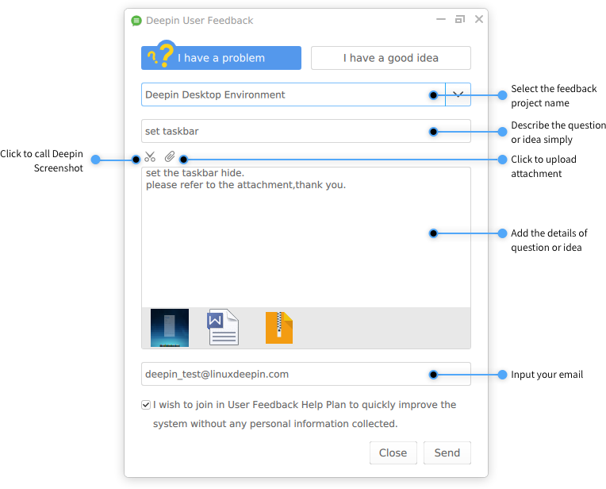

# Deepin User Feedback|../common/deepin-feedback.svg|

## Overview|../common/icon_overview.svg|

During the process of using deepin, do you have some problems or good ideas want to tell us but there is no convenient way? In fact, we are always listening to you by heart.

Now, Deepin User Feedback is specially designed to collect user feedbacks, and you can send your problems or ideas to us. We will reply timely to provide a better service and experience.

Your valuable comments are truly what keep us going!

## Guide|../common/icon_guide.svg|

### Run Deepin User Feedback

Where can you find Deepin User Feedback to run? 

1. Click on  at the bottom of desktop or move the mouse pointer to the upper left corner of the screen, enter into launcher interface.
2. Scroll the mouse wheel up and down, find  by browsing to click on. 

### Close Deepin User Feedback

If you want to close Deepin User Feedback, you can: 

- Right click on  on Dock to select **Close All**.
- On Deepin User Feedback interface, click on  or **Close** in the lower right corner.

## Main Interface|../common/icon_maininterface.svg|

## Submit Feedback|../common/icon_submitfeedback.svg|

### I Have a Problem

1. On Deepin User Feedback interface, click on **I have a problem**.
2. Click on  to select the feedback project name.
3. Input the problem title.
4. Add detailed description of the problem.
5. Input your email address.
6. Click on **Send** to feed back the problem.

### I Have a Good Idea

1. On Deepin User Feedback interface, click on **I have a good idea**.
2. Click on  to select the feedback project name.
3. Briefly describe your idea.
4. Add detailed description of the idea.
5. Input your email address.
6. Click on **Send** to submit a good idea.

### Upload Screenshots or Attachments

When describing the problem or idea detailedly, you can also call Deepin Screenshot to capture pictures or upload attachments to supplement, so we can fully know the feedback.

#### Upload Screenshots

1. On Deepin User Feedback interface, click on  to call Deepin Screenshot.
2. Pictures captured are automatically added to the detailed description.
3. If you want to delete the uploaded pictures, please move the mouse pointer over them and click on  in the upper right corner.

#### Upload Attachments

1. On Deepin User Feedback interface, click on .
2. Select the attachment to automatically add to the detailed description.
3. If you want to delete the uploaded attachments, please move the mouse pointer over them and click on  in the upper right corner.

