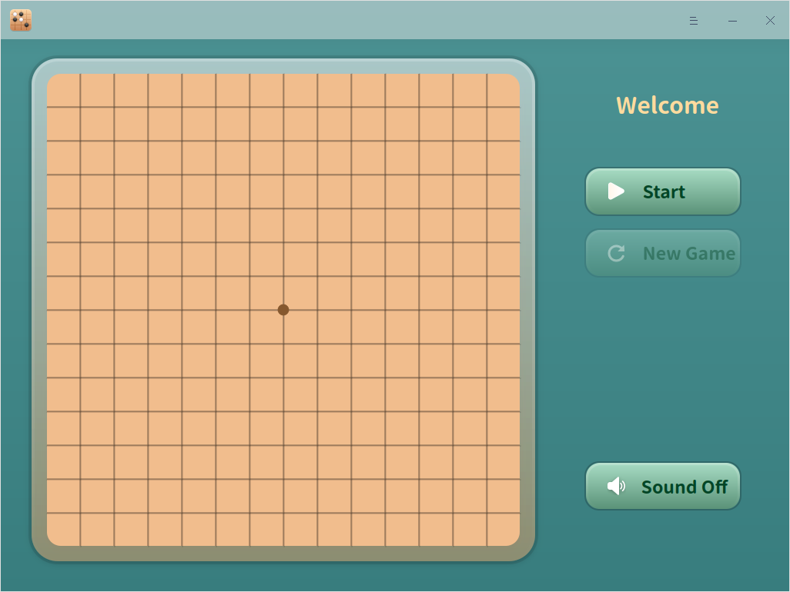

# Gomoku|deepin-gomoku|

## Overview

Gomoku is a small game of chess for two players, suitable for both young and old. Let's have a game in the spare time.

## Guide

You can run, close or create a shortcut for Gomoku as follows.

### Run Gomoku

1. Click  in the Dock to enter the interface of launcher.
2. Locate  by scrolling the mouse wheel or searching "Gomoku" in the Launcher interface and click it to run. 

3. Right-click to:

   - Select **Send to desktop** to create a shortcut on the desktop.

   - Select  **Send to dock** to fix it into the dock.

   - Select **Add to startup** to run it automatically when the computer is turned on.

### Exit Gomoku

- On the main interface, click to exit.
- Right-click   in the Dock, select **Close all** to exit.
- On interface of Gomoku, click   and select **Exit** to exit.

## Rules

The two players use black and white pieces respectively and play on the intersection of the straight and horizontal lines of the board, the first to form a five-piece line wins.

## Operations

1. Click **Start** in the interface ti choose the color of your pieces. The black piece goes first.

   

2. During the game, you can:
   - Click **Pause** to pause the game.
   - Click **New Game** to start a new game.
   - Turn off/on the sound.

3. The game does not end until either one player wins.  

## Main Menu

In the main menu, you can switch themes, view manual, and so on.

### Theme

The window theme includes Light Theme, Dark Theme and System Theme.

1. Click  on the interface.
2. Click  **Theme** to select one.

### Help

Click Help to get the manual, which will help you further know Gomoku.

1. Click  on the interface.
2. Click **Help** to view the manual.

### About

1. Click  on the interface.
2. Click **About** to view version and introduction about Gomoku.

### Exit

1. Click  on the interface.
2. Click  **Exit**.