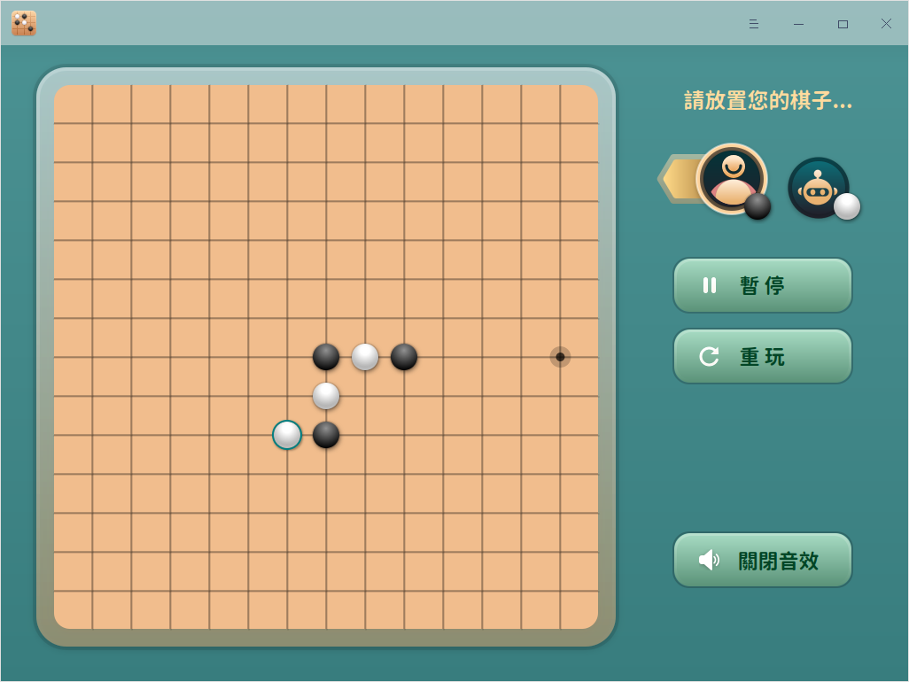

# 五子棋|deepin-gomoku|

## 概述

五子棋是兩人對弈的棋類小遊戲，老少皆宜，閒暇時間來一局吧。

## 使用入門

您可以通過以下方式運行或關閉五子棋，或者創建快捷方式。

### 運行五子棋

1. 單擊任務欄上的啟動器圖標 ，進入啟動器界面。
2. 上下滾動鼠標滾輪瀏覽或通過搜索，找到五子棋圖標  ，單擊運行  。
3. 右鍵單擊 ，您可以：
   - 單擊 **發送到桌面**，在桌面創建快捷方式。

   - 單擊 **發送到任務欄**，將應用程序固定到任務欄。

   - 單擊 **開機自動啟動**，將應用程序添加到開機啟動項，在電腦開機時自動運行該應用程序。

### 關閉五子棋

- 在五子棋界面單擊，退出五子棋。
- 右鍵單擊任務欄上的 ，選擇 **關閉所有** 來退出五子棋。
- 在五子棋界面單擊  ，選擇 **退出** 來退出五子棋。

## 遊戲規則

雙方分別使用黑白兩色的棋子，下在棋盤直線與橫線的交叉點上，先形成五子連線者獲勝。

## 操作介紹

1. 在五子棋界面，單擊 **開始** 按鈕，選擇您的棋子顏色，默認黑棋先下。

   

2. 遊戲開始後，可以進行以下操作：

   - 單擊 **暫停** 按鈕暫停遊戲；

   - 單擊 **重玩** 按鈕新開一局；

   - 關閉或開啟音效。

3. 直到一方獲勝，遊戲結束。

## 主菜單

在主菜單中，您可以切換窗口主題，查看幫助手冊等。

### 主題

窗口主題包含淺色主題、深色主題和系統主題。

1. 在五子棋界面，單擊。
2. 選擇 **主題**，選擇一個主題顏色。

### 幫助

1. 在五子棋界面，單擊 。
2. 選擇 **幫助**，進一步了解和使用五子棋。

### 關於

1. 在五子棋界面，單擊 。
2. 選擇 **關於**，查看五子棋的版本和介紹。

### 退出

1. 在五子棋界面，單擊 。
2. 選擇 **退出**。