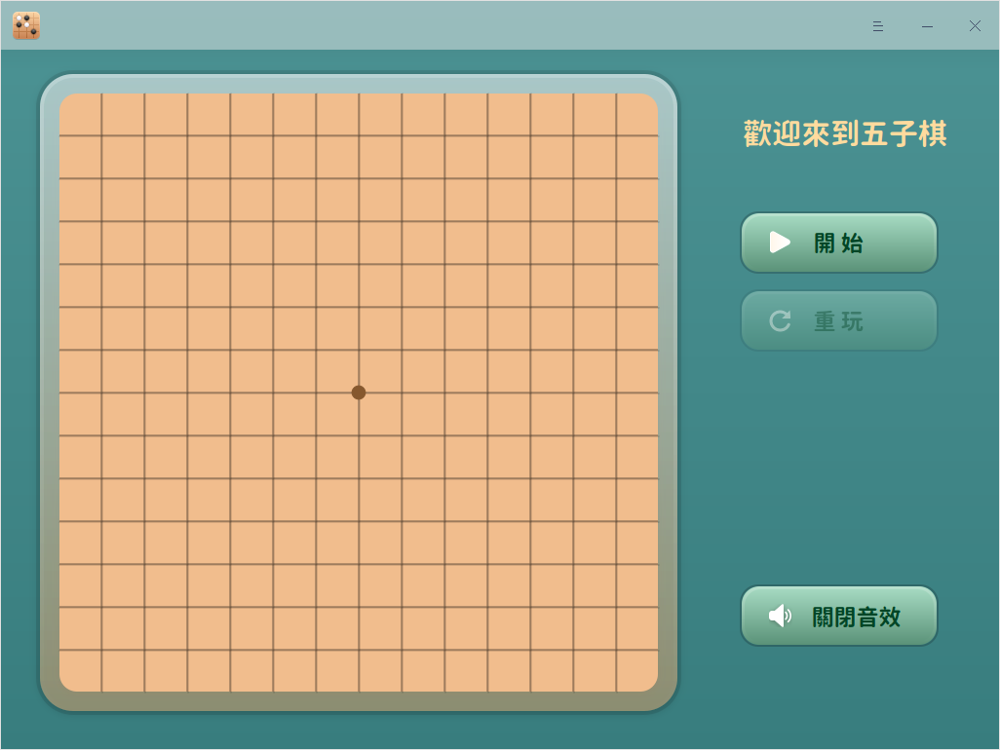

# 五子棋|deepin-gomoku|

## 概述

五子棋是兩人對弈的棋類小遊戲，老少皆宜，閒暇時間來一局吧。

## 使用入門

您可以透過以下方式執行或關閉五子棋，或者建立捷徑。

### 執行五子棋

1. 單擊任務欄上的啟動器 ，進入啟動器介面。

2. 上下滾動滑鼠滾輪瀏覽或透過搜尋，找到「五子棋」按钮 ，單擊開啟。

3. 右鍵單擊 ，您可以：

   - 單擊 **建立桌面捷徑**，在桌面建立捷徑。

   - 單擊 **釘選到Dock**，將應用程式固定到Dock。

   - 單擊 **開機啟動**，將應用程式添加到開機啟動項，在電腦開機時自動執行該應用程式。

### 關閉五子棋

- 在五子棋介面，單擊 ，關閉五子棋。
- 右鍵單擊任務欄上的  圖示，選擇 **全部關閉** 來關閉五子棋。
- 在五子棋介面單擊 ，選擇 **退出** 來關閉五子棋。

## 遊戲規則

對弈雙方分別使用黑白兩色的棋子，下在棋盤直線與橫線的交叉點上，先形成五子連線者獲勝。

## 操作介紹

1. 在五子棋界面，單擊 **開始** 按鈕，選擇您的棋子顏色。默認黑子先下。

   

2. 遊戲開始後，可以進行以下操作：

   - 單擊 **暫停** 按鈕暫停遊戲；
   - 單擊 **重玩** 按鈕新開一局；
   - 關閉或開啟音效。

3. 直到一方獲勝，遊戲結束。

## 主選單

在主選單中，您可以切換視窗主題，查看說明手冊等。

### 主題

視窗主題包含亮色主題、暗色主題和系統主題。

1. 在五子棋介面，單擊 。
2. 單擊 **主題**，選擇一個主題顏色。

### 說明

查看幫助手冊，讓您進一步了解和使用五子棋。

1. 在五子棋介面，單擊 。
2. 單擊 **說明**，查看五子棋的說明手冊。

### 關於

1. 在五子棋介面，單擊 。
2. 單擊 **關於**，查看關於五子棋的版本和介紹。

### 退出

1. 在五子棋介面，單擊 。
2. 單擊 **退出**。