<!--
SPDX-FileCopyrightText: 2024 UnionTech Software Technology Co., Ltd.

SPDX-License-Identifier: GPL-3.0-or-later
-->

# 安全中心|deepin-defender|

## 概述

安全中心是一款提供系统安全检测、病毒查杀、防火墙、垃圾清理以及安全工具等功能的应用软件。

## 使用入门

您可以通过以下方式运行或关闭安全中心，或者创建快捷方式。

### 运行安全中心

1. 单击任务栏上的启动器图标 ，进入启动器界面。
2. 上下滚动鼠标滚轮浏览或通过搜索，找到安全中心图标  ，单击运行  。
3. 右键单击 ，您可以：
   - 单击 **发送到桌面**，在桌面创建快捷方式。

   - 单击 **发送到任务栏**，将应用程序固定到任务栏。

   - 单击 **开机自动启动**，将应用程序添加到开机启动项，在电脑开机时自动运行该应用程序。

### 关闭安全中心

- 右键单击托盘上的安全中心图标  ，选择 **退出** 来退出安全中心。
- 在安全中心界面单击  ，选择 **退出** 来退出安全中心。

## 操作介绍

### 系统体检

1. 打开安全中心，选择左侧导航栏的 **系统体检**，单击 **立即体检** 后进行系统体检。

2. 体检完后，若有异常则可以对每个问题项单独操作，还可以单击 **一键修复** 快速修复多项问题。

   

3. 处理完成后，单击 **完成** 返回到系统体检首页。

### 病毒查杀
#### 病毒扫描

安全中心支持三种病毒扫描方式，分别为全盘扫描、快速扫描和自定义扫描。

1. 打开安全中心，选择左侧导航栏的 **病毒查杀**。在病毒查杀界面，选择病毒扫描方式，扫描完成后会显示扫描结果。

   

2. 根据扫描结果，可以对每个风险项单独操作，也可以选择批量操作。

   **单项操作**：

   - 修复：单击修复按钮  后，风险项被修复，下次扫描不会被判定为异常。

   - 隔离：单击隔离按钮  后，风险项被隔离，隔离后不会影响其他文件，下次扫描不会被判定为异常，可在隔离区查看。

   - 信任：单击信任按钮  后，风险项被信任，下次扫描不会被判定为异常，可在信任区查看。
   
   **批量操作**：
   
   勾选需要处理的风险项后，在页面底部的下拉框中选择 **立即修复**、**立即隔离** 或 **添加信任** 选项后，单击 **执行**，则可以批量处理风险项。
   
   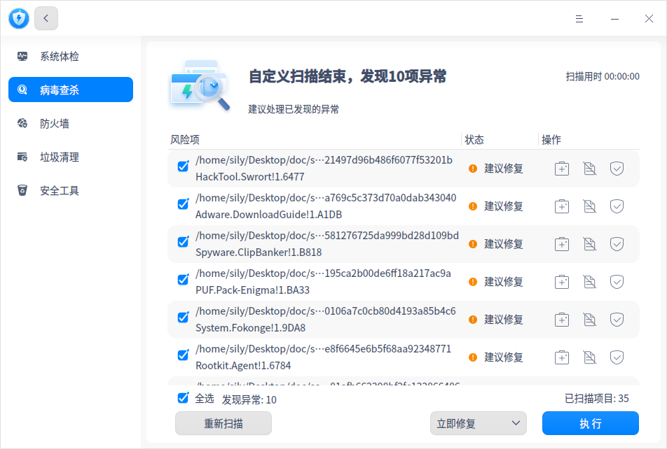

#### 定时扫描

针对快速扫描和全盘扫描，还可以设置定时扫描。定时扫描功能默认关闭，开启后，可以根据设置的内容执行病毒扫描任务。

- 扫描类型：支持选择快速扫描或全盘扫描。
- 扫描时间：选择或自定义扫描时间。
- 发现病毒处理方式：
  - 询问：发现病毒后弹出处理提示，可以选择 **忽略** 不处理，还可以选择 **立即处理**。若不做任何处理，则默认取消不处理。
  - 自动处理：扫描完成后自动处理异常病毒。

#### USB扫描

对于USB存储设备，可以设置是否自动扫描及发现病毒处理方式。

- 询问：发现病毒后，可以选择 **立即处理** 将病毒隔离或选择 **取消** 退出扫描。
- 自动处理：扫描完成后自动处理异常病毒。

#### 隔离区

在病毒查杀界面，单击 **隔离区**，可查看隔离文件列表，还可以选择将文件移出隔离。

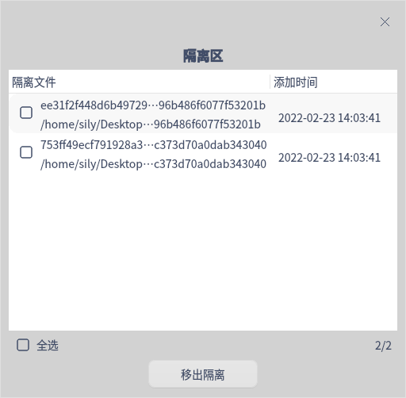

#### 信任区

在病毒查杀界面，单击 **信任区**，可查看信任文件列表，还可以选择将文件移出信任。

#### 白名单

在病毒查杀界面，单击 **白名单**，将文件加入白名单后，病毒扫描时则会被跳过。若文件发生变化，将导致信任失效，并自动从白名单目录中移除。

#### 查杀日志

在病毒查杀界面，单击 **查杀日志**，可查看每次病毒扫描的时间、扫描类型及结果。单击详情按钮 ，可查看日志详情，还可以选择删除日志。

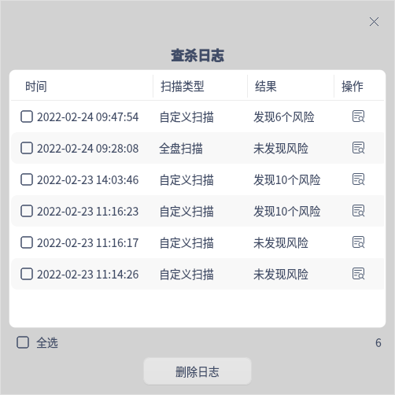

#### 病毒库更新

每天都有新病毒产生，所以要定期更新病毒库，以满足计算机的安全需求，当前支持病毒库在线更新和离线更新。

**在线更新**

当检测到新的病毒库时，在病毒查杀界面，单击 **更新** 进行病毒库更新。如果没有检测到新的病毒库，可以单击 **检查更新** 进行检查。

**离线更新**

如果因为断网等情况无法在线更新病毒库，则可以选择离线更新。

1. 在安全中心界面，单击 。
2. 选择 **病毒库离线更新**，弹出文件管理器，导入对应的.zip格式病毒库文件。如果当前使用的杀毒引擎是瑞星网安，则必须导入瑞星网安病毒库文件。
3. 导入成功后，病毒查杀界面右下角的病毒库版本更新为导入后的版本号。

### 防火墙

打开安全中心，选择左侧导航栏的 **防火墙**。在防火墙界面，开启或关闭防火墙需要输入系统登录密码进行认证。

防火墙开关默认关闭，网络防护策略无法生效。开启后默认选中专用网络策略，也可以切换为公共网络策略或自定义网络防护规则。

>   说明：当系统安全等级切换为高或中时，防火墙开关则会开启。

- 公共网络防护：主要为车站、商场、咖啡厅等公共网络信号，执行公网场景下的默认策略。

- 专用网络防护：主要为办公、家庭网络场景，执行专网场景下的默认策略。

- 自定义网络防护规则：选择此项后，可以自行配置高级防火墙规则。

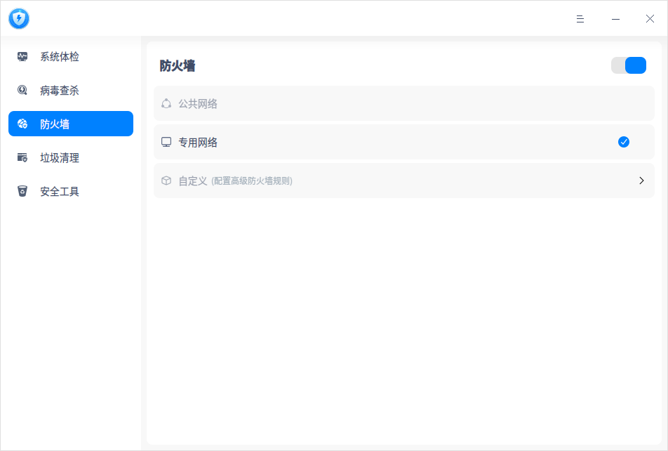

#### 自定义规则

1. 在防火墙界面，勾选“自定义”，单击更多图标 >，进入配置界面。

2. 单击 **添加** 按钮，填写或勾选防火墙规则信息，包括规则名称、程序服务、策略、方向。协议等。

   - 规则名称：规则名称不可重复，可以使用默认名称或自定义名称。

   - 程序服务：默认选择全部服务，也可以在下拉框中勾选或在输入框模糊搜索对应的服务。

   - 策略：默认选择允许，表示允许数据包传输。选择拒绝，表示不允许数据包传输。

   - 方向：默认选择出入站，出站表示本地主机访问外部数据，入站表示外部数据进入本地主机。

   - 协议：系统支持的通信协议，默认选择TCP，也可以在下拉框中勾选或在输入框模糊搜索对应的协议。

   - 本地端口/IP：非必填项，表示本地主机的端口号和IP，填写规则可以参考示例。

   - 远程端口/IP：非必填项，表示远程主机的端口号和IP，填写规则可以参考示例。

   - 状态：默认不勾选，表示该规则已停用。勾选后，启用该规则。

   

3. 完成所有的信息后，单击 **保存** 按钮。添加成功后，在配置页面查看规则列表。

   

4. 如果添加了多个规则，默认已启用的规则优先显示在前面并按照创建时间降序排列，已停用的规则在后面显示且按照创建规则时间的降序排列。当先后创建的规则有冲突时，以最后创建的启用规则为准。

#### 右键菜单

对于已添加的规则，根据启用状态可以进行相关操作。

单项操作：

- 已启用的规则：在右键菜单中，只能执行停用操作。
- 已停用的规则：在右键菜单中，可以执行修改、启用或删除操作。

多项操作：

- 全为已启用的规则：在右键菜单中，只能执行停用操作。
- 全为已停用的规则：在右键菜单中，可以执行启用或删除操作。
- 包含已启用和已停用的规则：在右键菜单中，可以执行启用、停用或删除操作。

### 垃圾清理

操作系统在日常运行中会产生各种垃圾，当垃圾越来越多，会影响系统的运行效率，浪费磁盘资源。建议定期清理垃圾，保障系统运行流畅，提升资源利用率。

1. 打开安全中心，选择左侧导航栏的 **垃圾清理**，进入垃圾清理界面。

2. 勾选对应的垃圾类型，当前可以选择清理系统垃圾、应用垃圾、痕迹信息和Cookies。

   

3. 单击 **立即扫描**，进入扫描界面。

4. 扫描完成后，可查看扫描发现的垃圾，并进行相应的处理。
   - 立即清理：清理所有选中的垃圾，您还可以自行取消勾选或者增加勾选。

   - 返回：不做任何处理，返回到垃圾清理界面。

5. 清理完成后单击 **完成** 即可，清理过程中还可以单击 **取消清理。**

### 安全工具

打开安全中心，选择左侧导航栏的 **安全工具**。安全工具包括系统工具和网络工具，单击对应图标则可以使用小工具。

#### 系统工具

**USB安全**

在USB安全界面，可以查看带存储功能的 USB 设备连接电脑的记录。

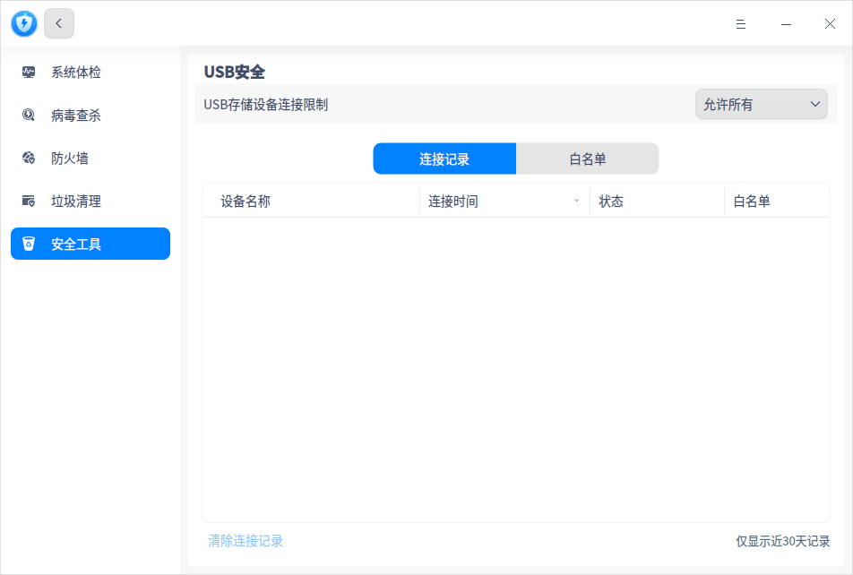

还可以将常用的USB设备加入白名单，设置只允许白名单设备连接电脑，防止电脑数据泄露。

**登录安全**

在登录安全界面，可以设置密码安全等级，还可以设置密码到期提醒时间，定期更换密码。

- 安全等级为 **高** 或 **中** ：在控制中心修改密码，或创建新用户设置密码时，若设置的密码不符合级别要求，会保存失败，您可以前往安全中心修改等级或重新设置密码。
- 安全等级为 **低** ：在控制中心修改密码，或创建新用户设置密码的时候，直接保存新设置的密码。

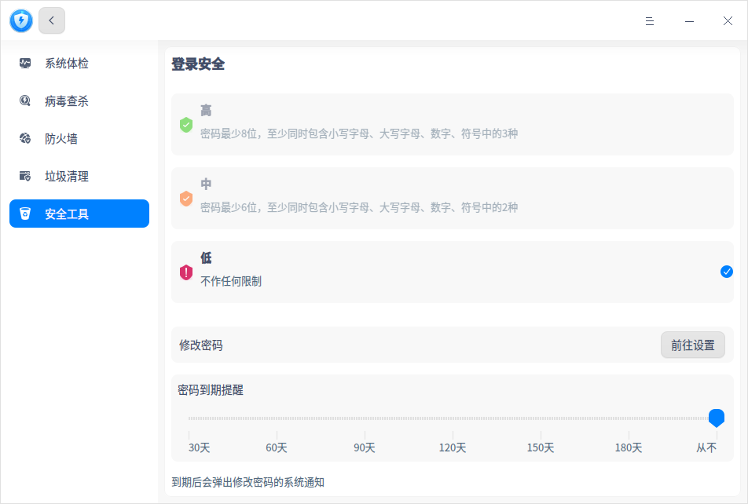

**自启动应用**

开机自启动管理界面仅显示启动器里的应用，包括应用名称、自启动状态和操作按钮。每个应用可选择允许或禁止开机自启动。

**系统安全等级**

系统安全等级配置功能入口默认隐藏，启用后会加强对系统权限的控制。如果需要使用，可以联系统信技术支持获取开启方式。

根据使用场景，选择适合系统安全等级配置，默认系统安全等级为低。

- **系统安全等级-高**：开启等保三级的安全防护，开启身份鉴别、自主访问控制、标记和强制访问控制、安全审计、数据完整性校验、数据保密性、网络安全、运行安全、资源监控等安全保护。同时开启三权分立，配置系统管理员、系统审计管理员、系统安全管理员帐号密码。
- **系统安全等级-中**：开启系统基础安全保护，同时开启防火墙网络安全保护、密码安全等级调整为中，保护系统安全。
- **系统安全等级-低**：适用于可信任的使用环境，提供基础安全防护。

（1）系统安全等级由低或中切换为高

1. 在系统安全等级界面，勾选“高”。弹出授权框，输入系统登录密码进行认证。

   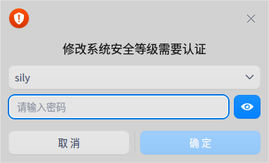

2. 弹出二次确认窗口，单击 **确定**。配置系统管理员、审计管理员、安全管理员帐号密码，每个管理员分配不同的权限。

   - 系统管理员（sysadm）：创建、删除用户，安装软件，系统相关设置；

   - 审计管理员（audadm）：添加审计规则，查看审计日志；

   - 安全管理员（secadm）：管理用户安全上下文，查询、设置安全配置；

   

4. 配置成功后，重启系统生效，普通用户部分权限会受限。在系统登录界面会显示三个管理员帐户，可以进行切换。

   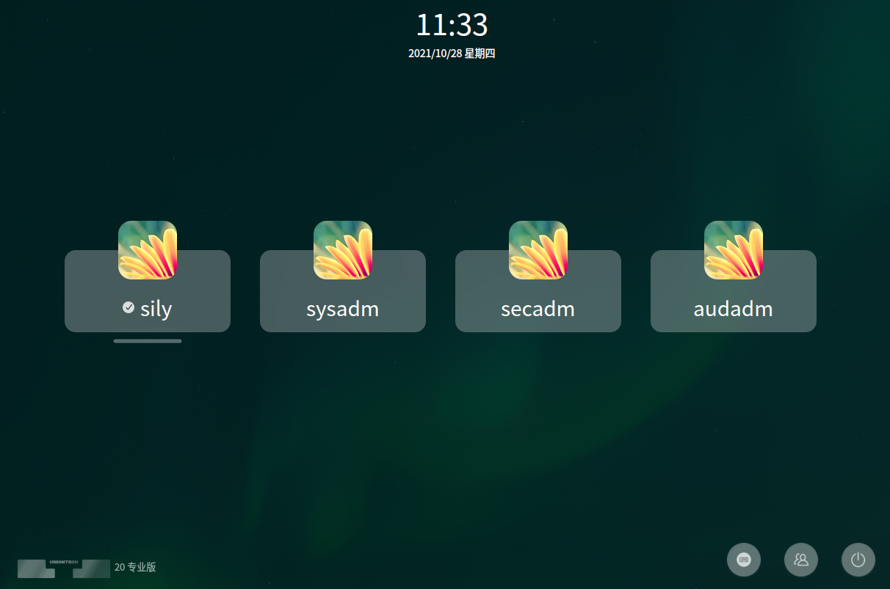

（2）系统安全等级由高切换为中或低

只有在安全管理员帐户下，系统安全等级可以从高切换为中或低。系统管理员和审计管理员帐户都无法切换系统安全等级。

1. 如果当前不是安全管理员帐户，在系统登录界面单击切换用户图标 ，选择secadm用户并登录。

2. 进入系统安全等级界面，勾选“中”或“低”。弹出授权框，输入系统登录密码进行认证。

3. 二次确认，配置成功后，删除三权帐户、恢复普通用户权限，等级切换立即生效。系统重启后恢复系统安全相关配置。

（3）系统安全等级由低切换为中或由中切换为低

1. 在系统安全等级界面，由低切换为中或由中切换为低时，需要系统登录密码进行认证。
2. 二次确认，配置成功后，等级切换立即生效。

**可信保护**

主要对系统关键组件进行完整性校验，可信保护功能默认关闭。

当系统安全等级切换为高时，同步开启完整性检查开关；当系统安全等级切换为中或低时，同步关闭完整性检查开关，可以自行关闭或开启。

1. 在可信保护界面，默认提供部分受保护的系统文件，不可修改，不可移除，保护策略默认禁止。对于新增的组件文件，则可以进行修改、移除保护，设置保护策略等操作。

2. 单击 **添加** 按钮，弹出文件管理器窗口，可以手动添加需保护的组件文件。

   

3. 新增的组件文件保护策略默认为“警告”，也可以设置为“禁止”。

   - 警告：当完整性被破坏且被检测到执行时，发出系统通知“xxx组件完整性被破坏，是否允许执行”，您可以选择 **忽略** 或 **禁止**。
   - 禁止：当完整性被破坏且被检测到执行时，发出系统通知“xxx组件完整性被破坏，禁止执行”。

4. 如果组件文件被修改了，状态栏从“正常”变为“已篡改”。

5. 勾选对应的组件文件，单击 **移除保护**，移除后则不再受保护。 

#### 网络工具

**联网控制**

在联网控制界面，联网控制功能默认关闭。开启后，可以设置列表中单个应用联网的状态，每个应用或服务下拉框有三种选项。

- 询问：应用联网时给出提示“xxx需要连接网络”，您可以选择 **仅允许本次**、**始终允许** 或 **禁止**。 

- 允许：应用联网时默认允许，不会有提示信息。

- 禁止：应用联网时给出提示“防火墙已禁止xxx连接网络”，您可以选择 **前往设置** 或 **确定**。 

>  说明：如果不发起网络连接则不会有提示信息，比如本身就不会联网的应用，即使选择 **询问** 或 **禁止** 也不会在启动时弹出提示。

  

**流量监控**

在流量监控界面，流量监控功能默认关闭。开启后，可以对系统里应用上网所使用的流量情况进行监控。

- 当前联网：查看列表中应用当前的下行网速、上行网速。单击管控下拉框，可以选择 **询问**、**允许** 或 **禁止** 选项，控制应用是否能联网，详细操作请参考安全工具中的 [联网控制](#网络工具)。

  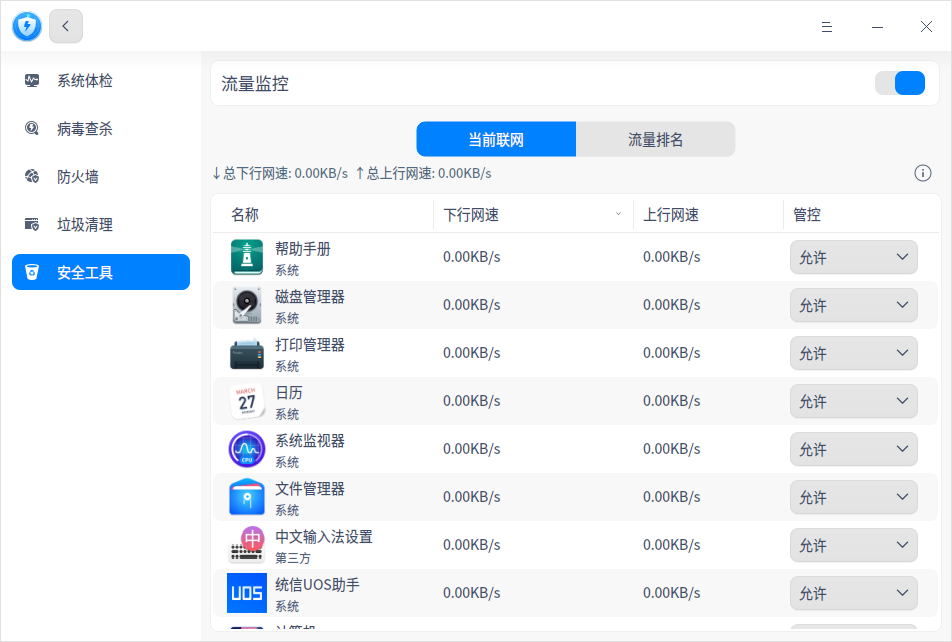

- 流量排名：查看启动器里所有应用的流量排名，包括下行流量、上行流量、总流量、流量时间分布详情。列表右上角支持切换时间跨度：当天、昨天、当月、上月。

  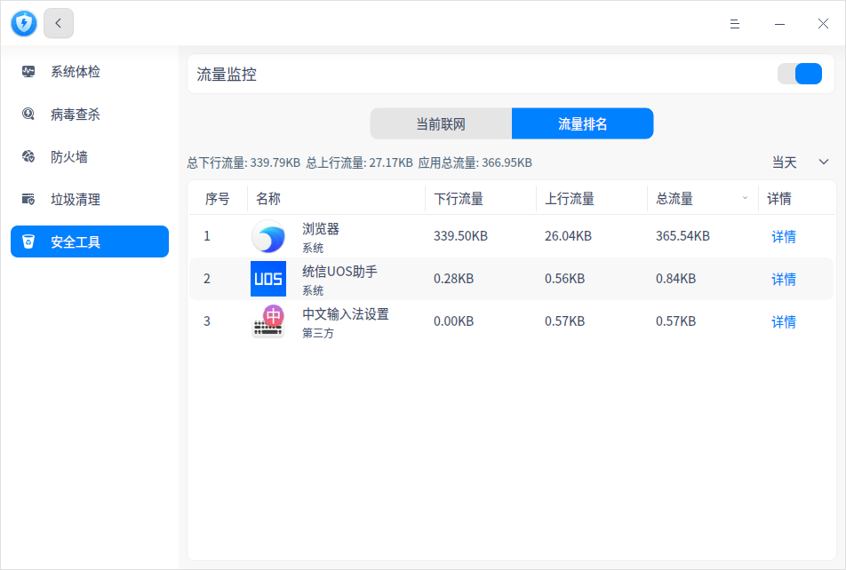

## 主菜单

在主菜单中，可以进行相关参数设置、问题反馈、切换窗口主题，查看帮助手册等操作。

### 设置

在安全中心界面，单击 ，选择 **设置** 后进行基础设置。

#### 基础设置

**病毒查杀**

- 加入“病毒查杀”到文件右键菜单：勾选后，单击文件（夹）右键可直接选择 **病毒查杀**。
- 不扫描超过此大小的压缩包：勾选后，若压缩包超过设定的大小，则不会进行扫描。
- 病毒库升级地址：勾选后，可设置病毒库升级地址。

**杀毒引擎**

可以选择瑞星网安或安恒信息杀毒引擎。

**关闭主窗口**

- 选择 **最小化到系统托盘**，关闭主窗口时，应用将隐藏到系统托盘。
- 选择 **退出**，关闭主窗口时直接退出应用。
- 选择 **每次询问**，每次关闭主窗口时会弹出确认弹框。

#### 恢复默认

单击 **恢复默认** ，恢复默认设置。

### 用户反馈

1. 在安全中心界面，单击 。
2. 选择 **用户反馈**，跳转到“服务与支持”应用的留言咨询界面，您可以反馈相关问题。

### 安全日志

1. 在安全中心界面，单击 。

2. 选择 **安全日志**，可以根据日志类型和日期查看安全中心的操作日志，还可以选择清除日志。

   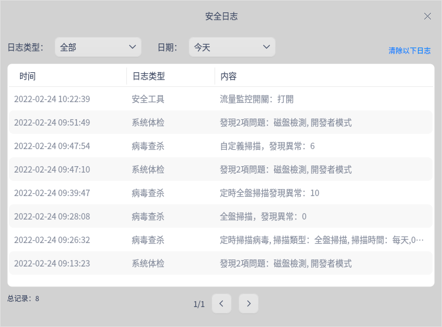

### 主题

窗口主题包含浅色主题、深色主题和系统主题。

1. 在安全中心界面，单击。
2. 选择 **主题**，选择一个主题颜色。

### 帮助

1. 在安全中心界面，单击 。
2. 选择 **帮助**，查看关于安全中心的帮助手册，进一步了解和使用安全中心。

### 关于

1. 在安全中心界面，单击 。
2. 选择 **关于**，查看安全中心的版本和介绍。

### 退出

1. 在安全中心界面，单击 。
2. 选择 **退出**。

 