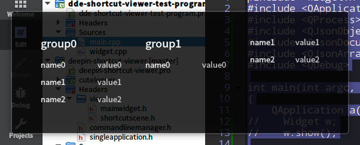


## deepin-shortcut-viewer 使用说明文档

### deepin-shortcut-viewer特性

##### 1. deepin-shortcut-viewer 是一个单进程应用.当deepin-shortcut-viewer启动后，在deepin-shortcut-viewer被销毁之前其他应用无法启动deepin-shortcut-viewer。当deepin-shortcut-viewer检测到有control键或者shift键被释放时候，deepin-shortcut-viewer会退出，或者用鼠标点击deepin-shortcut-viewer窗口区域。

##### 2. deepin-shortcut-viewer的窗口大小会根据快捷键内容进行自适应，调用方无需关心deepin-shortcut-viewer的窗口设置。

打开命令：deepin-shortcut-viewer -h看帮助
>* 参数-p,--pos是用来传一个中心坐标给deepin-shortcut-viewer去居中。一般用法是直接传父窗口的中心坐标给deepin-shortcut-viewer。
>
> * 参数-j,--json-data 以json格式字符串向deepin-shortcut-viewer传快捷键内容，下面介绍本json数据格式：
json 数据格式如下：
~~~json
{
    "shortcut": [
        {
            "groupItems": [
                {
                    "name": "name0",
                    "value": "value0"
                },
                {
                    "name": "name1",
                    "value": "value1"
                },
                {
                    "name": "name2",
                    "value": "value2"
                }
            ],
            "groupName": "group0"
        },
        {
            "groupItems": [
                {
                    "name": "name0",
                    "value": "value0"
                },
                {
                    "name": "name1",
                    "value": "value1"
                },
                {
                    "name": "name2",
                    "value": "value2"
                }
            ],
            "groupName": "group1"
        }
    ]
}
~~~
>
>数据的root object为shortcut每个object中,groupName是快捷键分组标签；groupItems是该分组的快捷键；groupItems中,name为快捷键标签，value为快捷键符号。

##### 实现程序实例：

~~~c++
#include "widget.h"

#include <QApplication>
#include <QProcess>
#include <QJsonObject>
#include <QJsonDocument>
#include <QJsonArray>

int main(int argc, char *argv[])
{

    QApplication a(argc, argv);

    QJsonObject root;
    QJsonArray shortcuts;

    for(int a = 0; a<2;a++){

        QJsonObject group;
        QJsonArray items;
        group.insert("groupName","group" + QString::number(a));

        for(int b = 0; b<3; b++){
            QJsonObject item;
            item.insert("name","name" + QString::number(b));
            item.insert("value","value" + QString::number(b));
            items.append(item);
        }
        group.insert("groupItems",items);
        shortcuts.append(group);
    }
    root.insert("shortcut",shortcuts);

    QJsonDocument doc(root);
    QStringList args;
    QString param = "-j=";
    param += doc.toJson().data();
    args<<param<<"-p = 200,200";
    QProcess::startDetached("deepin-shortcut-viewer",args);

    return a.exec();
}

~~~

程序截图：

#### 说明：

命令行调用的时候若是-r 和 -j的参数都使用了，deepin-shortcut-viewer会默认启用-r参数格式显示快捷键内容。
