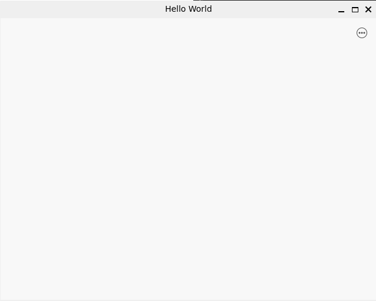

@mainpage

# dtkdeclarative

## 简介

dtkdeclarative 是基于 QtQuick及QtQml实现的开发控件库，它是用于代替已有的dtkwidget所开发的全新的DTK模块，其代码以 qtdeclarative 为基础进行开发，实现了对QML已有控件的覆盖（包含Qt Quick Controls 2中的所有控件），增加了大量在 DTK 环境下友好显示的视觉特效和颜色风格。该模块通过Qt插件的形式新增了名为“Chameleon”的样式插件，安装在 `/usr/lib/x86_64-linux-gnu/qt5/qml/QtQuick/Controls.2/Chameleon` 目录(由qml-module-qtquick-controls2-styles-chameleon包提供)。此外，与dtkwidget类似，dtkdeclarative也提供了一些QtQuick中所没有的功能，此类功能都以QML接口的形式提供，包含在 org.deepin.dtk 1.0 中，安装在 `/usr/lib/x86_64-linux-gnu/qt5/qml/org/deepin/dtk/` 目录（由libdtkdeclarative5包提供）。使用 dtkdeclarative 在 DTK 环境下编程具备一下特点：

1. 原始的 Qt 和 Qml 代码风格
2. 适配传统 Qml 的所有 API
3. 简单快速的界面开发接口
4. 统一的控件主题风格
5. 丰富的特效和色彩

dtkdeclative 设计图如下：<br>


## 与dtkwidget的区别

dtkwidget基于QtWidgets模块开发，其与dtkdeclarative的区别主要体现在QtWidgets和QtQuick/QtQml的差异。
QtWidget使用 C++ 语言开发，其控件都继承于 QWidget 并进行拓展，通过QPainter 在风格插件中进行样式的统一绘制。由于 C++ 语言的特殊性，其信号基于回调函数的方式实现，其事件处理基于多态的特性实现。因此在代码复杂度和冗余度上都有明显的劣势。
QtQuick/QtQml基于Qml语言开发，其特点是通过树状模型来指定父子类别，通过属性绑定来响应变化。除此之外，它能兼容JavaScript和C++语言的特性，保证开发过程的高效和快速，减少QtWidget编程中信号槽链接的繁琐程度。<br>
在使用dtkdeclarative之前，应当先熟悉QtQuick的开发模式，其最大的特点是使用“声明式语言（QML）”来描述UI的状态，而不用关心UI具体的渲染过程。下面是一些小例子：<br>

### 渲染方式的区别

  1. 使用dtkwidget显示一个100x100大小的红色矩形
```cpp
    class Rectangle : public QWidget
    {
    private:
        void paintEvent(QPaintEvent *) override {
            QPainter pa(this);
            pa.fillRect(0, 0, 100, 100, Qt::red);
        }
    };
```

  2.使用dtkdeclarative显示一个100x100大小的红色矩形

```qml
    Rectangle {
        width: 100
        height: 100
        color: "red"
    }

```

### 布局方式上的区别

1. 使用dtkwidget可以通过布局控件实现

    ```cpp
    int main(int argc, char *argv[]) {
        QApplication app(argc, argv);

        QWidget mainWidget;
        mainWidget.resize(200, 200);
        QHBoxLayout layout1(&mainWidget);
        QPushButton btn1("Button 1");
        layout1.addWidget(&btn1);
        QVBoxLayout layout2;
        QPushButton btn2("Button 2");
        QLineEdit lineEdit;
        layout2.addWidget(&btn2);
        layout2.addWidget(&lineEdit);
        layout1.addLayout(&layout2);
        mainWidget.show();

        return app.exec();
    }
    ```

2. 使用dtkdeclarative通过锚布局或布局器

    2.1. 使用锚布局

    ```qml
        Rectangle {
            width: 400

            height: 200
            color: "blue"

            Button {
                anchors.left: parent.left
                anchors.verticalCenter: parent.verticalCenter
                text: "Button 1"
            }

            Button {
                anchors.right: parent.right
                anchors.verticalCenter: parent.verticalCenter
                text: "Button 2"
            }

            Label {
                text: "Center"
                color: "white"
                anchors.centerIn: parent
            }
        }
    ```

    2.2. 使用布局器

    ```qml

        RowLayout {
            spacing: 20
            Button {
                text: "Button 1"
                // 设置Layout的附加属性
                Layout.fillWidth: true
                Layout.minimumWidth: 50
                Layout.preferredWidth: 100
                Layout.maximumWidth: 300
                Layout.minimumHeight: 150
            }

            Label {
                text: "Center"
            }

            Button {
                text: "Button 2"
                // 设置Layout的附加属性
                Layout.fillWidth: true
                Layout.minimumWidth: 100
                Layout.preferredWidth: 200
                Layout.preferredHeight: 100
            }
        }
    ```

### 信号槽连接上的区别

1. dtkwidget使用`QObject::connection`方式连接

    ```cpp
    int main(int argc, char *argv[]) {
        QApplication app(argc, argv);

        QWidget widget;
        widget.resize(300, 300);
        QPushButton btn("Button", &widget);
        btn.move(50, 50);
        QObject::connect(&btn, &QPushButton::clicked, []() {
            qDebug() << "Button Clicked...";
        });
        widget.show();
    }
    ```

2. dtkdeclarative使用function或Connections实现

    使用`on<Signal>`的方式连接

    ```qml
    Button {
        anchors.centerIn: parent
        text: "Button"
        // on<Signal> 进行信号槽连接
        onClicked: {
            console.log("Button clicked.....");
        }
    }
    ```

    使用Connections 方式连接
    该种方式应用于同一个信号链接到多个槽函数或者链接作用域不一样的多个组件。

    ```qml
    Button {
        id: btn
        anchors.centerIn: parent
        text: "Button"
    }

    // 5.15以下版本使用
    Connections {
        target: btn
        onClicked: {
            console.log("Button clicked...")
        }
    }
    // 5.15以上版本使用
    Connections {
        target: btn
        function onClicked() {
            console.log("Button clicked...")
        }
    }
    ```

## 入门资料

[QtQml和QtQuick的最佳编程方式](https://doc.qt.io/qt-5/qtquick-bestpractices.html)

本质上dtkdeclarative就是对于qt的qml模块的扩展，使用qt的资料学习qml再对照本文档进行开发是一种行之有效的手段

同时我们提供了对应的开发规范，详细介绍了对于DCI图标，调色板和DConfig的使用，以方便开发者开发:
@ref DevSpecification

## 依赖关系

dtkdeclarative项目依赖于dtk的部分项目以及qtqml的相关依赖。项目中使用到dtkdeclarative项目时，构建运行环境是项目迁移的开始。

由于 dtkdeclarative 被用于替代 dtkwidget 而实现的快速高效的UI编程开发，因此它并不依赖于 dtkwidget 而依赖于 dtkcommon、dtkcore以及dtkgui项目，
这是构建dtkdeclarative时所必需的依赖项，对于DTK的无标题以及圆角窗口等属性，在程序运行和显示时需要依赖 qt5platform-plugins 项目内容，用于深度适配 DTK 开发工具。

除此之外，dtkdeclarative需要依赖 QtQml以及QtQuick 相关内容，如 qtdeclarative 和 qtquickcontrols2 。
对于某些运行依赖，即某些qml控件插件，dtkdeclarative也需要依赖安装，如qml-module-qtquick-shape和qml-module-qtgraphicaleffects。

下表列出dtkdeclarative项目所依赖大部分的库文件：
| 组件        | 依赖项                           |
|-----------|-------------------------------|
| dtkcommon | libdtkcommon-dev              |
| dtkcore   | libdtkcore-dev                |
| dtkcore   | libdtkcore5                   |
| dtkcore   | libqt5dbus5                   |
| dtkcore   | libqt5xml5                    |
| dtkgui    | libdtkgui5                    |
| dtkgui    | libdtkgui-dev                 |
|  dtkgui   | libqt5gui5                    |
|  dtkgui   | libqt5dbus5                   |
| dtkgui    | libqt5xml5                    |
| dtkgui    | qt5-image-formats-plugins     |
| Qt        | qtbase5-dev                   |
| Qt        | qtdeclarative5-dev            |
| Qt        | libqt5quickcontrols2-5        |
|           | qt5-platform-plugins          |
|           | qml-module-qtgraphicaleffects |
|           | qml-module-qtquick-shapes     |

## 使用教程

dtkdeclarative和Chameleon均为Qt的插件，所以都是动态加载的，不需要进行链接，只需考虑在运行时使Qt引擎能够找到并加载插件。

* 工程文件：不需要引用dtkdeclarative库信息。
* 风格适配：当成功配置dtk环境后，除非手动指定其他风格，否则所使用的控件风格将全部自动使用行云设计风格。
* 控件中导入dtk相关组件，应确保在最后引入，**可取别名以防被Qt原生同名控件覆盖**，例如：

```qml
import org.deepin.dtk 1.0
```

```qml
import org.deepin.dtk 1.0 as D
```

引用dtk控件，例如: 使用Button控件和dtk提供的字体绑定。

```qml

Button {
    font: D.DTK.fontManager.t6
}
```

### 简单的qml项目创建方式：

（由于qt官方已经从QMake切换到CMake,且在完成文档之前，dtk项目组已经完成了向CMake项目的迁移，故不提供QMake项目的创建的方式）
（因为版本缘故 下列截图可能存在风格主题以及其他差异请以你安装的qtcreator为准）

1. QtCreator新建qml项目
    

    需要选择构建系统为CMake

    

    然后qt会自动给你创建一个例子

    如果出现例子不能运行的情况，显示qtquick not found 则需要检查 qml-module-qtquick-window2 是否被正确安装

2. 指定风格控件

    在cmake中添加和修改：

    ```cmake
    find_package(Qt5QuickControls2) # 添加

    # 修改连接库
    target_link_libraries(untitled1
    PRIVATE Qt${QT_VERSION_MAJOR}::Core Qt${QT_VERSION_MAJOR}::Quick Qt${QT_VERSION_MAJOR}::QuickControls2)

    ```

    在main函数中手动指定：

    ```cpp
    #include <QGuiApplication>
    #include <QQmlApplicationEngine>
    #include <QQuickStyle> //添加

    #include <DGuiApplicationHelper>

    int main(int argc, char *argv[])
    {
    #if QT_VERSION < QT_VERSION_CHECK(6, 0, 0)
        QCoreApplication::setAttribute(Qt::AA_EnableHighDpiScaling);
    #endif
        QGuiApplication app(argc, argv);
        auto pt = Dtk::Gui::DGuiApplicationHelper::instance()->applicationPalette(); //添加
        QQuickStyle::setStyle("Chameleon");
        QQmlApplicationEngine engine;
        const QUrl url(QStringLiteral("qrc:/main.qml"));
        QObject::connect(&engine, &QQmlApplicationEngine::objectCreated,
                        &app, [url](QObject *obj, const QUrl &objUrl) {
            if (!obj && url == objUrl)
                QCoreApplication::exit(-1);
        }, Qt::QueuedConnection);
        engine.load(url);

        return app.exec();
    }

    ```


然后在QML中导入dtk库(前提：dtk组件被正确安装)，并开启dtk窗口圆角特性

main.qml：
```qml
import QtQuick 2.15
import QtQuick.Window 2.15
import org.deepin.dtk 1.0

ApplicationWindow {
    width: 640
    height: 480
    visible: true
    title: qsTr("Hello World")

    flags: Qt.Window | Qt.WindowMinMaxButtonsHint | Qt.WindowCloseButtonHint | Qt.WindowTitleHint
    header: TitleBar {

    }
}
```
得到效果如下：



实际效果可能和这个效果会有差异（因为在测试多系统的兼容性，此代码是在debian sid + gnome + dtk上运行）

@weakgroup org.deepin.dtk
@brief dtk的qml模块
