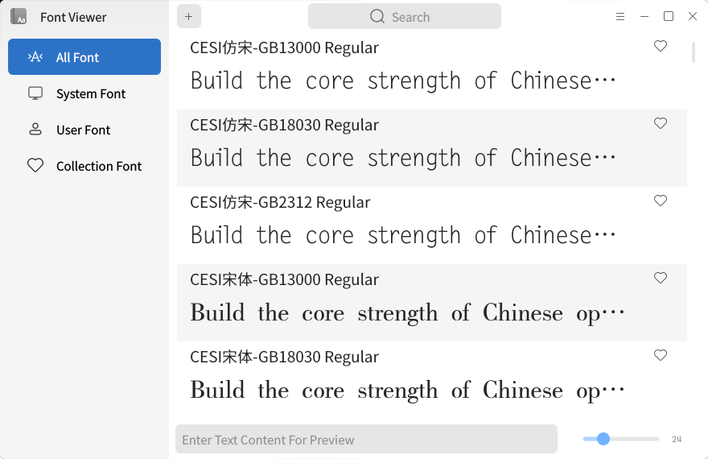
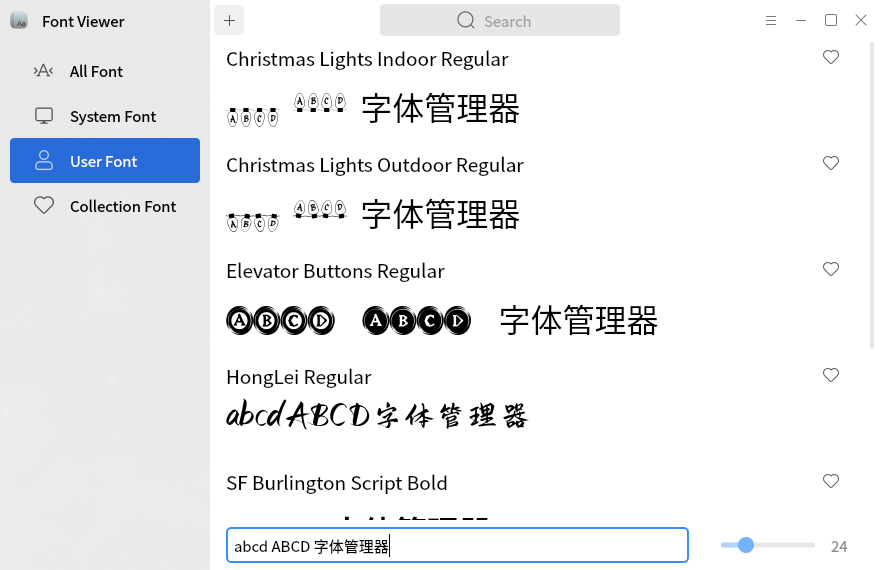
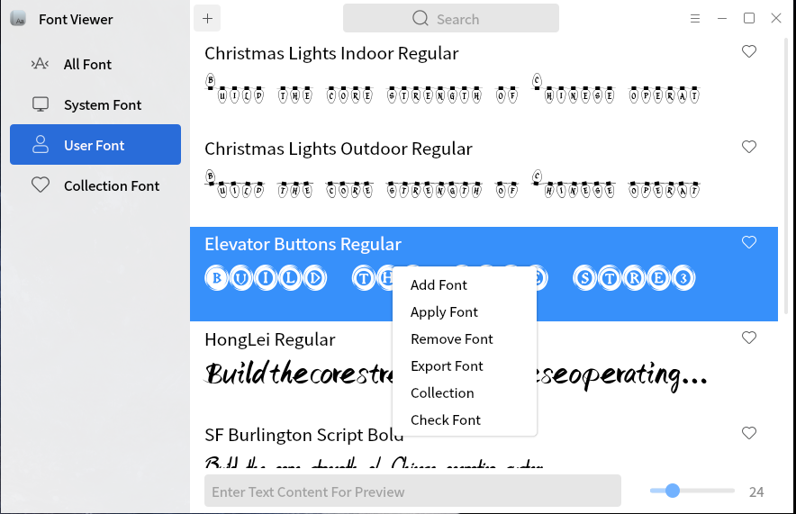
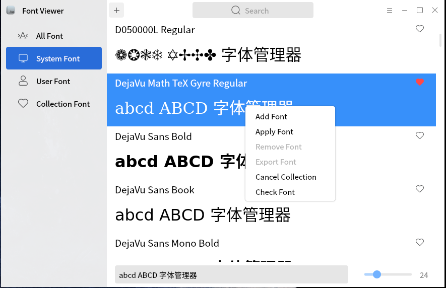

# Font Viewer

## Summary

The font manager is a tool for viewing font styles. While viewing font styles, you can apply fonts, uninstall fonts, export fonts, collect fonts, and change preview content and preview font size.

"All fonts" includes "system fonts" and "my fonts"; "System font" is the font in the system; "My font" is the font installed by the user; "Favorite font" is the font that users collect.

 

### Preview Area

In the preview area, you can modify the preview content and preview font size.

### Add font

Click "! [] (image/3. PNG)" icon to add a font.
The added fonts will be displayed in "My font" and "All fonts".

### Right click menu

Right click the font list of "my font" to pop up a menu. You can add fonts, apply fonts, uninstall fonts, export fonts, collect fonts and view font information. Right click system font to add font, apply font, collect font and view font information.

### Help and about

Click Help in the menu bar to open the help manual of the font viewer.

Click "about" to view the information about the font viewer.
