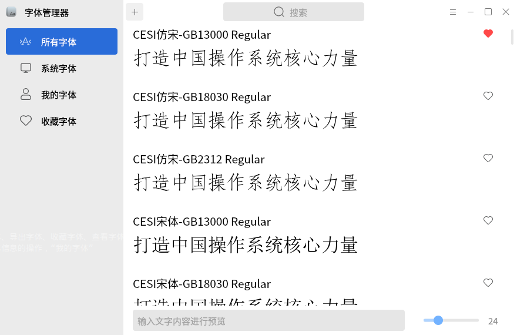
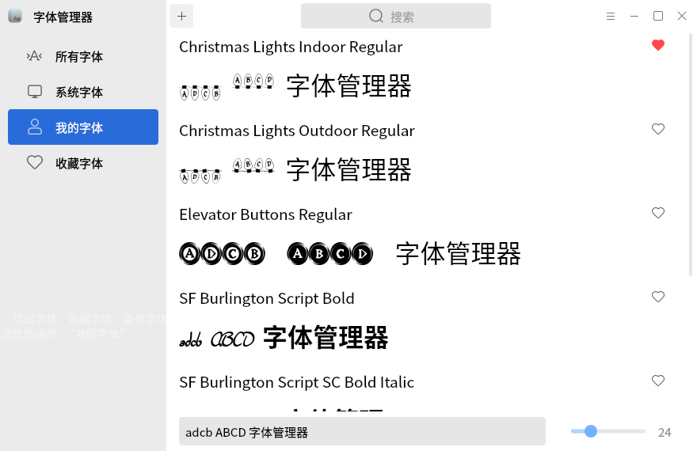
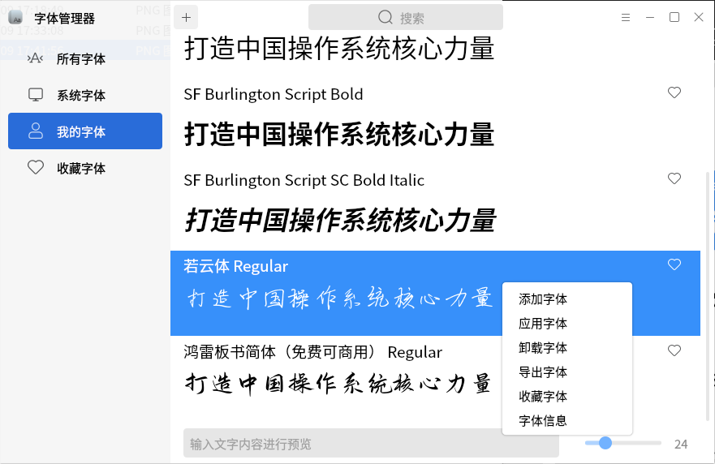
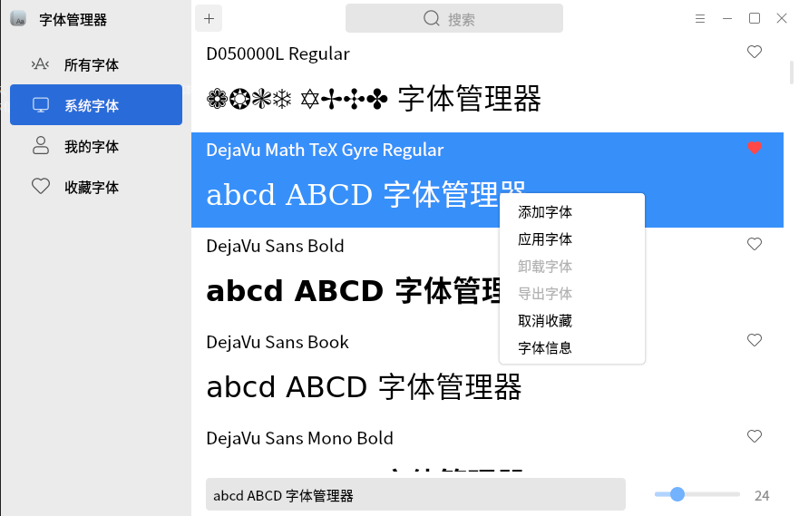

# 字体管理器

## 概 述

字体管理器是一个用于查看字体样式的工具。在查看字体样式的同时，可以应用字体、卸载字体、导出字体、收藏字体，还可以改变预览内容和预览字号。

“所有字体”包含“系统字体”和“我的字体”；“系统字体”是系统中自带的字体；“我的字体”是用户自己进行安装的字体；“收藏字体”是用户进行收藏的字体。

主界面如图1所示。

 

### 预览区域

在预览区域可以修改预览内容和预览字体的大小。

### 添加字体

点击“”图标可以添加字体。

添加后的字体会在“我的字体”和“所有字体”中显示出来。

### 右键菜单

右击“我的字体”的字体列表会弹出菜单可以对字体进行添加字体、应用字体、卸载字体、导出字体、收藏字体、查看字体信息的操作。对于“系统字体”右键只可以进行添加字体、应用字体、收藏字体、查看字体信息的操作。

### 帮助和关于

在菜单栏中点击帮助可打开字体管理器的帮助手册。

点击“关于”，可查看字体管理器的关于信息。
