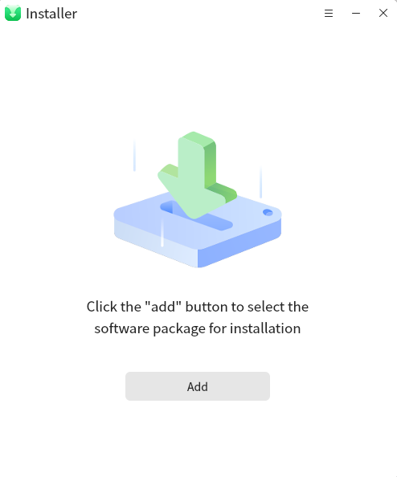
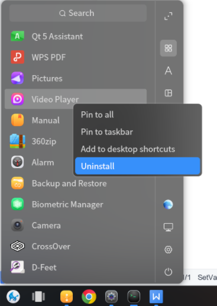
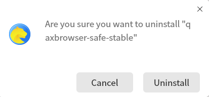

# installer

## Overview

The installer is used to install the deb package into the system or into the compatible environment. The installation interface of the installation into the system and the installation interface in the compatible environment are as shown in Figure 1 and Figure 2:

## Installer use

The first type: double-click the deb to be installed, and the installer interface will pop up directly;

The second type: type the command through the terminal, lingmo-installer + package name, such as lingmo video lingmo-installer lingmo-video_3.1.0-71_amd64.deb, the installation interface will pop up;

In the pop-up installation interface mentioned above, the installer will automatically identify whether to install in a compatible environment or install in the system according to the properties of the package, just click install;

Note: Only after the installation succeeds or fails, can the next one be installed;

## Uninstaller use

There are two ways to uninstall an application, as follows:

The first one is to uninstall by right-clicking on the start menu, and clicking the uninstall button will pop up the uninstall interface, as shown in the figure below:

The second is to use the terminal to type the uninstall command, the path of the lingmo-uninstaller + desktop file, for example, uninstall 360 browser, lingmo-uninstaller /usr/share/applications/browser360-cn-lingmo-v10.desktop;

Note: When the application is running, the uninstaller will not allow uninstallation; when the uninstaller is uninstalling, simultaneous uninstallation is not allowed;

