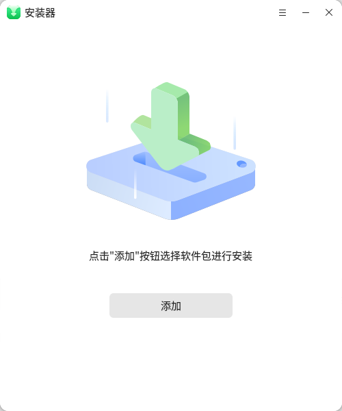
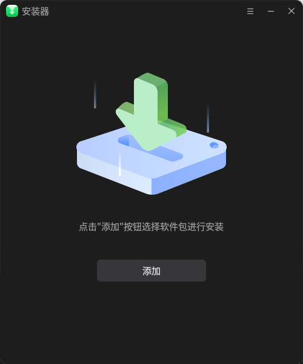
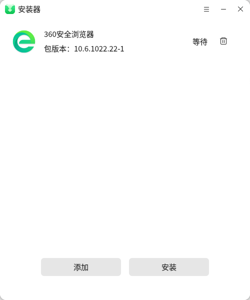
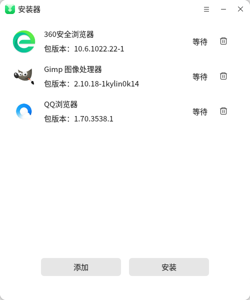
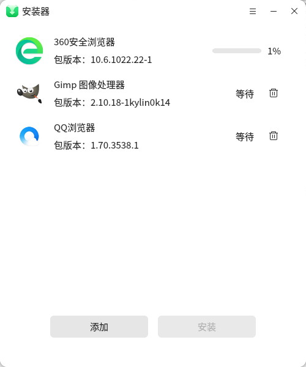
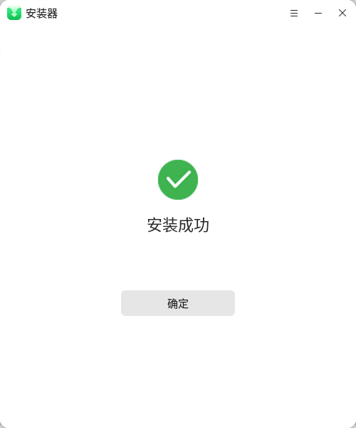
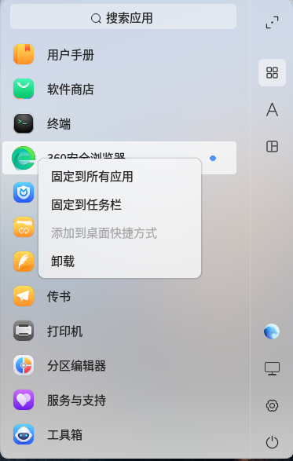

# 安装器

### 概述

安装器用于用户在系统中图形化安装或卸载deb格式的软件应用。

### 打开方式

-   "**开始菜单**"" > "**安装器**".

图 2.1 安装器-日间模式

图 2.2 安装器-夜间模式

### 软件安装

单个软件包安装有三种方式：

第一种：在开始菜单中打开安装器，点击添加后选择需要安装的软件包，点击"安装"；

图 3.1 单个软件包安装

第二种：双击所需要安装的deb包，会弹窗安装器界面，点击"一键安装"；

第三种：通过在终端输入命令安装，lingmo-installer +
包名，会弹出安装界面，点击"一键安装"。例如安装360安全浏览器，在终端输入：

lingmo-installer browser360-cn-stable\_10.6.1022.22-1\_amd64.deb

图 3.2 单个软件包安装

安装器还支持批量安装软件包，先在开始菜单打开安装器，然后点击"添加"，

添加需要批量安装的多个软件包，点击"安装"。

图 3.3 软件包批量添加

图 3.4 软件包批量安装

安装器会根据包的属性，自动识别在系统中或兼容环境中安装，用户直接点击安装即可。

图 3.5 安装成功

注意：当安装的与机器架构不符或软件包命名不规范时，安装器将会弹出错误提示。

图 3.6 软件包命名不规范提示

图 3.7 不规范提示

### 软件卸载

卸载软件有两种方式：

第一种：通过开始菜单找到要卸载的软件点击右键进行选择卸载，会弹出卸载界面；

图 4.1 开始菜单中卸载软件

第二种：通过终端输入命令卸载，lingmo-uninstaller +
desktop文件的路径，例如卸载360安全浏览器，在终端输入：

lingmo-uninstaller /home/lingmo/桌面/browser360-cn.desktop

图 4.2 卸载软件

注：当应用正在运行的时候，软件不允许卸载；不允许进行同时卸载两个及以上的软件。

### 常见问题

（1）灵墨桌面操作系统V10可安装.exe后缀的软件吗？

灵墨桌面操作系统V10 SP1 2303版本在X86、ARM架构下可以运行KWRE兼容环境，可以安装所支持的.exe后缀软件。

（2）灵墨桌面操作系统V10如何离线安装软件？

请先下载对应架构的软件包，拷贝到系统，右键选择“在终端中打开”，执行命令：sudo dpkg -i 软件包名，输完命令回车，提示输入密码（输入的密码不会显示在屏幕），输完回车即可完成。

（3）灵墨桌面操作系统V10如何在线安装软件?

可通过系统中自带的软件商店一站式搜索下载安装软件。

（4）灵墨桌面操作系统V10下载软件除在应用商店外还可以去哪里下载？

请到对应第三方软件的官网，下载对应的linux版本的安装包。

（5） 灵墨桌面操作系统V10如何更新软件源？

登录系统，确保系统可连接外网，打开终端执行命令：sudo apt update更新软件源。

（6）灵墨桌面操作系统V10能运行安卓应用吗？

灵墨桌面操作系统V10在X86、ARM架构下支持KMRE兼容环境，可以运行安卓应用。

（7）灵墨桌面操作系统V10软件商店没几个软件可以下载？

需要更新外网源才行，打开终端执行命令：sudo  apt  update。

（8）灵墨桌面操作系统V10能安装IE浏览器吗？

灵墨桌面操作系统V10不支持安装IE浏览器。

（9）灵墨桌面操作系统V10如何卸载软件？

可通过系统中自带的软件商店卸载相应的软件。

（10）怎么安装杀毒软件？

可通过软件商店，搜索您想安装的杀毒软件名称进行安装，或在安装系统时选择可预装的软件。

（11）安装软件提示缺失依赖怎么办？

可单独下载依赖包安装解决，打开终端执行命令：sudo apt-get install xxx（依赖包名），然后重新安装该软件。

（12）dpkg安装命令出错，报“与本机系统体系结构不符...”怎么办？

请按照架构安装对应软件，鲲鹏-arm、飞腾-arm、龙芯-mips/loongarch、兆芯-x86、海光-x86、申威-alpha。

（13）怎么批量安装软件？

新建一个空白文件夹夹，将想批量安装的软件包拷贝至此处，在该文件夹空白处右键，点击从终端打开，输入命令：sudo  dpkg  -i  *， 即可批量安装软件。

（14）安装软件一直在0%怎么办？

一般后台正在下载，请耐心等待。如果长时间没有反应请查看网络连接是否正常。

（15）灵墨桌面操作系统V10有可以查看CPU/GPU的温度检测硬件类似鲁大师的工具吗?

工具箱。

