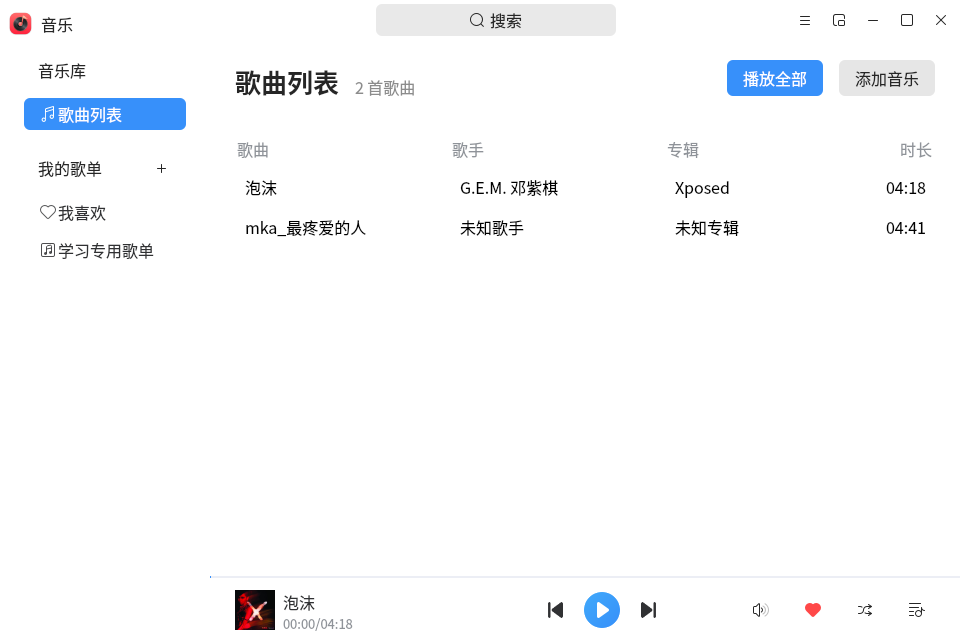
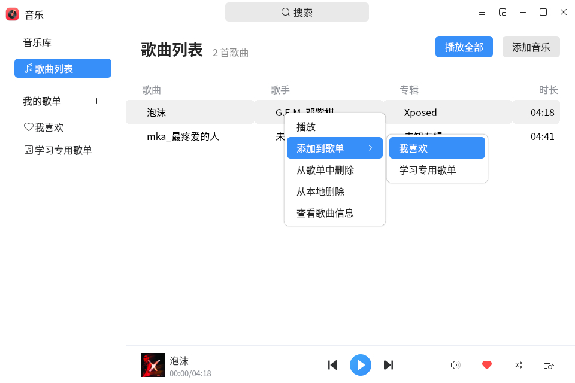
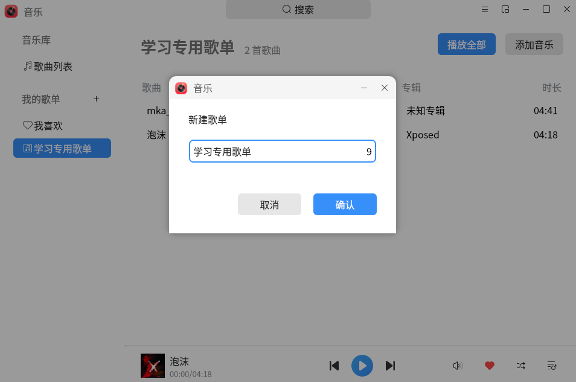
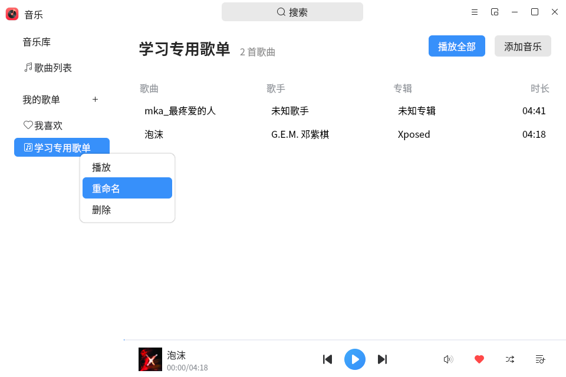

# 音乐
## 概 述
音乐是一款简单易用，界面友好，支持.mp3、.ogg、.wma、.aac、.flac等音乐格式的音乐播放器。在播放本地音乐的同时，还可以根据喜好将自定义歌单来对音乐进行分组。除了常规模式外，音乐还有小窗口模式来满足用户的不同需求。

### 歌曲列表

添加完歌曲后的歌曲列表页面如下图所示。

您可以选择控制区域进行播放/暂停、上一首、下一首等操作。

### 歌曲右键

您可以选择一首歌曲，通过鼠标右键进行添加到“我喜欢”歌单、删除、查看歌曲信息等操作。

### 新建歌单

您可以通过“我的歌单”右侧加号“+”进行新建歌单。

注：新建歌单名不能包含以下字符：\ / : * ? " & < > |

### 歌单右键

您可以通过右键查看歌单可编辑的操作，如播放、重命名、删除等操作，但“我喜欢”歌单仅有播放操作。

### 切换迷你模式

为了更好的体验您可以切换Mini窗口。

在Mini窗口中，您可以进行上一首、播放、暂停、下一首、选择播放模式等操作。

#### 切换前

#### 切换后

