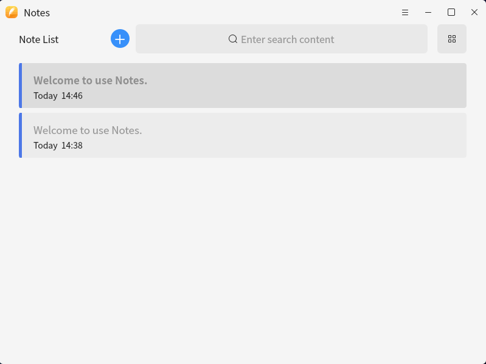
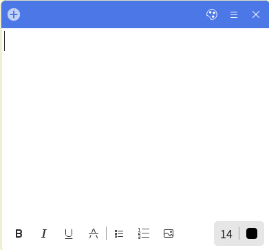

# Note Book

## Abstract

Lingmo Notepad is a small plug-in in the sidebar, which provides convenient text recording and flexible interface display.

### Function I（Notes List）

#### Notes List UI

（1）Sort in reverse order of modification time in real time.

（2）The modification time and some text content of each note are displayed.

（3）New: add a list entry and open a note tab.

（4）Search: search by matching the text content of all notes in the list.

（5）Delete: deletes the selected item in the current list. After deletion, the previous note in the list will be automatically selected. If the note of the corresponding item is open during deletion, the note page will be closed at the same time; If no entry is selected in the list, the deletion is invalid.

（6）Double click the list / icon entry, open or reactivate the top note and get the input focus.

### Function II（Note Page）

#### Note Page UI

（1）Support automatically save with text modification.

（2）Support users to customize the note header color and save the database.

（3）After the text is modified, the items in the corresponding note list of this note page will be automatically sorted at the top.

（4）After the note header color is modified, the items in the note list corresponding to this note page are automatically updated and synchronized.

（5）Delete this note: delete this note and delete the corresponding entry in the note list corresponding to this note page.

（6）Open note book: any note can recall the note list.

（7）New: creating a new note page in any note page will create a new note page and synchronize it to the note book.

（8）Support exporting to PDF.

（9）Close: close the current note page. If the text content of the current note page is empty, delete the note and delete the entry in the note book list corresponding to the note page.

（10）Support bold, italic, underline, strikeout, unordered list and ordered list.

（11）Support to modify font size and font color.
