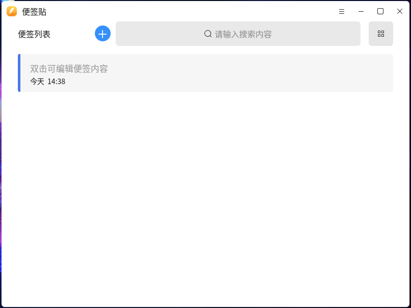
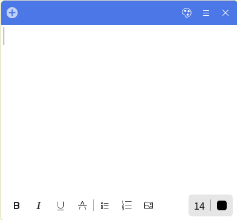

# 便签贴

## 概 述

灵墨便签贴是侧边栏的一个小插件，提供便捷的文本记录和灵活的界面展示。

### 软件功能一（便签列表）

#### 便签列表界面

（1）实时按照修改时间倒序排序

（2）显示每条便签的修改时间和部分文本内容

（3）新建：列表条目增加并打开一个便签页

（4）搜索：匹配列表中所有便签的文本内容进行搜索

（5）删除：删除当前列表选中条目，删除后自动选中列表中上一条便签，若删除时，对应条目的便签为打开状态，则同时关闭此便签页；若无列表中无条目选中，则删除无效

（6）支持双击列表/图标条目，打开或重新激活置顶便签并获取输入焦点

### 软件功能二（便签页）

#### 便签页界面

（1）支持文本修改自动保存

（2）支持用户自定义便签头颜色并保存数据库

（3）文本修改后，此便签页对应便签列表中条目自动置顶排序

（4）便签头颜色修改后，此便签页对应便签列表中条目自动更新同步

（5）删除此便签：删除此便签，并删除此便签页对应便签列表中对应条目

（6）打开便签：任意便签可重新唤起便签列表

（7）新建：在任一便签页新建会创建新便签页，同步到便签

（8）关闭：关闭当前便签页，若当前便签页文本内容为空，则删除此便签，并删除此便签页对应便签列表中条目

（9）支持加粗、斜体、下划线、删除线、无序列表、有序列表

（10）支持修改字体大小，字体颜色
