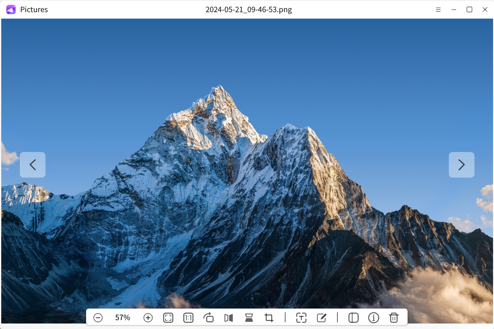
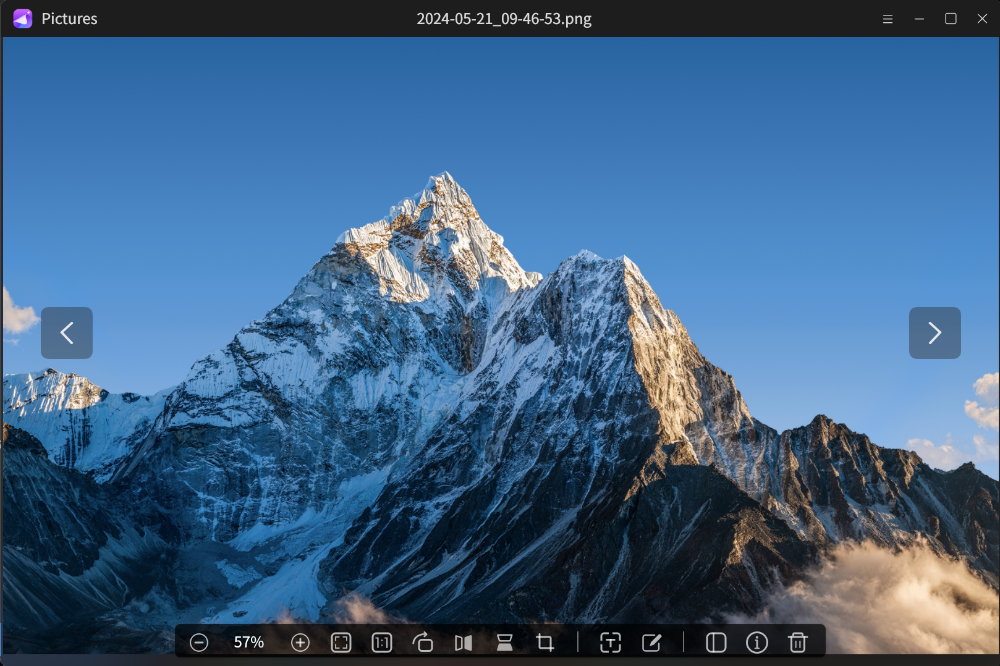
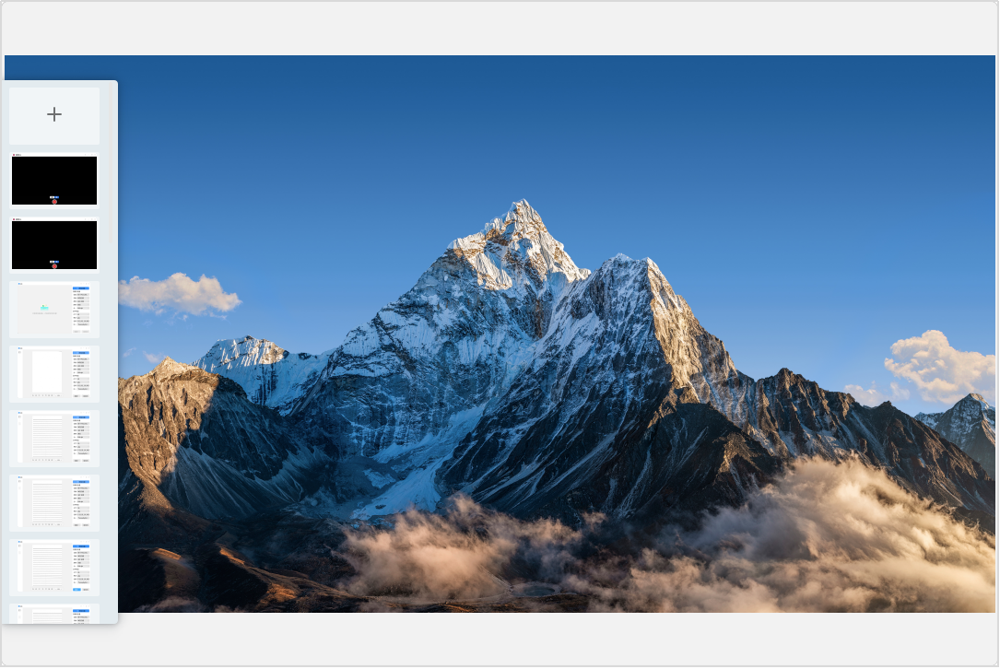
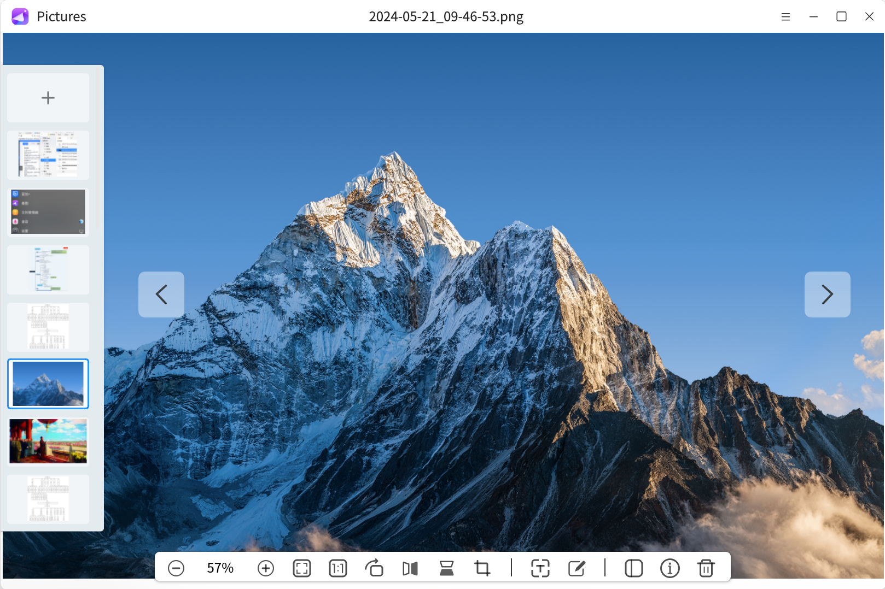
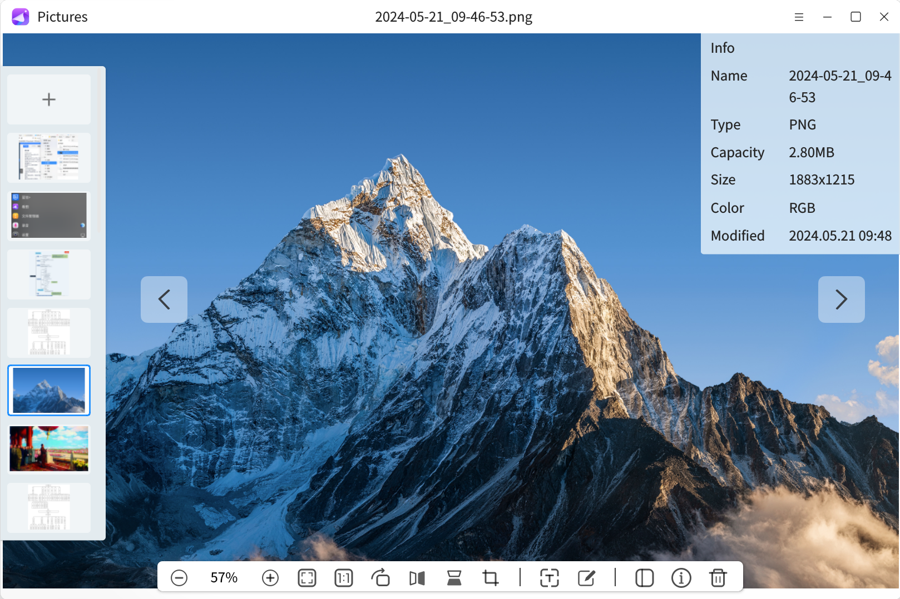
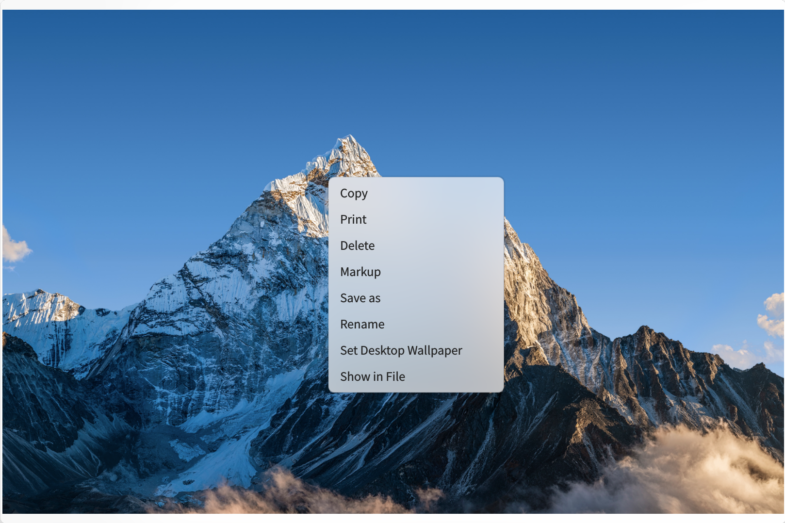
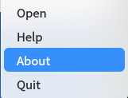
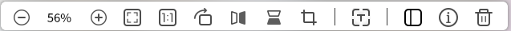

# Pictures
## Overview
Pictures is an easy-to-use, user-friendly image viewer that supports opening multiple image formats. While viewing the image, you can also edit and process the image simply, and support the functions of image scaling scale selection, adaptive window display, image clipping, image mirror flipping and so on.

 

## Opening mode
* "**opening menu**">"**Pictures**"
* Selected image > double-click > Open by default > "**Pictures**"
* Selected image > Right click > "**Opening mode**" > "**Pictures**"
* "**taskbar**" > "**search**" > "**Pictures**" > selected"**open**"

 

 

 

## Basic operation
Open the picture for the first time, click"**load picture**"or click ""button and select "**open**" to select and open the image file. After opening the image file, click "" in the toolbar to open the sidebar, which displays the thumbnail of the image. Selecting the "+" button in the sidebar can also open other images.

 

After opening the image, the interface only displays the current image and the sidebar when the cursor does not stay.

 

 

When the cursor stays on the interface, the image name, toolbar and the button to switch images are displayed. The toolbar mainly provides some image view options and image editing operations. Please refer to the toolbar function description for detailed function introduction.  

Click "" to switch the previous image, click "" to switch the next image, or click the thumbnail in the sidebar to switch the image. Shortcut keys can also be used to switch and delete images. Shortcut keys and corresponding functions are shown in the following table:

| Shortcut key |       function        |
| ------------ | --------------------- |
|      ←       |       Previous        |
|      →       |         Next          |
| Shift + Del  | Delete to recycle bin |

 

 

Click "" in the toolbar to view the image details, including name, format, size, size, color space, creation time and modification time.

 

 

Right click the image to pop up the menu bar, which provides the function options of image copy, print, delete, save as, rename, set as desktop wallpaper, and display in folder.  

Select "copy" to copy the image to the clipboard; Select "print" to send the image to the printer for printing; Select "delete" to delete the current image to the recycle bin; Select "Rename" to edit the current image file name; Select "show in folder" to open the folder location of the image. In addition, you can set the image format supported by desktop wallpaper as desktop wallpaper.

 

 

Click "" in the upper right corner of the interface to open the picture viewing menu bar, select the option of "**open**" to select and open the image file, select "**help**" to automatically jump to the user manual to view the operating instructions of the tool, select "**about**" to view the current version information, and select "**exit**" to close and exit the application.

 

 

## toolbar
The toolbar mainly provides some operations for images, including reducing the view, enlarging the view, adapting to the window, rotating to the right, horizontal mirroring, clipping, viewing image information, displaying / hiding the sidebar, and deleting images.

 

 

Function description of Drawing toolbar

|  Secondary menu   |       function       |             describe             |
| ----------------- | -------------------- | -------------------------------- |
|  | Adjust attempt ratio |  Zoom in and out of the image    |
|  |      Fit window      |   Adjust image to fit window     |
|  |     Original size    |   Display image in full size     |
|  |      Rotate right    |   Image rotates 90 ° clockwise   |
|  |   Horizontal mirror  |      Flip image horizontally     |
|  |   mirror vertically  |      Flip image vertically       |
|  |         OCR          | Identify the text in the picture |
|  |        Clipping      |        Custom clip image         |
|  |        sidebar       |     Turn the sidebar on / off    |
|  |      information     |      View image information      |
|  |        delete        |     Delete image to recycle bin  |