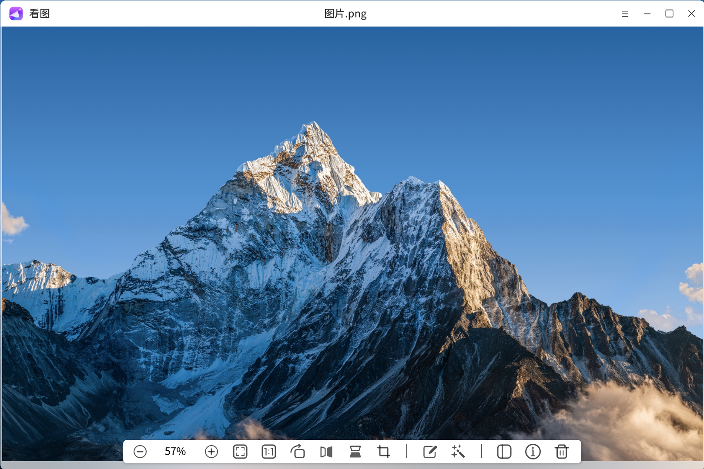
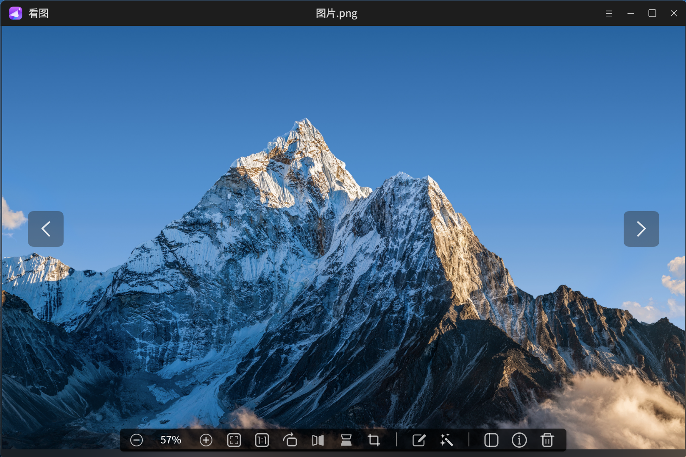
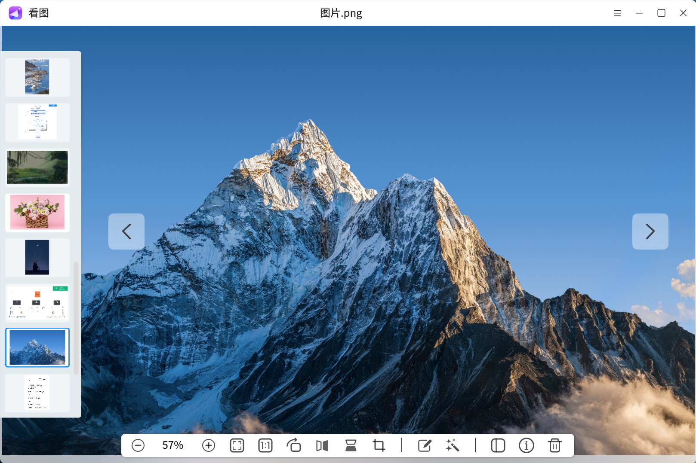
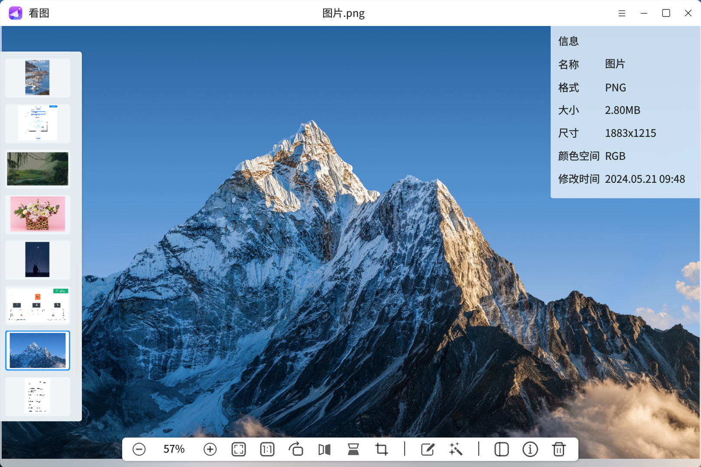
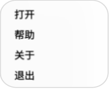

# 看图
## 概述
看图是一款简单易用，界面友好，支持打开多种图像格式的图像查看器。在查看图像的同时，还可以对图像进行简单的编辑和智能处理，支持图像缩放比例选择、自适应窗口显示、图像裁剪、图像镜像翻转等功能。

 

## 打开方式
* “**开始菜单**”>“**看图**”
* 选中图像 > 双击 > 默认打开 > “**看图**”
* 选中图像 > 右键单击 > “**打开方式**” > “**看图**”
* “**任务栏**” > “**搜索**” > “**看图**” > 选择“**打开**”  

 

 

 

## 基本操作
首次打开看图，点击“**载入图片**”或者点击“”按钮后选择“**打开**”选择并打开图像文件。打开图像文件后，点击工具栏中的“”可以打开侧边栏，侧边栏展示了图像的缩略图，选择侧边栏中的“+”按钮也可以打开其他图像。  

 

打开图像后，光标无停留时界面隐藏所有控件。

 

 

光标停留在界面时显示图像名、工具栏以及切换图像的按钮。工具栏主要提供一些图像视图选项和图像编辑操作，详细功能介绍请见工具栏功能说明。  

点击“”切换上一张图像，点击“”切换下一张图像，或者点击侧边栏中的缩略图切换图像。使用快捷键也可以进行切换、删除图像的操作。快捷键及对应功能如下表所示：  

|    快捷键    |     功能   |
| ----------- | ---------- |
|      ←      |   上一张    |
|      →      |   下一张    |
| Shift + Del | 删除到回收站 |

 

 

点击工具栏中的“”可以查看图像详细信息，包括名称、格式、大小、尺寸、颜色空间、创建时间及修改时间。

 

 

点击工具栏中的“”可以打开智能处理菜单栏，提供OCR文字识别、扫描黑白件、抠图换背景的功能选项。

 

 

右键单击图像会弹出菜单栏，提供图像的复制、打印、删除、另存为、重命名、设置为桌面壁纸、在文件夹中显示的功能选项。  

选择“复制”可将图像复制到剪切板；选择“打印”可将图像发送给打印机进行打印；选择“删除”可将当前图像删除到回收站；选择“重命名”可对当前图像文件名进行编辑；选择“在文件夹中显示”可打开图像所在文件夹位置。另外还可以将桌面壁纸支持的图像格式设置为桌面壁纸。

 

 

点击界面右上角“”可以打开看图菜单栏，选择“**打开**”选项可以选择并打开图像文件，选择“**帮助**”将自动跳转至用户手册中，可查看该工具的操作说明，选择“**关于**”可查看当前版本信息，选择“**退出**”即关闭并退出应用。  

 

 

## 工具栏
工具栏主要提供一些对图像的操作，包括：缩小视图、放大视图、适应窗口、向右旋转、水平镜像、剪裁、查看图像信息、显示/隐藏侧边栏、删除图像。

 

 

看图工具栏功能说明

| 二级菜单 | 功能 | 描述 |
| ------- | ----| :---|
|  | 调整试图比例 |  放大、缩小图像  |
|  |   适应窗口  | 调整图像适应窗口  |
|  |    原尺寸   | 以原尺寸显示图像  |
|  |   向右旋转  | 图像顺时针旋转90° |
|  |   水平镜像  |   水平翻转图像   |
|  |   垂直镜像  |   垂直翻转图像   |
|  | 标注 | 对图片进行标注 |
|  |    智能处理 | 对图片智能化处理 |
|  |    剪裁    |   自定义剪裁图像  |
|  |   侧边栏    |  打开/关闭侧边栏 |
|  |    信息     |  查看图像信息   |
|  |    删除     | 删除图像至回收站 |

