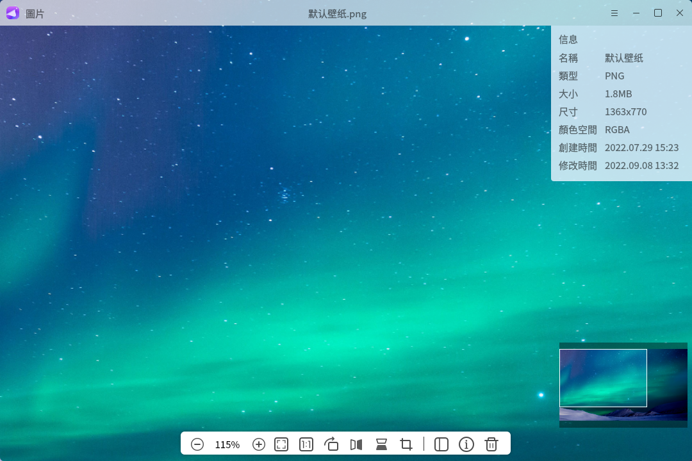
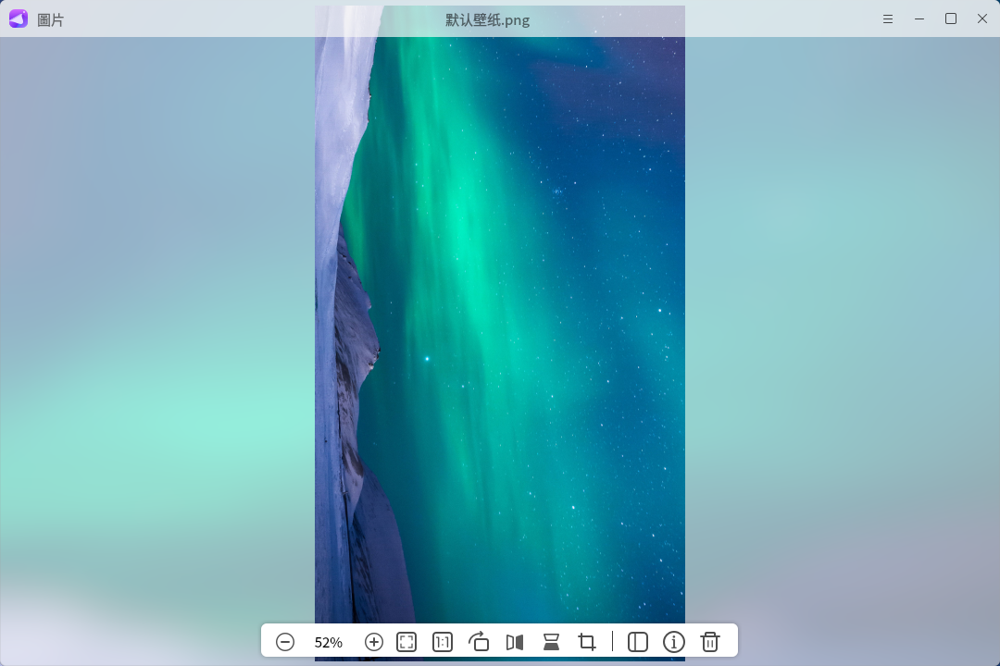
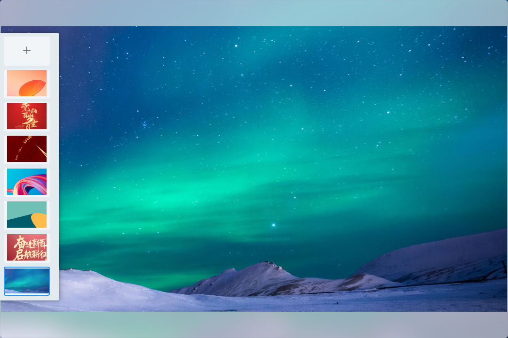
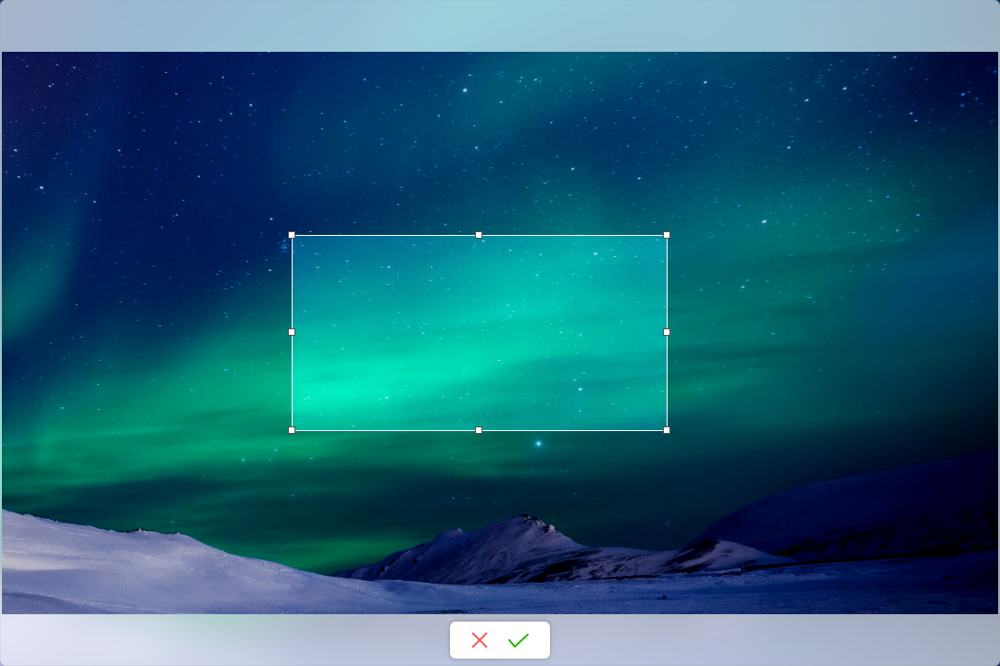
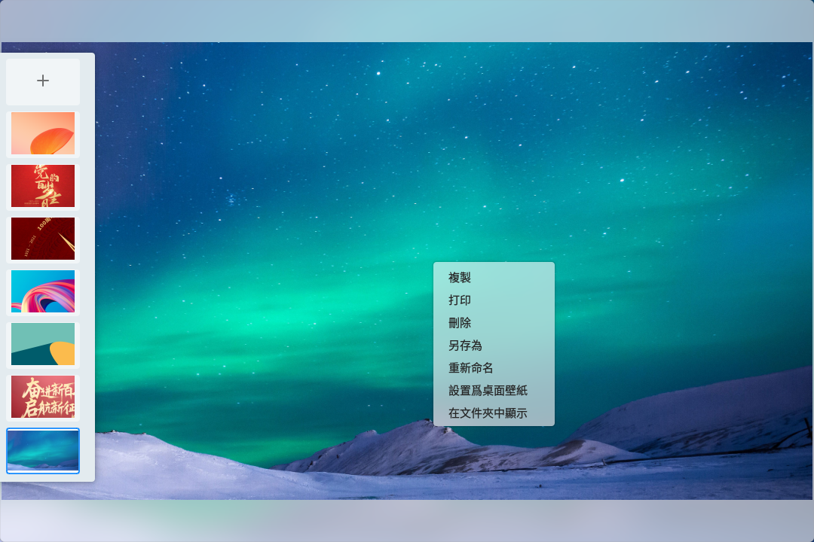

# 看圖
## 概 述
看圖是一款簡單易用，界面友好，支持多種圖片格式的圖片查看器。在查看圖片的同時，還可以對圖片進行簡單的編輯和處理，例如：放大、縮小、旋轉、翻轉、刪除等。除此之外，還可以查看圖片的詳細信息。主界面如圖1所示。

 

## 基本功能
圖標及其功能:

|圖 標	|功能說明	|圖 標 |	功能說明
| :------------ | :------------ | :------------ | :------------ |
||	打開圖片	||	上一張
||	下一張||	放大
||	縮小||	正常大小顯示圖片
||	圖像適合窗口||圖片旋轉90度
||	水平鏡像||垂直鏡像
||	查看圖片詳細信息|| 側邊欄
||	刪除到回收站| | 裁剪

 

點擊主界面“+”按鈕或者“”按鈕的“打開”選項，打開一張圖片。打開側邊欄后，點擊側邊欄縮略圖或“下一張”“上一張”按鈕進行切換。如圖2所示。

 

## 工具欄
工具欄主要提供一些對圖片的操作，包括：縮小、放大、查看圖片原始尺寸、適應窗口尺寸、旋轉、水平翻轉、垂直翻轉、查看圖片詳細信息、刪除。改變尺寸的功能包括：縮小、放大、查看圖片原始尺寸、適應窗口尺寸。以放大爲例，點擊工具欄的“”按鈕，可對圖片進行放大。當圖片放大到超出主界面可視範圍時，拖動導航器中間的高亮窗口，用戶可查看圖片全貌。如圖3所示。

對圖片旋轉的功能包括：旋轉、水平鏡像和垂直鏡像。以旋轉為例，每次點擊工具欄的“”按鈕，可對圖片進行90°順時針旋轉。如圖4所示。

點擊工具欄的“”按鈕，可以在主界面的左側查看當前圖片所在文件夾的所有可支持圖片的縮略圖。點擊某一個可切換主界面當前圖片的显示。如圖5所示。

點擊工具欄的“”按鈕，可以在主界面的右上角窗口查看當前圖片的詳細信息。如圖6所示。

點擊工具欄的“”按鈕，可以進入裁剪模式。如圖7所示。

點擊工具欄的“”按鈕，可以將當前圖片刪除至回收站。

 

## 右鍵菜單
圖片右鍵菜單主要包含以下功能：複製、打印、刪除、另存為、重新命名、設置為桌面壁紙、在文件夾中顯示。如圖8所示。

點擊複製選項，可將圖片複製到剪切板。點擊打印選項，可將圖片發送給打印機進行打印。點擊刪除選項，可將當前圖片刪除到回收站。點擊另存為，可將當前圖片轉換為其他支持的格式。點擊重命名，對當前圖片文件名進行編輯。另外還可以將桌面壁紙支持的圖片格式設置為桌面壁紙。最後，可直接在文件夾中選中显示。

 

## 附錄
### 快捷鍵

| 快捷键 | 功能 |
| :------------ | :------------ |
|← | 上一張
|→ | 下一張
|del | 刪除
|esc | 取消
|enter | 保存

