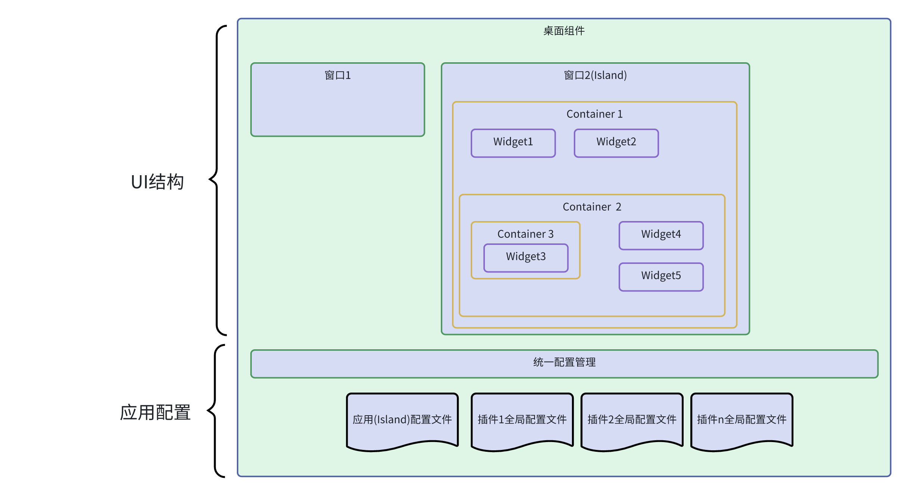
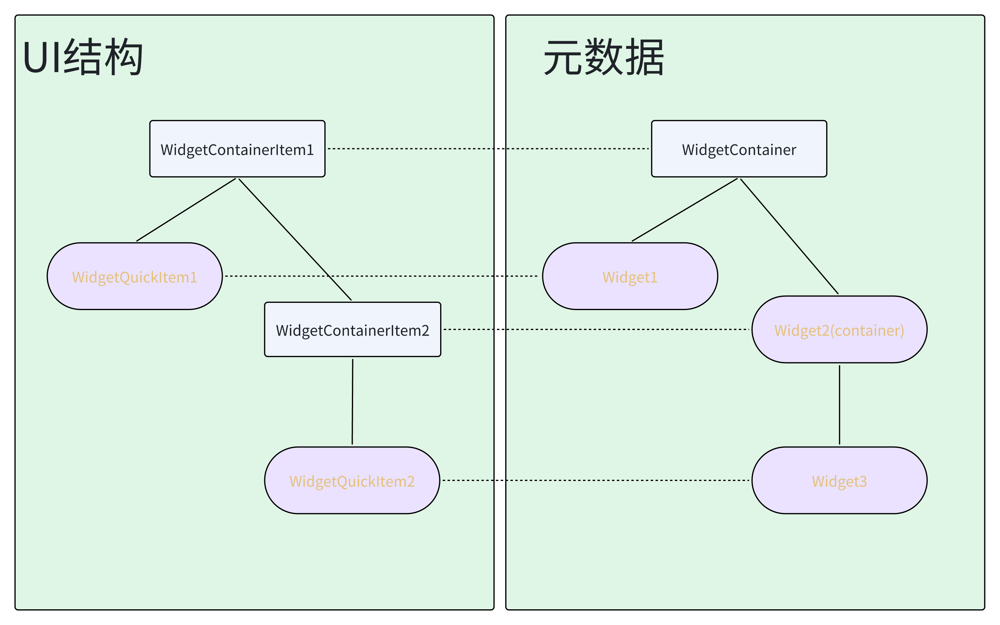
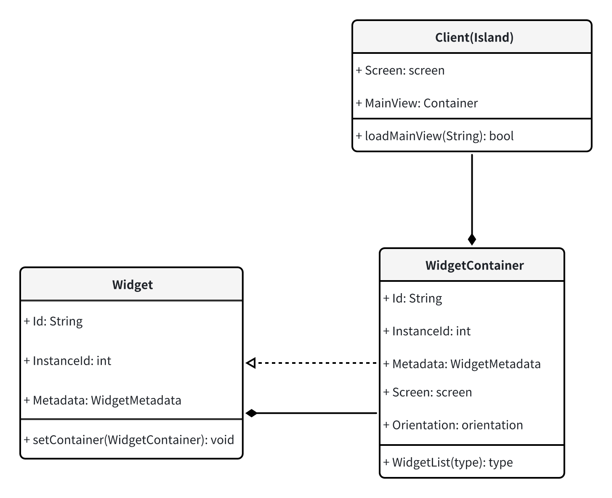

# lingmo-quick-items

## 介绍
lingmo-quick是lingmo桌面环境的一个组件库，用于为qml应用程序或QT应用程序提供lingmo桌面环境的特色功能组件。

* qml应用程序可以通过import 对应模块的uri进行使用。
* C++应用程序也可以通过cmake导入并使用lingmo-quick提供的程序库。

## 主要模块
### [core](core)
lingmo-quick项目的通用数据和数据结构定义。

### [items](items)
lingmo-quick的qml组件库。

items是qml import的主要入口点，用于向qml应用程序提供lingmo-quick的各种功能和组件。

### [framework](framework)
### 1. 简介
   lingmo-quick作为一个基于Qt Quick的UI开发功能集合,其中提供了一个基于插件模式的UI开发框架,目的在于实现对桌面通用插件的定义,加载以及统一配置管理等功能,
   此框架的特点包括:
- 可实现桌面组件一定程度上的功能解耦与功能复用
- 插件和宿主应用(Host)之间不会强制有二进制依赖关系,插件的开发相对更加独立,不易产生版本迭代时插件不兼容的情况.
- 插件开发门槛低,无需了解宿主应用全部功能即可开发插件.
- 通用性,可以实现不同桌面组件之间无缝共享插件
- 统一的配置管理模块,便于应用和插件的统一配置管理

#### 1.1 基本概念

  插件框架整体由4个主要部分组成: Widget(插件),Container(容器),Island(窗口) ,Config(配置),

  Widget表示一个桌面插件,Container为可用于放置插件的容器,Island为基于QQuickWindow的通用窗口,继承了加载Container的功能.Config为统一的配置接口,提供了上述3个结构共用的配置管理功能.

  基于此框架开发的一个应用的典型结构如下图所示:

  此应用包含两个窗口,其中窗口2为插件框架中的Island,而Island中包含了一个主Container(mainView)作为UI的根节点,根节点与其所有子节点共同组成一个树形结构.通过统一配置管理接口,应用(Island)可以生成属于自己的本地配置,也可以访问属于其插件的全局配置.

####   1.2 设计模式

  整体插件框架分为两部分,一部分是负责保存和处理信息的后端（Widget/Container/Island），另一部分就是负责显示的前端（WidgetQuickItem/WidgetContainerItem/IslandView):

  框架类似Composite模式:

  Widget:定义了插件和插件容器的公共接口,并实现了相关的默认行为,同时也作为插件(leaf&Component)

  Container:继承自Widget,作为UI结构中的分支节点对象(Composite),负责管理所有子widget的生命周期

  client表示宿主应用,client在调用插件框架时,可以选择直接使用封装好的Island窗口作为应用窗口,也可以选择直接初始化Container作为插件加载根节点.



### 2.概要设计

####    2.1 关键组件

#####    2.1.1 Widget与WidgeQuicktItem

   Widget类定义了一个插件的基础信息接口,提供对插件包元数据进行访问的接口以及虽配置文件进行访问的接口.
   WidgeQuicktItem继承自QQuickItem,是插件框架中的一个基本UI元素(插件)，是插件UI的入口，也是插件UI树的根节点.
   在一个插件的生命周期开始时,Widget会先被创建,基于Widget提供的数据,一个WidgetItem会被创建然后被加载到UI树中.(翻译文件会在UI初始化之前被加载)
   要卸载插件时,在Widget被删除前,UI中的WidgetItem会先执行析构.

##### 2.1.2 WidgetContainer和WidgetContainerItem

   WidgetContainer与WidgetContainerItem的关系和Widget与WidgeQuicktItem的关系类似.
   
   WidgetContainer继承自Widget,在其基础上增加了一些用于插件容器的属性,如屏幕信息,边距等,实现了插件加载和配置文件自动加载功能.一般情况下，WidgetContainer用于加载Widget，但一个WidgetContainer还可能与Island有关联（作为island的主视图）。

   WidgetContainerItem是容器的主入口，容器负责管理和控制WidgetItem，并将他们放置在某种布局中。

   WidgeQuicktItem和WidgetContainerItem只是UI组件，并不包含各种原始信息，那如何在界面上访问对应的Widget和Container呢？
   为了满足这个需求，我们为每一个WidgetItem添加了一个附加属性"Widget"，在qml文件中可以通过这个附加属性访问Widget的全部属性。同样的ContainerItem也有一个附加属性"WidgetContainer"，可以访问Container的全部属性。
   
   如何注册附加属性：使用 qmlRegisterUncreatableType<WidgetItemAttached>(uri, 1, 0, "Widget", "For widgetItem attached prop.");
   更新版的QT可以使用：QML_ATTACHED 宏进行标记注册，但是qt5版本并不推荐

#####    2.1.3 Island和IslandView

   Island表示一个应用程序(或应用程序支持加载插件的部分),一个Island中包含一个"mainView",即一个主"WidgetContainer"作为当前的主视图,一个Island同一时间只能加载一个主视图.

   IslandView是一个QQuickView窗口,封装了加载和显示Island的主"WidgetContainer"对应的WidgetContainerItem的功能。

   IslandView提供两种模式,一种是在加载mainView时直接初始化UI,一种是先在加载后台所有数据,由用户决定在何时初始化UI,前者适合开发一些功能比较简单的应用,而后者便于可以在将UI需要依赖的所有数据都初始化好之后再加载UI,一定程度上防止一些UI显示异常甚至报错.
   
   Island需要配合Config机制使用,实际上,island与Config几乎是强绑定状态，需要使用者理解Config并处理好初始配置。

#####    2.1.4 WidgetInterface

   WidgetInterface是一个插件接口定义,插件可以选择实现这个接口以实现某些特性功能,如增加自定义右键菜单项等.这是一个可选接口,但可以脱离qmlUI单独加载,即可以实现一个不包含UI的插件,仅包含一个动态库的插件.

#####    2.1.5 WidgetMetadata

   WidgetMetadata表示一个插件的原始元数据信息,所谓原始元数据,就是插件在打包时安装的metadata.json文件中提供的信息.原始元数据在插件框架中非常重要，它用于描述一个插件，包括插件的名称，ID，介绍等基础信息，还有插件的类型（Host），国际化，UI入口等信息.实际上,他可以类比为原生linux应用的"desktop"文件.

   WidgetMetaData在一个Widget首次加载时加载,并且在同一个插件被多次加载时共享.Widget提供了在运行时访问全部metadata信息的功能，并可以修改部分信息，如Tooltip文本等(仅在运行时生效,不会直接修改json文件)。

#####    2.1.6 WidgetLoader

   插件加载器,WidgetLoader用于根据插件ID加载插件,默认加载路径为:
```
   ":/lingmo/widgets"

   "/usr/share/lingmo/widgets"

   "~/.local/share/lingmo/widgets"
```

   可在运行时临时增加查找目录

   还继承了插件种类判断功能,插件元数据中有一个类型(host)字段,可以通过指定插件加载器所在的应用(宿主)类型,可以自动过滤掉不属于当前类型的插件.例如,在某个应用的插件选择页面只显示可以被加载到当前应用的插件.

   插件加载器的扫描路径逻辑可以根据需求进行扩充,例如不同分类的插件可以区分不同目录等

####    2.2 插件包

   一个完整的Widget插件又称作Widget包，在安装时的基本目录结构如下：

```
// 插件的基本目录结构如下：
org.lingmo.widget /     # 插件顶级目录
├── metadata.json    # 元数据
├──translations
│    └── *.qm 
└── ui
     └── main.qml    #UI入口文件(根控件)
```

   其中目录名称需要与插件的唯一ID保持一致，一般使用域名反写。

   其中metadata.json为插件的元数据文件或描述文件,一个典型的元数据文件如下:
```json
{
  "Authors": [
    {
      "Name": "iaom",
      "Email": "zhangpengfei@kylinos.cn"
    }
  ],
  "Id": "org.lingmo.testWidget",
  "Icon": "lingmo-search",
  "Name": "test-widget",
  "Name[zh_CN]": "测试插件",
  "Tooltip": "这是一个测试插件",
  "Tooltip[zh_CN]": "这是一个测试插件",
  "Description": "test-widget",
  "Description[zh_CN]": "这是一个测试插件",
  "Version": "1.0",
  "Website": "https://lingmo.org",
  "BugReport": "https://gitee.com/lingmo/lingmo-quick/issues",
  "ShowIn": "All", 

  "Contents": {
    "Main": "ui/main.qml",
    "I18n": "translations/org.lingmo.testWidget",
    "Plugin": "/home/iaom/git/lingmo-quick/cmake-build-debug/framework/test/org.lingmo.testWidget/libtest-plugin.so",
    "PluginVersion": "1.0.0", 
    "PluginPreload": false, 
    "Config": "LocalOnly"
  }
}
```

比较重要的几个字段:
- Id:必须,表示插件的唯一Id,插件加载器根据Id区分每个插件,插件目录需要满足"插件加载路径/id"的结构.
- I18n:翻译文件路径,格式为"相对路径/配置文件前缀"
- ShowIn: 表示插件可以显示在哪些宿主应用,目前包括:Panel, SideBar, Desktop, TaskManager, All(前面所有, 默认)
- Contents/Main: 必须,表示插件UI入口,为插件目录相对路径, 也可以制定qrc资源文件路径.
- Contents/Plugin:so插件路径,可继承WidgetInterface实现一个so插件(基于QtPlugin机制),目前支持增加自定义右键菜单项
- Contents/PluginVersion:插件接口版本(Plugin字段不为空时必须指定接口版本)
- Contents/PluginPreload:true表示插件在加载时即加载so插件,否则会在调用so插件功能时加载
- Config:配置文件行为,"LoclOnly"表示插件的配置文件将记录在宿主应用中,为空时将生成全局配置文件

####   2.3 配置

  配置模块用于为widget/WidgetContainer/Island提供配置读取和存储功能。设计目标是提供一个统一的配置文件管理机制,可以将插件框架中各个模块的配置文件实现统一管理.配置文件通过专门的配置文件加载器（ConfigLoader）获取，加载器负责初始化配置并处理节点映射等工作。

  配置文件为json格式,一个典型的配置配置文件实例如下所示:
```json
  {
  "_views": [
    {
      "id": "org.lingmo.panel",
      "instanceId": 0,
      "panelSize": 48,
      "widgets": [
        {
          "id": "org.lingmo.menu.starter",
          "instanceId": 0
        },
        {
          "id": "org.lingmo.panel.search",
          "instanceId": 1
        },
        {
          "id": "org.lingmo.panel.taskView",
          "instanceId": 2
        }
      ]
    },
    {
      "disabledInstances": [
        0
      ],
      "id": "org.lingmo.panelNext",
      "instanceId": 1,
      "panelSize": 56,
      "widgets": [
        {
          "id": "org.lingmo.dataIsland",
          "instanceId": 0,
          "maximumWidth": 208,
          "minimumWidth": 64,
          "type": "data",
          "widgets": [
            {
              "id": "org.lingmo.menu.starter",
              "instanceId": 0
            },
            {
              "id": "org.lingmo.panel.taskView",
              "instanceId": 1
            }
          ]
        },
        {
          "id": "org.lingmo.appIsland",
          "instanceId": 1,
          "maximumWidth": 16777215,
          "minimumWidth": 64,
          "type": "app",
          "widgets": [
            {
              "id": "org.lingmo.panel.taskManager",
              "instanceId": 0
            },
            {
              "id": "org.lingmo.panel.search",
              "instanceId": 1
            }
          ]
        }
      ]
    }
  ],
  "panelConfigVersion": "1.0"
}
```

##### 2.3.1 节点(child)

配置文件为Json格式,一个完整的Config由多个节点组成,而它本身也表示一个节点,一个完整的Config是一个树形结构。

在上面的示例中，_views 所在的对象为根节点，该节点有个2个属性(_views, panelConfigVersion)。

##### 2.3.2 分组信息(groupInfo)

想要Config变成树形结构，我们需要指定如何生成这颗树，而分组就是我们生成树的依据。

ConfigGroupInfo就是Config对节点进行解析的依据，它指定了进行分组的属性和区分分组中各个子对象的主键属性（用于区分不同对象的属性）.有了依据，Config就可以将配置文件中的对应属性当作一个组，将组内的对象作为节点读取出来作为几个单独的Config，并与当前的Config形成树形结构 .

需要注意的是，指定进行分组的属性一般是一个json数组，如果在设置分组信息时，原本的数据不是数组，那么这个属性的数据会被全部清空。

对于上述的Json，我们可以指定分组信息为：


```c++
// 设置组信息的对应方法是：
config.addGroupInfo("_views", "instanceId");
```
设置好Config的分组信息后，我们的Config就得到了两个子Config：
```
// 子Config 1
{
    "id": "org.lingmo.panel",
    "instanceId": 0,
    ...
}

// 子Config 2
{
    "id": "org.lingmo.panelNext",
    "instanceId": 1,
    ...
}
```
该分组信息的意思是：将当前Config对象的_views属性作为一个分组，并且该分组中的对象以instanceId属性进行区分

Config类有这几个方法用于处理子Config
```c++
// 是否是根节点，只有根节点能读取和保存配置文件
bool isRoot() const;
// 当前Config的主键属性的值
const QVariant &id() const;
// 当前Config属于的组
const QString &group() const;
// 当前的分组信息
const ConfigGroupInfo &groupInfo() const;
// 添加一条分组信息
void addGroupInfo(const QString &group, const QString &key);

// 获取某个组下的全部子Config
ConfigList children(const QString &group) const;
// 某个组下有多少Config
int numberOfChildren(const QString &group) const;
// 通过组名和组内对象主键的值拿到子Config
Config *child(const QString &group, const QVariant &id) const;

/**
 * 添加子节点
 * @param group 组名
 * @param childData 数据
 */
void addChild(const QString &group, const QVariantMap &childData);

/**
 * 删除一个子节点
 * @param group 组名
 * @param id 主键值
 */
void removeChild(const QString &group, const QVariant &id);

/**
 * 删除一个key
 * @param key 要删除的键
 */
void removeKey(const QString &key);
```
  需要注意的是,当我们对Config进行分组操作后，我们就不能再通过getValue方法去读取这些组节点了，必须使用child或children去获取子节点配置（Config）.
  可以通过以下方法获取子节点:
```c++
  // 获取一个分组下的所有子节点：
  QList<Config *> c = config.children("_views");
  // 获取某个子节点
  Config *c = config.child("_view", 0)
  修改上面第一个"instanceId = 0"节点的"panelSize"属性，需要：
  // 'panelSize'配置在 '_views' 组中，并且这个组的主键属性为'instanceId'
  Config c = config.child("_views", 0);
  c.setValue("panelSize", 56);
  也可以在已有分组下增加一个新的子节点:
  QVariantMap wData;
  wData.insert(QStringLiteral("id"), "panel-neo");
  wData.insert(QStringLiteral("instanceId"), 2);
  //添加新的子节点
  config->addChild(QStringLiteral("widgets"), wData);
```
如果没有将child属性作为组，此时的child只是一个普通的json数组数据，想要修改某个属性就需要遍历这个child数组，并找到对应的json对象修改数据。

TODO:多进程间共享的插件全局配置文件监听与通知机制

##### 2.3.3 应用

在插件框架中,Widget的Config是WidgetContainer的子Config，而WidgetContainer的Config又是Island的子Config。

Island的Config的分组信息是：{ "_views", "instanceId" },在实际使用时,Id(主Container的id)也作为唯一属性

WidgetContainer的Config的分组信息是：{ "widgets", "instanceId" }

Widget的Config已经是最底层的节点，目前没有分组信息。

Island在加载mainView(主Container)时,会根据mainView的Id在配置文件的"_view"节点寻找对应的id,将找到的第一个符合的配置节点作为需要加载的WidgetContainer的配置节点:
```c++
/**
* 加载配置文件中的一个view
* @param id view的ID
* @return 加载成功返回true,否则返回false
  */
  bool loadMainView(const QString &id);
```
  这里参数是Id而不是instanceId,因为一个主Container也是一个打包为一个Widget包的插件.

  TODO:增加bool loadMainView(const QString &id, int instanceId);之类的接口,使得_views分组下可以有同Id的不同WidgetContainer
  
  随后WidgetContainer会根据配置文件内容自动加载属于自己的内容,即分析自己的widgets分组并加载其中的Widget.

### 3. 开发示例

   [一个简单的插件&一个基础的容器&以及一个基于插件框架开发的应用](https://gitee.com/lingmo/lingmo-quick/tree/upstream/framework/test/)

   [一个简单的时钟显示插件:](https://gi43l7c2w7z.feishu.cn/docx/YXVYdLS8So81Mpx4O85ck3ZQnNd?from=from_copylink)


### [platform](platform)
lingmo桌面环境特有组件库，提供一些能够与lingmo桌面环境进行交互的组件。

core,items和framework模块都有使用platform提供的功能。

### [modules](modules)
* #### [window-thumbnail](window-thumbnail)
  窗口动态预览控件，支持x和wayland环境

### [widgets](widgets)
为lingmo-quick插件框架开发的一些插件或qml模块库。

### 其他
截止目前，lingmo-quick仍在快速迭代中，文档相对来说不是那么完善。想要参与lingmo-quick的开发，可以通过提交issue或PR与我们进行交流。
