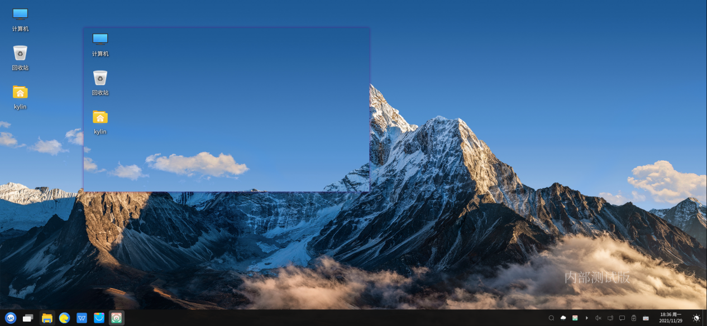

# Screenshot
### Overview
Screenshot is a self-developed multifunctional desktop utility tool that can conveniently capture and save images. It supports shortcut key screenshots, custom screenshots>, brush drawing, drawing marks, adding text, and fixing screenshots to the desktop.

### Open the app

<b>“Start Menu”>“Screenshot”or“Taskbar”>“search”>“Screenshot”</b>.

### Basic operation

After opening the screenshot application, the real-time position diagram of the cursor is displayed on the desktop. After moving the cursor, left-click to customize the window to be intercepted>, and left-click in the opened window to automatically intercept the current window.
The following table lists the shortcut keys for screenshots and their corresponding functions. By default, screenshots will be saved to the <b>"Pictures"</b> folder of the system by using the shortcut keys.

|shortcut | function |
| :------------ :| :------------ |
| PrtSc | Capture full screen |
| Shift+PrtSc | Customize the screenshot area |
| Ctrl+PrtSc  | Capture the current window |

After the window is captured, the current window size and screenshot toolbar are automatically displayed. You can adjust the window size by stretching the screenshot window. Use Toolbar Tools to edit, save, and copy the screenshot to the clipboard. For detailed function descriptions, please see The screenshot toolbar function description table.

### Toolbar function description 

The function description of the screenshot toolbar is shown in the table below :

| icon | name | description |
| :------------ :| :------------ | :------------ |
||rect|Draw a square|
||circle|Draw a circle|
||line|Draw a straight line|
||arrow|Draw an arrow|
||painter|Paint yourself|
||mark|Make a drawing mark|
||text|Add text|
||blur|Fuzzy area|
||undo|Undo the previous operation|
||cancel|Cancel screenshot operation|
||copy|Copy screenshot to clipboard|
||save|Save screenshot|
||pin picture|Pin screenshot to desktop|

