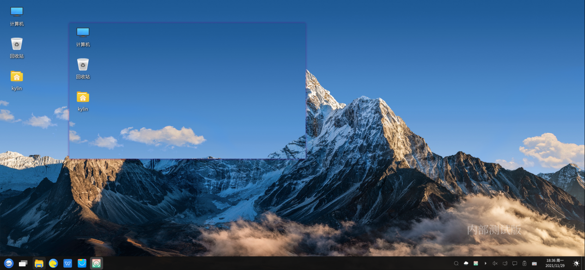

# 截 图
## 概 述
截图是自研的一款多功能的桌面实用工具，可便捷地截取图像并保存，支持快捷键截图、自定义截图、画笔绘制、绘图标记、添加文本、固定截图至桌面等功能。

### 打开方式

<b>“开始菜单”>“截图”或“任务栏”>“搜索”>“截图”</b>。

### 基本操作

打开截图工具后，桌面显示光标的实时位置框图，移动光标后左键单击可自定义选取需要截取的窗口，在打开的窗口中左键单击一下可自动截取当前的窗口。
下表列出了截图快捷键及对应的功能，使用快捷键截图默认将截图保存至系统的<b>“图片”</b>文件夹中。

|快捷键 | 功能 |
| :------------ :| :------------ | 
| PrtSc | 截取全屏|
| Shift+PrtSc |自定义截图窗口|
| Ctrl+PrtSc  |截取当前窗口 |

截取窗口后，自动显示当前窗口大小和截图工具栏，可通过拉伸截图窗口调整窗口大小，使用工具栏工具可对截图进行编辑、保存、复制到剪切板等操作，详细功能介绍请见截图工具栏功能说明表格。

### 工具栏功能说明

截图工具栏功能说明如下表所示:

|图标 | 名称 | 描述 |
| :------------ :| :------------ | :------------ |
||方框|画出方形|
||圆形|画出圆形|
||直线|画出直线|
||箭头|画出箭头|
||画笔|自行绘画|
||标记|进行绘画标记|
||文本|添加文本文字|
||模糊|模糊区域|
||撤销|撤销至上一步操作|
||取消截图|取消截图操作|
||复制至剪切板|将截图复制至剪切板|
||保存|保存截图内容|
||固定截图|固定截图至桌面|
