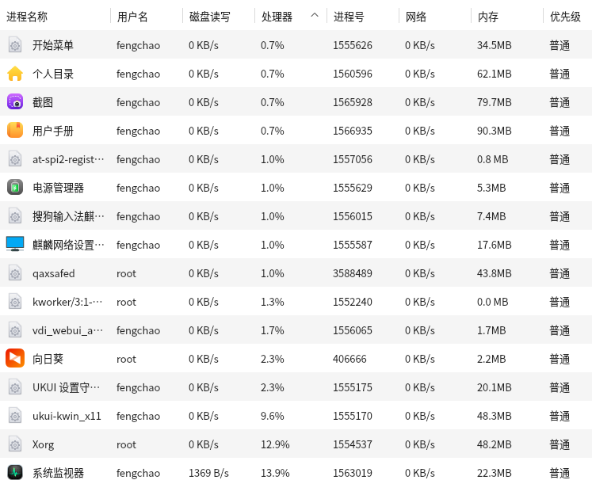
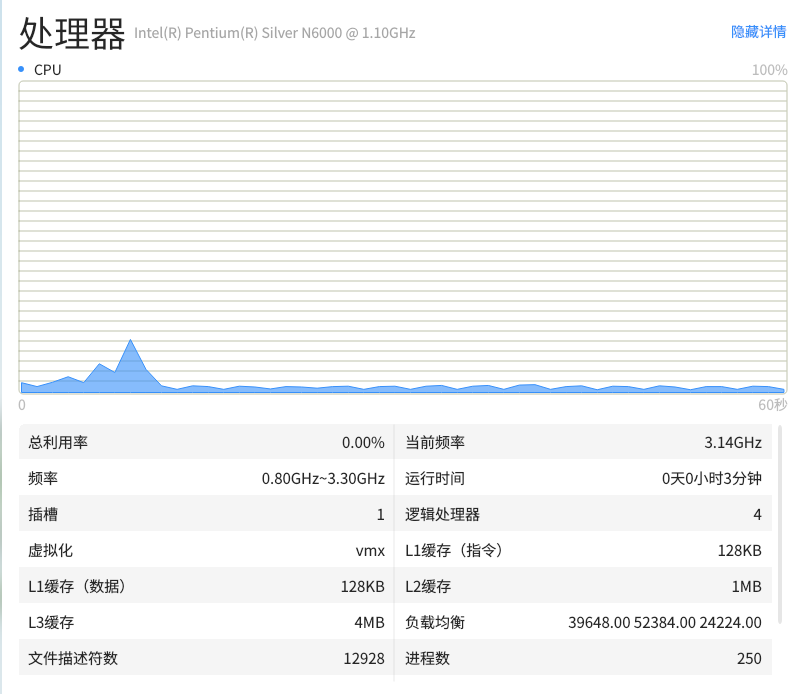
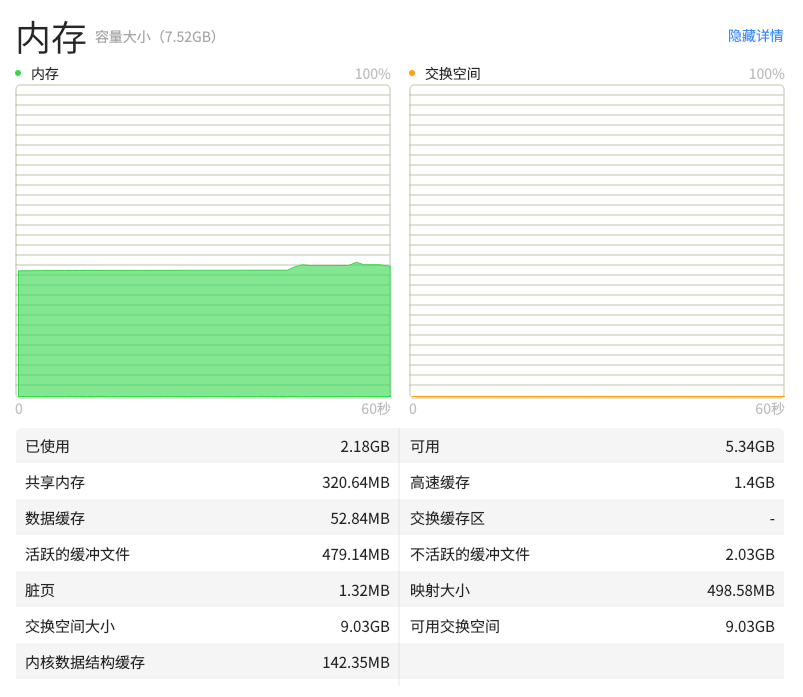
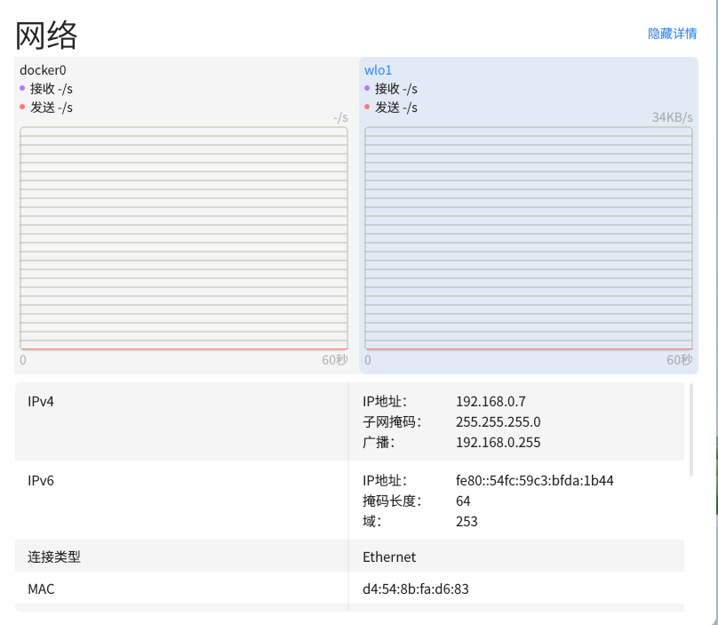
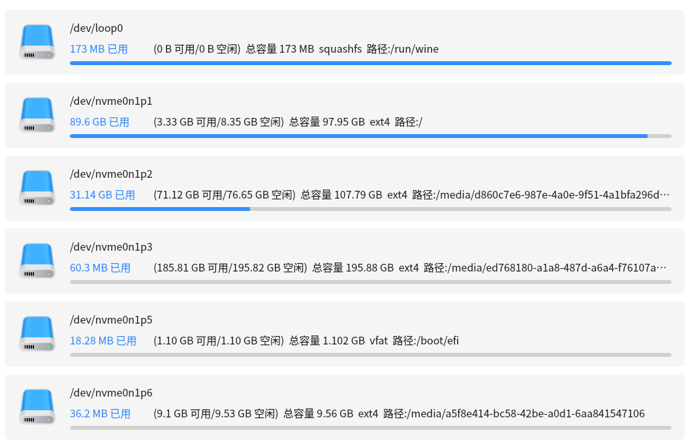

# 系统监视器
## 概 述 
系统监视器是灵墨上监控系统进程，系统资源和文件系统的专业应用，通过其简洁明了的界面，可直观显示用户想要查找的系统相关信息。

 

## 侧边栏/标题栏
侧边栏/标题栏提供界面切换和搜索框搜索功能。

- 用户可以按需求切换进程，文件系统界面。

- 用户可以选择进程的启动用户以及进程类别对进程进行切换，当前用户或是全部用户，亦或是应用程序的进程。

 

## 进 程
显示进程列表以及对进程进行指定操作。

统计显示所有启动了的进程，并显示他们的具体核心信息，如进程号，名称，启动用户，处理器占用率，内存，优先级，磁盘IO速率以及网络流向消耗等，其中应用程序页合并子进程数据。并且可对进程执行强制结束，结束和设置优先级等功能。

 

## 资 源
监测显示处理器，内存和交换空间以及系统网络流量信息。

### 处理器历史
动态折线图统计处理器历史占用率，右上方标签显示实时处理器占用率数据，点击查看处理器详情页。

### 内存和交换空间历史
动态折线图统计系统运行内存和交换空间历史占用总量，右上方标签显示实时占用量和总量，点击查看内存情页。

### 网络历史
动态折线图统计系统接收和发送流量历史数据，右上方显示实时网路接收和网络发送速率，点击查看网络详情页。

 

## 文件系统
统计已挂载的系统分区列表以及每个分区的具体信息。

- 实时监测挂载到系统的分区数量，并以列表形式显示出来。
- 显示挂载的分区，挂载路径，文件系统类型，文件系统容量，文件系统可用空间以及剩余空间等功能。