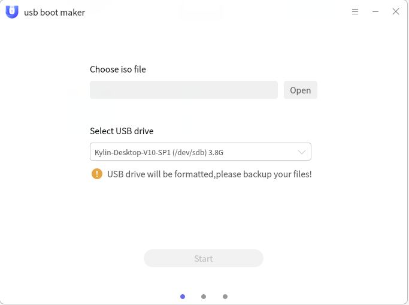
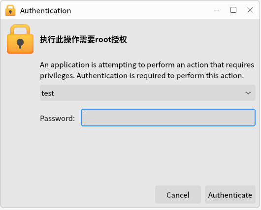
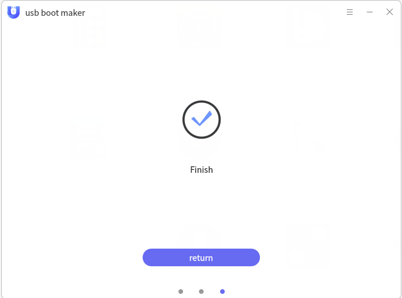

# USB Boot Maker

## Overview
 
       USB Boot Maker is a self-developed tool for the production system to start the U Disk, can be made into a u disk form of the installation media, easy to no optical drive media computer installation mirror files.
 

## Open mode
 

  **"Start Menu">"U Disk launcher"**or**"Taskbar">"Search">"U Disk launcher"**.
 

## Basic operation
 

  Open U Disk launcher, click**"Browse"**,select the local CD image file, insert U Disk and choose to make a boot disk u disk.
 

 

  Select a good mirror file and U Disk, Click**"Start production"**,will pop-up authorization window, enter the user password, click**"Authorization"**,waiting for the completion of production.
 

 
When you’re done, you’ll be prompted.
  

