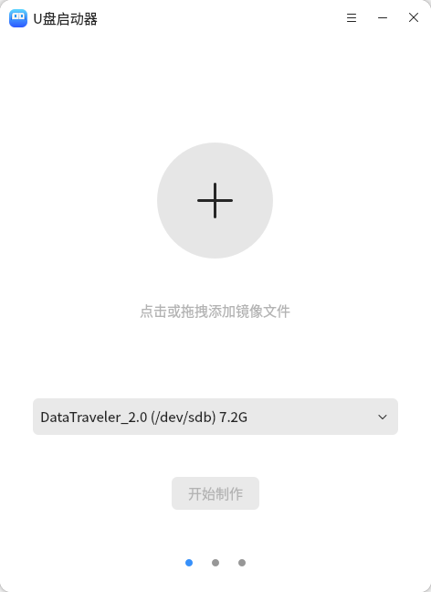
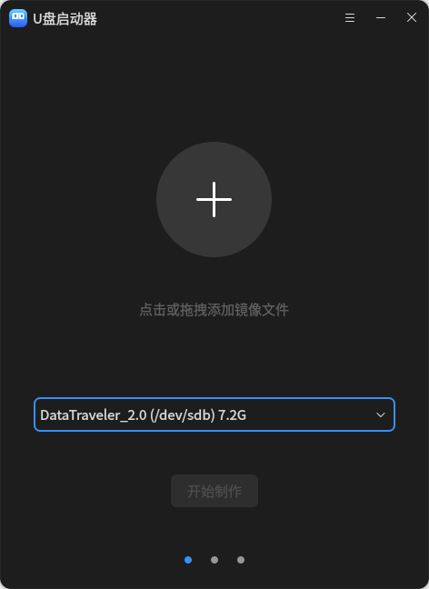
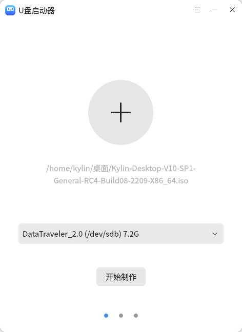
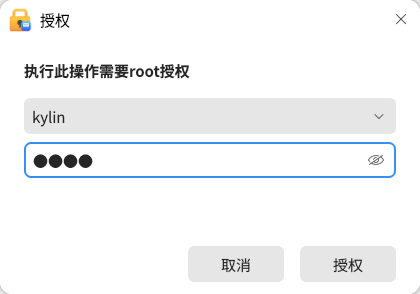
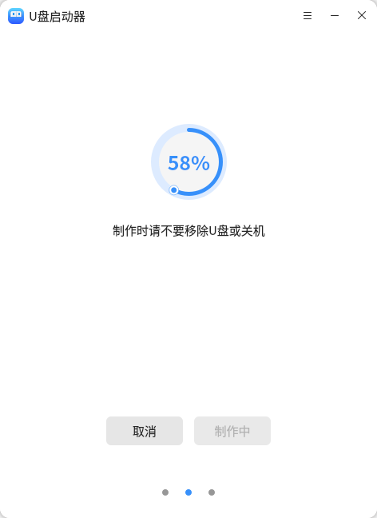

# U盘启动器
## 1.1.1. 概  述

 

   U盘启动器是一款用于制作系统启动U盘的工具，可将镜像文件制作成U盘形式的安装介质，方便无光驱介质的电脑安装镜像文件。

 

## 1.1.2. 打开方式

 

  **“开始菜单”**>**“U盘启动器”**;

 

   **“任务栏”**>**“搜索”**>**“U盘启动器”** > 选择**“打开”** 。

 

 

 

 

 

## 1.1.3 基本操作

 

## 1.1.3.1 添加镜像文件和设备

 

  打开U盘启动器后，点击**“+”**添加光盘镜像文件，或直接拖拽镜像文件至**“+”**处，插入U盘并选择准备制作系统启动盘的U盘。

 

 

## 1.1.3.2 开始制作

 

   选择好镜像文件和U盘后，点击**“开始制作”**，将弹出执行授权窗口，输入您的账户密码，点击**“授权”**，等待制作完成。

 

 

 

 

##  1.1.3.3 制作完成

 

   制作完成后，应用会出现相关提示。

 

 

  注: 使用U盘启动器制作镜像U盘后，U盘变成只读状态无法再拖动文件到U盘.
