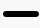
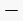
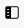
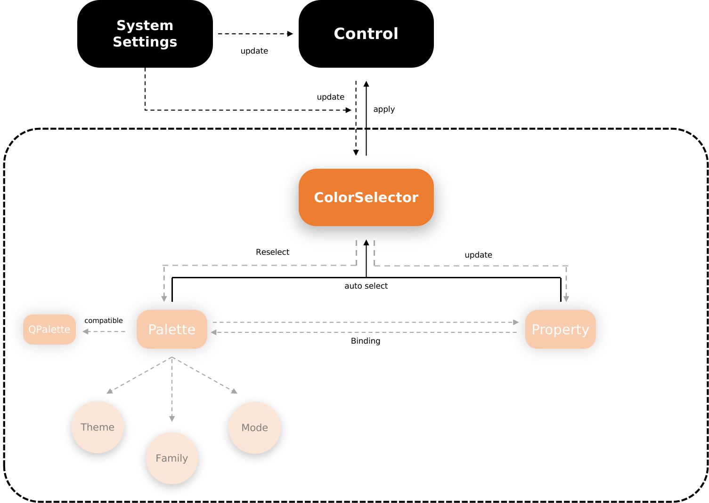

@page DevSpecification 开发规范

# 开发规范

## 字体绑定

为了能够保持和dtkwidget字体属性保持一致的相关接口，能够更方便的通过QML结构和属性绑定原理进行实现，dtkdeclarative中提供了一种便捷的绑定方式如下代码所示，当字体被修改时，所有使用到此字体的控件都会发生改变。

```qml
import org.deepin.dtk 1.0
Text {
    font: DTK.fontManager.t6
}
```

与 dtkwidget不同的是，这种字体绑定属性需要处理的代码量更少，阅读性较高。以下代码是 dtkwidget 进行字体绑定的操作：

```cpp
QWidget widget;
DFontSizeManager::instance()->bind(&widget, DFontSizeManager::T1);
```

目前dtkdeclarative中提供的一些标准控件都已经添加了默认的字体属性绑定，如ApplicationWindow控件其字体默认绑定为 t6 号。当需要修改字体大小或者添加自定义控件的字体属性时，则手动绑定指定字号即可。

## 应用图标

DCI图标是dtkdeclarative设计实现的一种新的图标格式，设计该格式主要为了解决QIcon在显示中的局限性，解决图标模式单一、种类繁多以及拓展性不强的问题。DCI图标相关文档在dtkcore和dtkgui也存在。

DCI图标文件整合了控件的各个状态、缩放比以及图标大小为一体，在控件的对应状态，程序的对应缩放比下自动选择合适的图标进行显示。另外，DCI图标能够跟随控件的调色板信息进行颜色调整，因此当前的DCI图标控件并非仅仅作为图标进行显示，更能够作为控件以及组合控件用于界面。例如，当前实现的控件中，Switch控件中的开关样式，Slider控件中的滑块样式等等。

DCI图标也拥有一些隐藏特性，如某些DCI图标存在一个图标边距值（具体内容需要参见设计文档）的属性，这个间距值隐藏在图标内部外部无需关心，但需要了解的是，当图标存在阴影效果时，该边距值就会体现在图标大小不包含阴影上，换句话说，拥有阴影的图标，其阴影不包含在组件的大小中。

图标控件的图标跟随其状态切换，当控件状态或系统主题发生改变时，图标控件会根据设定参数重新绘制指定的图标，由DCI相关类型进行统一查找、解析、绘制。文件大小、图标种类、缩放比、颜色调整、图标状态及图标叠加等等数据归档到了DCI文件内部。


### DCI图标需要手动设置的属性

1. sourceSize

    需要手动指定DCI图标控件的大小，该大小等价于最后显示在应用中的大小。当设计给出的图标中不包含相对应的大小时，DCI图标在绘制时会进行自适应缩放，以保证与此大小一致，

2. name

    需要指定的图标名称，该名称在图标主题规范下定义，默认优先从系统图标主题中寻找，其次在资源文件中寻找，最后在默认的Fallback路径下寻找。一些系统也有的图标文件放置在“/usr/share/dsg/icons”目录下。应用资源文件的图标主题目录分为两种，带主题的图标文件和内嵌图标文件，区别在于带主题的图标文件在不同的图标主题下图标文件不同，而内嵌图标文件对图标主题不敏感，是最终的搜索路径。更多的图标主题细节可以在**图标主题规范**的相关文档中寻找。

    **因此，应用程序的图标目录需要严格遵循图标主题规范进行放置，否则DciIcon控件将无法正确找到图标文件**

3. mode

    mode对应于控件的当前状态，对于Control控件，其状态包含 “Normal”,"Hovered","Pressed","Disabled"四种，如果图标在多种状态下显示的效果不同，该图标需要指定对应的mode来区分当前需要显示状态。由于颜色选择器（ColorSelector）会记录控件的状态，因此如果该控件有颜色选择器，可以通过将颜色选择器的控件状态指定给DciIcon控件，这是一种简便方式；如果控件无法指定颜色选择器，则只能手动进行控件状态的属性绑定。对于颜色选择器的内容，颜色控制中将详细描述。

4. palette

    palette为DciIcon的专有调色板，与Qt调色板不同的是该调色板目前仅有四种类型，Foreground（前景色）、Background(背景色)、HighlightForeground（高亮前景色）和Highlight（高亮色）。其分别对应与Qt调色板中的WindowText、Window、HighlightedText以及Highlight。由于其一致性，DTK的专有接口中可以直接将这两种调色板类型进行转换，具体函数为 `DTK.makeIconPalette()`。

    调色板的主要用途在于：一些场景中某些图标需要在特定情况下发生颜色变化，例如标题栏中的最大化、最小化、关闭按钮以及列表项视图中的图标跟随选中状态进行颜色变化等等。
    一个图标不仅仅只包含一个调色板，可能需要多个调色板数据，当某一调色板数据未获取到时，图标中的某一图层或整个图标（若图标只有一个图层或各个图层调色板颜色一致）将不会发生颜色变化。
    对应的调色板具体颜色值与设计师所提供的颜色值保持一致，并非一定和控件调色板一一对应，如果仅需要指定某一调色板颜色也可手动指定，例如：`palette.foreground: "red"`  或 `palette.background: control.palette.window`。

    dci图标能够根据不同系统主题（深浅主题）选择不同的图标文件，该属性的设置是可选的，如需手动指定其特殊主题显示，则可进行单独设置。

    4.1 例如下 DciIcon 控件示例：

    ```qml
        Control {
               id: control
               DciIcon {
                   sourceSize.width: 32 //对应大小的图标
                   sourceSize.height: 32
                   name: "window_menu" // 图标名称
                   mode: control.ColorSelector.controlState //对应状态下的图标
                   palette: DTK.makeIconPalette(control.palette) //调整图标颜色，Qt调色板转为dci调色板
                   theme: DTK.themeType //对应主题下的主题
               }
           }
    ```

    <dl class="section note">
        <dt>注解</dt>
        <dd>图标控件主要是对.dci文件进行查找、参数解析和组合绘制，本身没有做过多的特例化。 </dd> <br>
        <dd>图标未达到所需的效果，可能是控件属性设置错误，也可能是原始的dci图标本身就达不到所需效果。 </dd> <br>
        <dd>绘制的图标为正方形，即宽高相等。</dd> <br>
    </dl>

### DciIcon的附加属性

dtkdeclarative中几乎所有的控件都已经适配了dciicon，例如：Button, MenuItem以及各种自定义控件。但某些控件由于被qtquick-controls2定义了QIcon的相关接口，因此对于这类控件，可以使用DciIcon的附加属性来设置除QIcon外包含的信息。例如以下示例，由于Button的默认icon接口是Qicon类别，对于DDciIcon的相关属性可以通过以下方式设置：

```qml
Button {
    icon.name: "window_menu"
    icon.width: 36
    icon.height: 36
    DciIcon.mode: DTK.ControlState.HoveredState
    DciIcon.palette {
        foreground: "red"
        background: "green"
        highlightForeground: "white"
        highlight: "black"
    }
}
```

### Dtkdeclarative 中默认的 Dci 图标

下述图标只列列举标准状态，即无调色板时的默认状态。仅提供形状，不代表实际场景效果。

| 图标名称                | 效果                     |
|:-----------------------:|:------------------------:|
| action_add              |   |
| action_compress         |   |
| action_copy             |   |
| action_cut              |   |
| action_decompress       |   |
| action_delete           |   |
| action_edit             |   |
| action_newfolder        |   |
| action_open             |   |
| action_paste            |  |
| action_power            |  |
| action_redo             |  |
| action_reduce           |  |
| action_reset            |  |
| action_search           |  |
| action_selectall        |  |
| action_setting          |  |
| action_share            |  |
| arrow_ordinary_down     |  |
| arrow_ordinary_left     |                          |
| arrow_ordinary_right    |                          |
| arrow_ordinary_up       |                          |
| entry_clear             |  |
| entry_loadfile          |  |
| entry_option_arrow_down |  |
| entry_password_hide     |  |
| entry_voice             |  |
| list_add                |  |
| list_delete             |  |
| menu_arrow              |  |
| menu_select             |  |
| window_close            |  |
| window_maximize         |  |
| window_menu             |  |
| window_minimize         |  |
| window_quit_full        |  |
| window_restore          |  |
| window_sidebar          |  |

## 颜色控制



颜色控制器（颜色选择器、ColorSelector）是dtkdeclarative项目中专门用于替代QPalette而实现的一套取色系统。该系统能够根据控件状态自由选择颜色，但其又并非完全摒弃QPalette，某些调色板信息仍可以在dtkdeclarative中进行使用，如高亮色以及高亮前景色。dtkdeclarative推荐使用ColorSelector进行颜色绑定，其优点将会在下述描述中列出。

对于QPalette，其缺点在于颜色类型过于单调，调色板颜色数据仅仅只有一套，当出现控件有多个状态时，如果颜色差异较大，只能选择用不同的颜色类型进行替代。这样的编码方式在qml中显得冗杂且局限。为了能够更方便的使用 Qml 的属性绑定特性，创建每个控件独有的颜色调色板，然后根据每个控件的状态选择其调色板数据中对应状态的颜色作用在控件上。颜色控制器的大致实现原理就是如此。

颜色控制系统可以分为三个层次：调色板、控件属性和取色器。取色器作为监听者，能够监听这二者的变化，除此之外，取色器会根据当前绑定的控件状态、控件对象等等信息自动更改颜色。下面给出一个简单的示例代码：

```qml
Control {
    id: control
    width: 500
    height: 50

    property Palette backgroundColor: Palette {
        normal: "black"
    }
    property Palette textColor: Palette {
        normal: "white"
    }

    contentItem: Text {
        text: "Test......."
        color: control.ColorSelector.textColor
        horizontalAlignment: Qt.AlignHCenter
        verticalAlignment: Qt.AlignVCenter
    }

    background: Rectangle {
        width: 250
        height: 50
        color: control.ColorSelector.backgroundColor
    }
}
```

<dl class="section note">
    <dt>注解</dt>
        <dd> 当控件类型继承于 Control 或者控件存在调色板数据时，该控件的ColorSelector 附加属性才会被创建。</dd><br>
        <dd> 如果当前控件非继承于Control类型，且具备创建ColorSelector的条件，该ColorSelector将寻找其最上层父类的Control控件，并进行调色板和控件状态的更新绑定。</dd> <br>
        <dd> ColorSelector仅会监听当前控件和离它最近的父类Control控件的调色板属性。其中间父类不论是否存在ColorSelector对象，都不会读取和绑定。<dd>
</dl>

### Palette

DTK设计实现的调色板数据类，它作为ColorSelector进行颜色选择的载体，通常情况下具有“Normal”，“Hovered”，“Pressed”以及“Disabled”四种类别，与控件的这四种类型一一对应。例如一下代码：

```qml
Palette {
    id: palette
    normal: "red"
    hovered: "green"
    pressed: "blue"
    disabled: "black"
}
```

如果开发某一控件仅具备某一种或多种状态，不存在的状态颜色值可以不必指定。相反，如果控件具备某种状态，但该种状态的颜色值并未指定，则ColorSelector将使用“Normal”状态下的颜色来替代。
    * 暗色主题
调色板类型区分了暗色主题下的情况。相对于一般情况，暗色主题在各个状态中添加了“Dark”关键字，例如 “normalDark”、“hoveredDark”、“pressedDark”以及“diabledDark”等。例如以下代码：

```qml
Palette {
    id: palette
    normal: "red"
    normalDark: "black"
    hovered: "green"
    hoveredDark: "yellow"
}
```

* 是否可用（enabled）

    默认情况下，该属性为启用状态，当该属性设置为false时，取色器将忽略该属性再向上进行查找。例如一下代码：

    ```qml
    Palette {
        id: palette
        normal: "red"
        enabled: false
    }
    ```

* 颜色族（family）

    调色板具备颜色族的属性，目前可供使用的颜色族有两种：“Common”和“Crystal”。调色板默认的颜色族为“Common”，即当调色板未指定颜色族时其默认的颜色族就是“Common”，例如上述示例代码。同样的，可以通过指定不同颜色族来指定其独立的颜色属性，例如以下代码：

    ```qml
    Palette {
        normal {
            common: "#f0f0f0"
            crystal: Qt.rgba(0.20, 0.2, 0.2, 0.1)
        }
        hovered: "#d2d2d2"  //  common family
        pressed.crystal: "#cdd6e0"  //  crystal family
    }
    ```

    颜色族的属性可以在ColorSelector中进行切换并在控件颜色变化中进行展示，当一个控件的窗口背景（这里指其所在的窗口而非应用窗口）在如下场景中，且其调色板颜色都为同一颜色时，这个控件才可以只提供 "common" 颜色族，否则这两种颜色族的颜色都应该被正确指定。

    1. 窗口背景是纯色背景
    2. 窗口背景是一个图片
    3. 窗口背景是透明模糊背景

    当控件被指定了两种颜色族时，ColorSelector 会根据其所在的 Control 父控件所使用的颜色族，使用适合当前场景的颜色。

    如可通过如下代码手动修改控件的当前颜色族：

    ```qml
    Button {
        ColorSelector.family: Palette.CrystalColor
        text: "Button"
    }
    ```

    目前在 dtkclarative 提供的控件中，当控件处于 DialogWindow 中时，自动会使用其 CrystalColor 颜色族，而在 ApplicationWindow 中时，其颜色族为 CommonColor。

* QPalette适配

    上述介绍到调色板能够适配高亮色（Highlight）以及高亮文本色（HighlightText）的调色板信息，目前dtkdeclarative适配的只有这两种类型。对于这种类型的使用方式如下示例代码：

    ```c++
    Palette {
        normal: DTK.makeColor(Color.Highlight)
        hovered: DTK.makeColor(Color.Highlight).lightness(+10)
        pressed: DTK.makeColor(Color.Highlight).opacity(-10)
    }
    ```

    调色板类型在创建颜色时，能够进行颜色微调。由于目前的使用场景中，仅在亮度（lightness）和不透明度（opacity）的调整居多，因此颜色值中只保留了对这两个颜色属性的调整。该颜色调整取值范围为[-100, +100]，每调整10个单位数值就等于调整10%的对应属性。

### QPalette

QPalette 在 QML 中的角色是一系列不同颜色类型的集合，如背景色、前景色、高亮色以及高亮文本色等等。和 QWidget 中的 QPalette 不同的是，它没有 QPalette 表示不同状态时的颜色，其配色方案只有一套，如需修改就必须手动调整该调色板的值。当控件使用的颜色不会跟随控件的状态发生较多的变化，或控件使用的颜色是一种通用情况下的颜色（与具体控件无关）时，可以直接使用 QPalette 对应的颜色角色，下表列出 QPalette 能够使用的颜色角色：

| **角色名**    | **描述**             |
| :------------ | :------------------- |
| window        | 通用的背景色         |
| windowText    | 通用的前景色         |
| highlight     | 高亮色               |
| highlightText | 高亮背景下的文本颜色 |

除此之外，**其他调色板颜色在 dtkdeclarative 开发中不宜出现**，当自定义控件时需要出现与控件相绑定的特殊颜色时，请使用 ColorSelector 。

### ColorSelector

#### ColorSelector 跟随颜色变化

  上述简述简单提及了颜色控制器的简单用法，下面描述一下颜色控制器跟随颜色变化的使用场景和高级用法。

1. 颜色控制器能根据控件状态发生颜色变化

    ```qml
    import org.deepin.dtk 1.0

    Control {
        id: control
        width: 50
        height: 50
        hoverEnabled: true // 开启 Hover 属性
        property Palette backgroundColor: Palette {
            normal: "red"
            hovered: "green"
        }

        Rectangle {
            anchors.fill: parent
            color: control.ColorSelector.backgroundColor
        }
    }
    ```

    上述代码描述了Control控件在hovered状态下颜色从“red”向“green”自动变化的过程。值得注意的是，对于其子类Rectangle而言，由于没有独立的Palette属性，因此无法直接使用其ColorSelector附加属性，只能获取其Control父类的ColorSelector对象进行使用。如果上述代码成为以下形式，则可以使用自身的ColorSelector对象：

    ```qml
    import org.deepin.dtk 1.0

    Control {
        id: control
        width: 50
        height: 50
        hoverEnabled: true // 开启 Hover 属性

        Rectangle {
            property Palette backgroundColor: Palette {
                normal: "red"
                hovered: "green"
            }
            anchors.fill: parent
            color: ColorSelector.backgroundColor
        }
    }
    ```

2. 手动调整调色板的颜色值，控件颜色会跟随变化

   将上述示例修改为如下形式，可以看出：手动修改调色板颜色值，ColorSelecor能够跟随更新。

    ```qml
    import org.deepin.dtk 1.0

    Control {
        id: control
        width: 50
        height: 50
        hoverEnabled: true // 开启 Hover 属性

        Rectangle {
            id: rect
            property Palette backgroundColor: Palette {
                normal: "red"
                hovered: "green"
            }
            anchors.fill: parent
            color: ColorSelector.backgroundColor

            MouseArea {
                anchors.fill: parent
                onClicked: {  // 鼠标单击改变颜色
                    rect.backgroundColor.hovered = "yellow"
                }
            }
        }
    }
    ```

    ColorSelector能够支持调色板属性在重新赋值时的颜色更新，上述示例修改后的代码如下：

    ```qml
    import org.deepin.dtk 1.0

    Control {
        id: control
        width: 50
        height: 50
        hoverEnabled: true // 开启 Hover 属性

        Rectangle {
            id: rect
            property Palette backgroundColor: Palette {
                normal: "red"
                hovered: "green"
            }
            anchors.fill: parent
            color: ColorSelector.backgroundColor

            MouseArea {
                Palette {
                    id: otherPalette
                    normal: "black"
                    hovered: "gray"
                }
                anchors.fill: parent
                onClicked: {  // 鼠标单击改变颜色
                    rect.backgroundColor = otherPalette
                }
            }
        }
    }
    ```

3. 修改ColorSelector的颜色属性，控件颜色跟随修改
      不光针对属性的修改能够生效，当直接修改ColorSelector对应的颜色属性时，同样能够更新所有使用到该颜色属性的控件，上述代码可以修改为如下形式：

    ```qml
    import org.deepin.dtk 1.0

    Control {
        id: control
        width: 50
        height: 50
        hoverEnabled: true // 开启 Hover 属性

        Rectangle {
            id: rect
            property Palette backgroundColor: Palette {
                normal: "red"
                hovered: "green"
            }
            anchors.fill: parent
            color: ColorSelector.backgroundColor

            MouseArea {
                anchors.fill: parent
                onClicked: {  // 鼠标单击改变调色板
                    Palette {
                        id: otherOPalette
                        normal: "black"
                        hovered: "gray"
                    }
                    rect.ColorSelector.backgroundColor = otherPalette
                }
            }
        }
    }
    ```

    使用ColorSelector修改调色板属性时，一般都能进行复原，常规做法是赋值为 “undefined”，例如以下代码：

    ```qml
    import org.deepin.dtk 1.0

    Control {
        id: control
        width: 50
        height: 50
        hoverEnabled: true // 开启 Hover 属性

        Rectangle {
            id: rect
            property Palette backgroundColor: Palette {
                normal: "red"
                hovered: "green"
            }
            anchors.fill: parent
            color: ColorSelector.backgroundColor

            MouseArea {
                anchors.fill: parent
                onClicked: {  // 单击修改调色板
                    Palette {
                        id: otherPalette
                        normal: "black"
                        hovered: "gray"
                    }
                    rect.ColorSelector.backgroundColor = otherPalette
                }
                onDoubleClicked: {  // 双击恢复为默认值
                    rect.ColorSelector.backgroundColor = undefined
                }
            }
        }
    }
    ```

4. 子控件能通过其自身的ColorSelector获取到Control控件的调色板颜色

   上述描述中已经提及，ColorSelector属性能够获取其自身对象以及其最近的Control控件的调色板属性，并监听Control控件的状态变化，进行颜色属性的自动更新。以下示例展示了控件获取Control控件的调色板代码：

    ```qml
    import org.deepin.dtk 1.0

    Control {
        id: control
        width: 200
        height: 200
        hoverEnabled: true // 开启 Hover 属性
        property Palette backgroundColor: Palette {
            normal: "red"
            hovered: "green"
        }

        background: Rectangle {
            property Palette borderColor: Palette {
                normal: "blue"
                hovered: "yellow"
            }
            color: ColorSelector.backgroundColor  // 继承Control类中的backgroundColor调色板属性
            border.width: 2
            border.color: ColorSelector.borderColor // 获取自身的borderColor调色板属性
        }
    }
    ```

5. 控件父类发生变化后，ColorSelector绑定的颜色属性同样自动发生变化

   由于ColorSelector的状态变化根据其父类Control控件，并且能获取到对应控件的Palette调色板数据，因此当Control父类控件发生变化时，控件的Palette属性也会发生。ColorSelector会自动检测这种变化并作用到正在显示的颜色属性中，如果ColorSelector发现改变后的父类仍保存相同名称的颜色调色板，ColorSelector的颜色属性会自动变化成该颜色，当发现改变后的父类没有相同名称的颜色调色板，ColorSelector会将颜色置空（即变成黑色），例如以下示例代码。

    ```qml
    import org.deepin.dtk 1.0

    Rectangle {
        // 父类矩形中包含两个子类Control控件
        width: 500
        height: 50

        Control {
            // Control控件中包含Rectangle子控件，演示父类转换
            id: control1
            width: 220
            height: 50
            anchors.left: parent.left
            anchors.top: parent.top
            // Control控件的背景色调色板属性被应用到矩形子控件的颜色中
            property Palette backgroundColor: Palette {
                normal: "gray"
            }

            Rectangle {
                property Palette borderColor: Palette {
                    normal: "red"
                }
                id: reparentRect1
                width: 50
                height: 50
                color: ColorSelector.backgroundColor
                border.width: 2
                border.color: ColorSelector.borderColor

                MouseArea {
                    anchors.fill: parent
                    onClicked: {  // 点击切换reparentRect1的父类
                        if (reparentRect1.parent == control1)
                            reparentRect1.state = "reparent2"
                        else
                            reparentRect1.state = "reparent1"
                    }
                }

                // 父类发生改变时，ColorSelector自动检测到父类Control的变化调整背景色颜色值
                states: [  // 使用状态属性添加添加父类转换的两种不同属性
                    State {
                        name: "reparent1"
                        ParentChange {
                            target: reparentRect1
                            parent: control1
                            x: 0
                            y: 0
                        }
                    },
                    State {
                        name: "reparent2"
                        ParentChange {
                            target: reparentRect1
                            parent: control2
                            x: 60
                            y: 0
                        }
                    }
                ]
            }
        }

        Control {
            id: control2
            width: 220
            height: 50
            anchors.left: control1.right
            anchors.leftMargin: 10
            anchors.top: parent.top

            // ColorSelector会在父类Control变化后自动检测backgroundColor的颜色值
            property Palette backgroundColor: Palette {
                // 该颜色和Control1控件不同进行颜色区分
                normal: "red"
            }

            Rectangle {
                // 自身存在调色板属性其自身才会创建ColorSelector对象，并寻找Control父类的变化
                property Palette borderColor: Palette {
                    normal: "gray"
                }
                id: reparentRect2
                width: 50
                height: 50
                color: ColorSelector.backgroundColor
                border.width: 2
                border.color: ColorSelector.borderColor

                MouseArea {
                    anchors.fill: parent
                    onClicked: {  // 点击切换reparentRect2的父类
                        if (reparentRect2.parent == control1)
                            reparentRect2.state = "reparent2"
                        else
                            reparentRect2.state = "reparent1"
                    }
                }

                states: [
                    State {
                        name: "reparent1"
                        ParentChange {
                            target: reparentRect2
                            parent: control1
                            x: 60
                            y: 0
                        }
                    },
                    State {
                        name: "reparent2"
                        ParentChange {
                            target: reparentRect2
                            parent: control2
                            x: 0
                            y: 0
                        }
                    }
                ]
            }
        }
    }
    ```

6. 已封装好的控件不推荐创建相同调色板属性，而推荐直接进行颜色覆盖

   当使用ColorSelector封装好某一自定义控件时，外部无需创建和控件内封装一致的调色板属性，当需要自定义的颜色替换时可直接进行属性替换。例如以下代码：

    创建 TestControl.qml 文件并写入以下代码：

    ```qml
    import org.deepin.dtk 1.0

    Control {
        id: control
        hoverEnabled: true // 开启 Hover 属性
        property Palette backgroundColor: Palette {
            normal: "red"
            hovered: "green"
        }

        background: Rectangle {
            property Palette borderColor: Palette {
                normal: "blue"
                hovered: "yellow"
            }

            id: rect
            color: ColorSelector.backgroundColor
            border.width: 2
            border.color: ColorSelector.borderColor
        }
    }
    ```

    在新的测试文件中使用这个封装好的自定义控件：

    ```qml
    Row {
        width: 200
        height: 100

        TestControl {
            width: 50
            height: 50

            // Correctly
            backgroundColor: Palette {
                normal: "cyan"
                hovered: "magenta"
            }
        }

        TestControl {
            width: 50
            height: 50

            // Wrongful 这种方式将无法进行属性替换
            property Palette backgroundColor: Palette {
                normal: "gray"
                hovered: "black"
            }
        }
    }
    ```

上述代码的场景应用于某个控件在不同情况下可能有颜色属性不一致的情况，对于已有的调色板属性可以直接进行属性替换，其内部的ColorSelector对象会检测到该种变化并处理。

#### ColorSelector 状态设置

  ColorSelector  可以进行控件单一状态（hovered、pressed、disabled、inactived）的设置。默认情况下，各个状态都是处于未设置的状态，即不针对某一状态进行单独处理而默认接受所有状态的改变。

1. 将控件的某一状态作为标准状态

    例如当有将控件的“hovered”作为其显示的标准状态时，可以将代码写成如下形式：

    ```qml
    Rectangle {
        width: 200
        height: 300

        Button {
            anchors.centerIn: parent
            text: "Hovered state"
            ColorSelector.hovered: true
        }
    }
    ```

2. 控件禁用某一状态

   例如如果需要禁用控件的“hovered”状态时

    ```qml
    Rectangle {
        width: 200
        height: 300

        Button {
            anchors.centerIn: parent
            text: "Can't Hovered"
            ColorSelector.hovered: false
        }
    }
    ```

3. 多种状态的叠加

    禁用状态和启用状态可以同时使用，例如如下示例代码：

    ```qml
    Rectangle {
        width: 200
        height: 300

        Button {
            anchors.centerIn: parent
            text: "Only Hovered"
            ColorSelector.hovered: true
            ColorSelector.pressed: false
            ColorSelector.disabled: false
        }
    }
    ```

上述代码中将“hovered”状态设置为标准状态，且禁用了“pressed”和“disabled”状态，因此示例中的按钮将展示“hovered”状态且不接受按钮的其他状态。
    <dl class="section note">
        <dt>注解</dt>
        <dd>状态控制仅接受真实bool值的设置，不针对属性绑定 </dd> <br>
        <dd>推荐某个控件只有一种状态被启用，当多个状态启用的情况下，标准状态修改哪种按照控件的情况而定。 </dd>
    </dl>

### 标准控件的 Palette 属性对照

dtkclarative 提供的标准控件中，能够通过替换其 Palette 属性来控制控件的自定义颜色。例如一个 Button 控件的文字颜色可用如下方式修改：

```qml
import org.deepin.dtk 1.0
Button {
    textColor: Palette {
        normal: "red"
        hovered: "blue"
    }
}

// 或

import org.deepin.dtk 1.0
Button {
    palette.windowText: "green"
}
```

如 HighlightPanel  控件修改背景色的方式如下：

```qml
import org.deepin.dtk 1.0
HighlightPanel {
    backgroundColor: Palette {
        normal: "red"
    }
}
```

下表列出基础控件可被替换修改的调色板颜色属性值（按字母顺序排序）：

| **控件**            | **属性**                | **描述**                                                |
| :------------------ | :---------------------- | :------------------------------------------------------ |
| ActionButton        | textColor               | 按钮的文本和图标的颜色                                  |
| BoxPanel            | color1                  | Box 或 Button 控件的背景渐变色1                         |
|                     | color2                  | Box 或 Button 控件的背景渐变色2                         |
|                     | insideBorderColor       | Box 或 Button 控件的内描边颜色                          |
|                     | outsideBorderColor      | Box 或 Button 控件的外描边颜色                          |
|                     | dropShadowColor         | Box 或 Button 控件的外阴影颜色                          |
|                     | innerShadowColor1       | Box 或 Button 控件的内阴影渐变颜色1                     |
|                     | innerShadowColor2       | Box 或 Button 控件的内阴影颜色2                         |
| BusyIndicator       | fillColor               | BusyIndicator 的填充色                                  |
| Button              | textColor               | 按钮控件中的文本和图标颜色                              |
| ButtonIndicator     | backgroundColor         | ButtonIndicator的背景颜色                               |
| ButtonPanel         | 继承于 BoxPanel         | 能使用 BoxPanel 中的所有调色板颜色                      |
| CheckDelegate       | backgroundColor         | CheckDelegate控件的背景色                               |
| ComboBox            | separatorColor          | ComboBox在编辑状态下的分隔符颜色                        |
| EditPanel           | backgroundColor         | 所有的编辑框背景色                                      |
|                     | alertBackgroundColor    | 所有编辑框在显示警告信息时的背景颜色                    |
| EmbeddedProgressBar | backgroundColor         | 嵌入式进度条的背景颜色                                  |
|                     | progressBackgroundColor | 嵌入式进度条的进度背景色                                |
| FloatingButton      | 继承于 Button           | 能使用 Button 控件中的所有调色板颜色                    |
| FloatingPanel       | backgroundColor         | FloatingPanel控件的背景颜色                             |
|                     | dropShadowColor         | FloatingPanel的外阴影颜色                               |
|                     | borderColor             | FloatingPanel的边框颜色                                 |
| HighlightPanel      | backgroundColor         | HighlightPanel的背景颜色                                |
|                     | outerShadowColor        | HighlightPanel的外阴影颜色                              |
|                     | innerShadowColor        | HighlightPanel的内阴影颜色                              |
| IpV4LineEdit        | backgroundColor         | IpV4LineEdit的背景框颜色                                |
| ItemDelegate        | checkedTextColor        | ItemDelegate在选中时的文本颜色                          |
| KeySequenceEdit     | backgroundColor         | KeySequenceEdit控件的背景颜色                           |
|                     | placeholderTextColor    | KeySequenceEdit的占位文本颜色                           |
| MenuItem            | subMenuBackgroundColor  | 子菜单的背景色                                          |
|                     | itemColor               | 文字和图标Hovered状态下的颜色                           |
| Slider              | grooveColor             | Slider控件的滑槽背景颜色                                |
| SliderTipItem       | tickColor               | Slider控件标签的背景颜色                                |
|                     | textColor               | Slider控件标签的文本颜色                                |
| SpinBoxIndicator    | inactiveBackgroundColor | SpinBox右侧指示按钮在未激活状态时的背景颜色             |
| Switch              | backgroundColor         | Switch按钮的背景颜色                                    |
|                     | handleColor             | Switch按钮的滑槽颜色                                    |
| TextField           | backgroundColor         | TextField控件的背景颜色                                 |
| TitleBar            | textColor               | TitleBar控件的文本和图标颜色                            |
| ToolButton          | textColor               | ToolButton控件的文本和图标颜色                          |
| WarningButton       | 继承于 Button           | 能使用 Button 控件中的所有调色板颜色                    |
| WaterProgressBar    | backgroundColor1        | WaterProgressBar的背景渐变色1                           |
|                     | backgroundColor2        | WaterProgressBar的背景渐变色2                           |
|                     | dropShadowColor         | WaterProgressBar的外阴影颜色                            |
|                     | popBackgroundColor      | WaterProgressBar的内置小气泡背景颜色                    |
|                     | textColor               | WaterProgressBar的文本颜色                              |
| WindowButton        | textColor               | WindowButton控件的文本和图标颜色                        |
| WindowButtonGroup   | textColor               | WindowButtonGroup内所有WindowButton控件的文本和图标颜色 |

## Settings

dtkdeclarative适配了配置策略中所有的内容，为了更方便的对接配置策略，将配置策略和qml语法相结合，dtkdeclarative设计实现了一套全新的Settings框架。

### Config 配置

关于配置策略相关指南，请参见[配置策略使用说明](\)TODO:(此链接暂时无效，待文档开放后修复) ，dtkdeclarative封装了C++中的配置策略属性实例，通过“Config”项指定，例如以下代码：

```qml
Config {
    name: "example"  // 必须指定
    property int key1 : 1
    property string key2 : "key2 default"
}
```

subpath属性用于指定文件查找路径，默认情况可以不指定，将直接从“appid”和“name”获取对应的路径进行查找。
Config 项可以直接通过QML属性的形式指定基础的键值类型，例如上述实例代码，该属性也能直接在控件的槽函数中进行绑定，例如以下代码：

```qml
Config {
    id: config
    name: "example"  // 必须指定
    property int key1 : 1
    property string key2 : "key2 default"

    onKey2Changed: {
        console.info("Config")
    }
}

LineEdit {
    text: config.key2
}
```

对于外部修改的配置项值，Config能够接受其变化并发出对应属性修改的信号，QML中能够监听该信号，并进行文本的实时绑定，监听的方式有两种，如下代码所示：

```qml
Config {
    id: config
    name: "example"  // 必须指定
    property int key1 : 1
    property string key2 : "key2 default"

    onKey2Changed: {
        console.info("Config Value changed...")
    }
}

// 1. 直接进行属性绑定
Label {
    text: "property binding key3:" + exampleConfig.key3
}

// 2. Qt.binding 进行属性绑定
Label {
    text: "config.key2"
    Component.onCompleted: {
        text = Qt.binding(function(){ return config.key2 })
    }
}
```
<dl class="section note">
    <dt>注意</dt>
    <dd>Config 中声明的属性，在对应的配置文件中需要有对应的键值，对于Config中新增的属性，不会直接生效到配置文件去；相反对于配置文件中有的键值，Config中没有对应属性时，若该值发生变化，将触发Config中valueChanged的信号，控件可以通过使用Connection 或者 槽函数绑定的形式动态获取，例如以下代码：</dd> <br>
</dl>

```qml
Config {
    id: config
    name: "example"  // 必须指定
    property int key1 : 1
    property string key2 : "key2 default"

    // 1. 直接通过信号槽进行连接
    onValueChanged: {
        console.info("Config Key:", key, "Config Value:", config.value(key))
    }

    // 2. 通过Connection进行连接
    Connection {
        target: config
        // 5.11 的写法
        onValueChanged: {
            console.info("Config Key:", key, "Config Value:", config.value(key))
        }
        // 5.15推荐写法
        function  onValueChanged(key) {
            console.info("Config Key:", key, "Config Value:", config.value(key))
        }
    }
}
```

### SettingDialog 相关

dtkdeclarative中的SettingDialog能够更加方便的使用QML语法，更方便的控制布局和样式，同时还能够完成与配置策略的关联。

dtkwidget中的SettingDialog通过解析Json文件，完成布局和控件的添加。这种方式存在一些局限性，例如布局的局限性，导致一些高级组合控件无法正常显示；界面的改动能够导致各个控件都出现相应的影响等等。

为了解决与QML的融合，能够使用树状代码结构的形式创建控件，摒弃Json的繁琐性和不易阅读性，并方便配置的统一管理，SettingDialog有一套统一的控件模板。

以下展示一个简单的SettingDialog示例代码：

```qml
import org.deepin.dtk.settings 1.0 as Settings

Config {  // 创建配置项 用于关联到SettingDialog中
    id: config
    name: "example"
    property string key : "key default" // 配置文件中需要有同名键
}

Settings.SettingsDialog {
    height: 600
    width: 680
    config: config

    groups: [  // 创建配置组，管理配置子组和Options
        Settings.SettingsGroup {
            key: "group1"
            name: "group1"
            Settings.SettingsOption {
                key: "key"  // Option中的键可以直接绑定到config中同名的属性值
                name: "ComboBox"
                Settings.ComboBox {  // Settings封装的基础控件类型
                    model: ["first", "second", "three"]
                }
            }
            Settings.SettingsOption {
                key: "key2"
                name: "LineEdit"
                Settings.LineEdit {}
            }
            Settings.SettingsOption {
                key: "canExit"
                name: "CheckBox"
                Settings.CheckBox {}
            }
        }
    ]
}
```

上述示例简单的展示了一个 SettingDialog 整体树构建过程，对于其中的细节和控件，以下将进行重点介绍：

#### SettingsGroup和SettingsOption

SettingsDialog的子项通过groups属性管理和维护，在窗口组件添加完毕后，它会获取到所有的groups项目树，并根据其父子关系进行左侧标题栏的生成和右侧内容页的展示。SettingsGroup就是添加进groups属性的数组子项。

**SettingsGroup：** 其内部用于管理Options，也可以添加子Group，当group存在多个子group时，需要指定其为children对象：

```bash
Settings.SettingsDialog {
    height: 600
    width: 680

    groups: [  // 创建配置组，管理配置子组和Options
        Settings.SettingsGroup {
            key: "group1"
            name: "group1"

            children: [
                Settings.SettingsGroup {
                    key: "group2"
                    name: "group2"

                    Settings.SettingsOption {
                        key: "key"  // Option中的键可以直接绑定到config中同名的属性值
                        name: "ComboBox"
                        Settings.ComboBox {  // Settings封装的基础控件类型
                          model: ["first", "second", "three"]
                        }
                    }
                },
                Settings.SettingsGroup {
                    key: "group2"
                    name: "group2"

                    Settings.SettingsOption {
                        key: "key2"
                        name: "LineEdit"
                        Settings.LineEdit {}
                    }
                }
            ]
      }
}
```

**SettingsOption：**SettingsGroup的子项，其内部用于添加控件，进行用户操作。和SettingsGroup一致的是它们都有 key 和、name以及visible 三个属性，但不同的是，SettingsOption中的“key”直接对应与 Config 中对应名称属性，而无需进行手动绑定；SettingsGroup 中的“key”通常用于进行以下过滤操作，例如通过单一的“key”过滤出对应的group并控制它们的显示与隐藏。
**附加属性：**SettingsGroup和SettingsOption都有附加属性，对于SettingsGroup和SettingsOption中子控件想要获取他们属性时，可以通过附加属性进行获取。不论是SettingsGroup还是SettingsOption，他们的附加属性返回的对象为距离其最近的父类SettingsGroup/SettingsOption对象。

#### Settings封装的控件

settings 封装的控件与自定义控件不同，它能够获取对应SettingsOption中的“name”属性并自动添加左右布局的标题描述，同时其属性的改动无需绑定即可自动生效到配置文件中，例如ComboBox效果图如下图所示：


目前被Settings封装好的控件如下表所示(*默认添加别名*)：

| 控件名称 | Settings控件名称  |
| :------- | :---------------- |
| CheckBox | Settings.CheckBox |
| ComboBox | Settings.ComboBox |
| LineEdit | Settings.LineEdit |

添加到SettingsOption中的自定义控件，也能实现上述封装控件的样子，SettingDialog封装了OptionDelegate控件，对于需要左侧显示名称右侧显示控件的设计需求，可以直接将自定义控件放到OptionDelegate中，如下代码所示：

```qml
Settings.SettingsGroup {
    key: "group2"
    name: "group2"

    Settings.SettingsOption {
        key: "option1"
        name: "group2.group1.option1"
        Settings.OptionDelegate {
            LineEdit {
                text: Settings.SettingsOption.name  // Option中的附加属性获取距离最上层的Option对象的name属性
                onEditingFinished: {  // 需要手动更新配置项的value属性
                    Settings.SettingsOption.value = text  // Option中的附加属性获取距离最上层的Option对象的value属性
                }
            }
        }
    ]
}
```

<dl class="section note">
    <dt>注意</dt>
    <dd>需要注意的是，对于此类自定义控件，其Option中对应的value值需要自定义控件进行手动绑定。</dd>
</dl>


#### 其他属性

下表列出了SettingDialog中的其他属性，并简单介绍：

| 属性名         | 子属性             | 描述                                                   |
| :------------- | :----------------- | :----------------------------------------------------- |
| groups         | 无                 | 配置项列表，用于添加SettingsGroup/SettingsOption配置项 |
| config         | 无                 | 配置策略                                               |
| container      | config             | 配置策略                                               |
|                | navigationTitle    | 导航栏标题，可重载，默认使用Settings.NavigationTitle   |
|                | contentTitle       | 内容页标题，可重载，默认使用Settings.ContentTitle      |
|                | contentBackground  | 内容页背景，可重载，默认使用Settings.ContentBackground |
|                | groups             | 配置项列表                                             |
| navigationView | ListView中的子属性 | 导航列表                                               |
| contentView    | ListView中的子属性 | 内容页列表                                             |
